# 온라인수출플랫폼(고비즈코리아) TO-BE Kubernetes 시스템 구성도

**사업명**: 온라인수출플랫폼 클라우드 전환 및 재구축
**발주기관**: 중소벤처기업진흥공단 (온라인수출처)
**공고번호**: R26BK01321359-000
**분석일**: 2026-02-21
**전환 기준**: 현행 VM 13식 → Kubernetes 컨테이너 기반 전환 (중진공 IDC 온프레미스 유지)

---

## 1. 전체 구성 개요

온라인수출플랫폼(고비즈코리아)의 TO-BE 아키텍처는 **단일 Kubernetes 클러스터(Master VM 3 + Worker VM 7 = 총 10 VM Node)** + **온프레미스 중진공 IDC**로 구성된 **하이브리드 클라우드** 환경이다. 현행 민간클라우드 VM 13식(WEB 2 + WAS 7 + DB 2 + NAS 2)을 Kubernetes Pod로 전환하여 **3개 Node Pool(WEB/App/Data)의 Worker VM 7대**에 통합 운영하며, NAS서버 2식은 CSP 관리형 스토리지로 대체한다. 중진공 IDC(Oracle DB, 통합정보시스템)는 온프레미스를 유지하고 IPsec VPN으로 연계한다. CSP Managed K8s 적용 시 Master VM은 CSP 관리 영역으로 별도 비용이 발생하지 않는다.


<!--
> **전체 구성도 이미지**: [`images/구성도/01_TOBE_쿠버네티스_시스템_구성도.png`](images/구성도/01_TOBE_쿠버네티스_시스템_구성도.png)

```
                                         【 사용자 】
    ┌──────────────┐ ┌──────────┐ ┌────────────────┐ ┌────────────────┐  ┌──────────────────┐
    │ 개발/인프라업체 │ │ 해외바이어 │ │ 중소기업·개인회원 │ │ 수출사업 수행업체 │  │ 중진공 업무담당자  │
    │  (SSLVPN)    │ │ (영문Web) │ │   (국문Web)     │ │  (사업관리Web)  │  │  (중진공 업무망)  │
    └──────┬───────┘ └────┬─────┘ └───────┬────────┘ └───────┬────────┘  └──────┬───────────┘
           │         ─────┴───────────────┴──────────────────┘                  │
           │SSLVPN   │ HTTPS                                                    │이중방화벽
           ▼         ▼                                                          ▼
┌──────────────────────────────────────────────────────────────┐  ┌──────────────────────────────┐
│           【 Cloud LB + WAF + CDN + DDoS Protection 】        │  │  【 중진공 업무망 (온프레미스) 】│
│  Cloud WAF │ Cloud CDN │ SSL종단(TLS1.3) │ DDoS Protection   │  │  사용자방화벽 → 서버방화벽     │
└──────────────────────────┬───────────────────────────────────┘  │  → 통합정보시스템 접근         │
                           ▼                                      └──────────────┬───────────────┘
╔═════════════════════════════════════════════════════════════════════════════════╗│
║              【 Kubernetes Cluster (CSP Managed, 총 10 VM Node) 】              ║│
║                                                                                ║│
║  ┌─ Control Plane ─ Master VM ×3 (CSP Managed) ───────────────────────────┐   ║│
║  │  ┌───────────────┐  ┌───────────────┐  ┌───────────────┐              │   ║│
║  │  │ Master VM #1  │  │ Master VM #2  │  │ Master VM #3  │              │   ║│
║  │  │ ┌───────────┐ │  │ ┌───────────┐ │  │ ┌───────────┐ │  HA 3중화   │   ║│
║  │  │ │API Server │ │  │ │API Server │ │  │ │API Server │ │  etcd 분산  │   ║│
║  │  │ │etcd       │ │  │ │etcd       │ │  │ │etcd       │ │  Scheduler  │   ║│
║  │  │ │Scheduler  │ │  │ │Scheduler  │ │  │ │Scheduler  │ │  Controller │   ║│
║  │  │ └───────────┘ │  │ └───────────┘ │  │ └───────────┘ │              │   ║│
║  │  └───────────────┘  └───────────────┘  └───────────────┘              │   ║│
║  └────────────────────────────────────────────────────────────────────────┘   ║│
║                                                                                ║│
║  ┌─ WEB Node Pool ─ Worker VM ×2 (← WEB서버 2식) ────────────────────────┐   ║│
║  │  ┌───────────────────────────┐  ┌───────────────────────────┐         │   ║│
║  │  │  Worker VM #1             │  │  Worker VM #2             │         │   ║│
║  │  │  4vCPU / 16GB / 100GB    │  │  4vCPU / 16GB / 100GB    │         │   ║│
║  │  │  ┌───────────────────┐   │  │  ┌───────────────────┐   │         │   ║│
║  │  │  │[Pod] Ingress Ctrl │   │  │  │[Pod] Ingress Ctrl │   │ Nginx   │   ║│
║  │  │  │     (Nginx)       │   │  │  │     (Nginx)       │   │ Ingress │   ║│
║  │  │  ├───────────────────┤   │  │  ├───────────────────┤   │ ×2 HA   │   ║│
║  │  │  │[Pod] 영문 Web     │   │  │  │[Pod] 사업관리 Web │   │         │   ║│
║  │  │  │     (Nginx)       │   │  │  │     (Nginx)       │   │ prod:   │   ║│
║  │  │  ├───────────────────┤   │  │  ├───────────────────┤   │ 영문 ×2 │   ║│
║  │  │  │[Pod] 국문 Web     │   │  │  │[Pod] 관리자 Web   │   │ 국문 ×2 │   ║│
║  │  │  │     (Nginx)       │   │  │  │  (Nginx+Nexacro)  │   │ 사관 ×2 │   ║│
║  │  │  └───────────────────┘   │  │  └───────────────────┘   │ 관리 ×1 │   ║│
║  │  └───────────────────────────┘  └───────────────────────────┘         │   ║│
║  └──────────────────────────────────┬────────────────────────────────────┘   ║│
║                                     │ ClusterIP (내부 서비스 통신)             ║│
║  ┌─ App Node Pool ─ Worker VM ×3 (← WAS서버 7식 통합) ───────────────────┐   ║│
║  │  ┌───────────────────┐ ┌───────────────────┐ ┌───────────────────┐    │   ║│
║  │  │ Worker VM #3      │ │ Worker VM #4      │ │ Worker VM #5      │    │   ║│
║  │  │ 8vCPU / 32GB      │ │ 8vCPU / 32GB      │ │ 8vCPU / 32GB      │    │   ║│
║  │  │ ┌───────────────┐ │ │ ┌───────────────┐ │ │ ┌───────────────┐ │    │   ║│
║  │  │ │[Pod] 영문 WAS │ │ │ │[Pod] 영문 WAS │ │ │ │[Pod] 기관연계 │ │    │   ║│
║  │  │ │    (Tomcat)   │ │ │ │    (Tomcat)   │ │ │ │  WAS(Tomcat)  │ │    │   ║│
║  │  │ ├───────────────┤ │ │ ├───────────────┤ │ │ ├───────────────┤ │ T  │   ║│
║  │  │ │[Pod] 국문 WAS │ │ │ │[Pod] 국문 WAS │ │ │ │[Pod] 민간연계 │ │ o  │   ║│
║  │  │ │    (Tomcat)   │ │ │ │    (Tomcat)   │ │ │ │  WAS(Tomcat)  │ │ m  │   ║│
║  │  │ ├───────────────┤ │ │ ├───────────────┤ │ │ ├───────────────┤ │ c  │   ║│
║  │  │ │[Pod] Redis    │ │ │ │[Pod] RabbitMQ │ │ │ │[Pod] GitLab   │ │ a  │   ║│
║  │  │ │  Cluster ×3   │ │ │ │     ×2        │ │ │ │[Pod] ArgoCD   │ │ t  │   ║│
║  │  │ ├───────────────┤ │ │ ├───────────────┤ │ │ ├───────────────┤ │    │   ║│
║  │  │ │[Pod]Prometheus│ │ │ │[Pod] 메일/SMS │ │ │ │[Pod] Harbor   │ │ H  │   ║│
║  │  │ │    Grafana    │ │ │ │  알림 서비스   │ │ │ │  이미지 저장소 │ │ P  │   ║│
║  │  │ ├───────────────┤ │ │ └───────────────┘ │ │ └───────────────┘ │ A  │   ║│
║  │  │ │[Pod] EFK      │ │ │                   │ │                   │    │   ║│
║  │  │ │  로그 수집     │ │ │                   │ │                   │    │   ║│
║  │  │ └───────────────┘ │ └───────────────────┘ └───────────────────┘    │   ║│
║  │  └───────────────────┘                                                │   ║│
║  └──────────────────────────────────┬────────────────────────────────────┘   ║│
║                                     │ ClusterIP (내부 서비스 통신)             ║│
║  ┌─ Data Node Pool ─ Worker VM ×2 (← DB 2식) + CSP NAS (← NAS 2식) ─────┐   ║│
║  │  ┌───────────────────────┐  ┌───────────────────────┐  ┌───────────┐  │   ║│
║  │  │ Worker VM #6          │  │ Worker VM #7          │  │ CSP NAS   │  │   ║│
║  │  │ 8vCPU / 32GB          │  │ 8vCPU / 32GB          │  │ (관리형)  │  │   ║│
║  │  │ 500GB SSD             │  │ 500GB SSD             │  │           │  │   ║│
║  │  │ ┌───────────────────┐ │  │ ┌───────────────────┐ │  │ PVC/CSI  │  │   ║│
║  │  │ │[Pod] MariaDB      │ │  │ │[Pod] MariaDB      │ │  │ Driver   │  │   ║│
║  │  │ │     Primary       │◀╋══╋▶│     Standby       │ │  │ 연동     │  │   ║│
║  │  │ │     (HA Master)   │ │  │ │     (HA Slave)    │ │  │          │  │   ║│
║  │  │ ├───────────────────┤ │  │ ├───────────────────┤ │  │ ← NAS   │  │   ║│
║  │  │ │[Sidecar] DGuard   │ │  │ │[Sidecar] DGuard   │ │  │  서버    │  │   ║│
║  │  │ │  DB 암호화         │ │  │ │  DB 암호화         │ │  │  2식    │  │   ║│
║  │  │ └───────────────────┘ │  │ └───────────────────┘ │  │  대체    │  │   ║│
║  │  └───────────────────────┘  └───────────────────────┘  └───────────┘  │   ║│
║  └──────────┬────────────────────────────┬───────────────────────────────┘   ║│
╚═════════════╪════════════════════════════╪═══════════════════════════════════╝│
              │IPsec VPN                   │스트림연계/VPN                       │
              │(DB 데이터 연계)              │(업무 시스템 연계)                    │
              ▼                            ▼                                    │
┌──────────────────────────────────────────────┐  ┌────────────────────────────┐│
│    【 중진공 IDC 내부망 (온프레미스 유지) 】    │  │    【 외부 연계 시스템 】    ││
│                                              │  │                            ││
│  ┌──────────────────────────────────────┐   │  │ ◆ 공공기관 연계             ││
│  │ Web/WAS (통합정보시스템)              │◀──┼──┤  한국무역통계진흥원          ││
│  │ Nexacro + Nginx (WEB)               │   │  │  중기기술정보진흥원          ││
│  │ Tomcat ×2 (사업관리 WAS)             │   │  │  스마트허브트레이            ││
│  │ Tomcat ×1 (통합정보 WAS)             │   │  │  공공마이데이터(VPN)         ││
│  │ 수출사업 접수/평가/정산               │   │  │                            ││
│  ├──────────────────────────────────────┤   │  │ ◆ 민간 서비스 연계          ││
│  │ Oracle DB (DGuard 암호화)             │   │  │  카페24(이커머스)           ││
│  │ 민감정보·정책자금 연계 (기존 유지)      │   │  │  토스페이먼츠(결제)          ││
│  └──────────────────────────────────────┘   │  │  아마존(글로벌 VPN)         ││
│          ▲ 이중방화벽 + 스트림연계            │  └────────────────────────────┘│
│          │                                  │                                │
└──────────┼──────────────────────────────────┘                                │
           ▲                                                                    │
           └────────────────────────────────────────────────────────────────────┘
```
-->

---

## 2. 영역 구분

| # | 영역 | 유형 | 설명 | 노드 수 |
|---|------|------|------|--------|
| 1 | **K8s Cluster** | CSP Managed K8s | 단일 클러스터, WEB·WAS·Data·관리 통합 운영 | **Master 3 + Worker 7 = 10** |
| 2 | **중진공 IDC 내부망** | 온프레미스 (유지) | 통합정보시스템 + Oracle DB | - |
| 3 | **중진공 업무망** | 온프레미스 (유지) | 중진공 업무담당자 행정 업무 | - |

> **클라우드 ↔ 온프레미스 간 2개의 독립 보안 채널 운영**
> 1. **IPsec VPN** — MariaDB(K8s) ↔ Oracle(IDC) 간 DB 데이터 연계
> 2. **스트림연계/VPN** — WAS(K8s) ↔ 통합정보시스템(IDC) 간 업무 연계

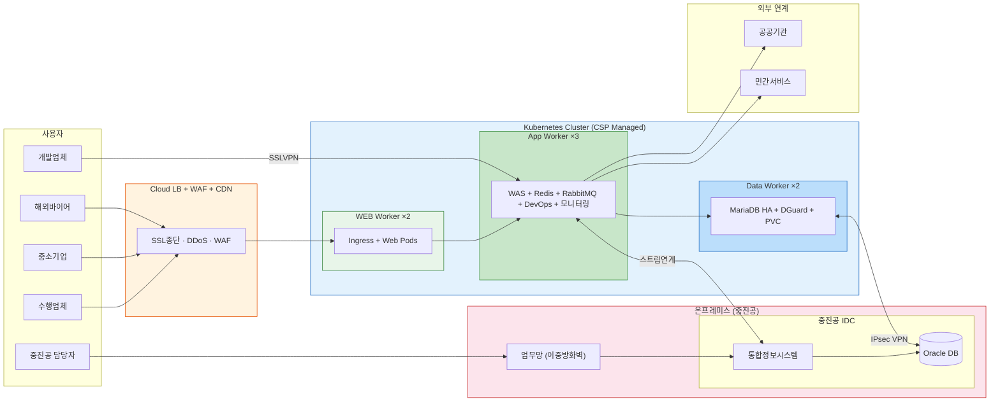

---

## 3. Kubernetes 노드 구성

> **설계 원칙**: RFP H/W 테이블(WEB 2식, WAS 7식, DB 2식, NAS 2식 = 13식)을 기준으로
> K8s Worker Node를 1:1 또는 통합 매핑하여 **총 7 Worker Node**로 구성한다.
> NAS서버 2식은 CSP 관리형 스토리지로 대체하여 별도 Node가 불필요하다.

### 3.1 AS-IS → TO-BE 노드 매핑

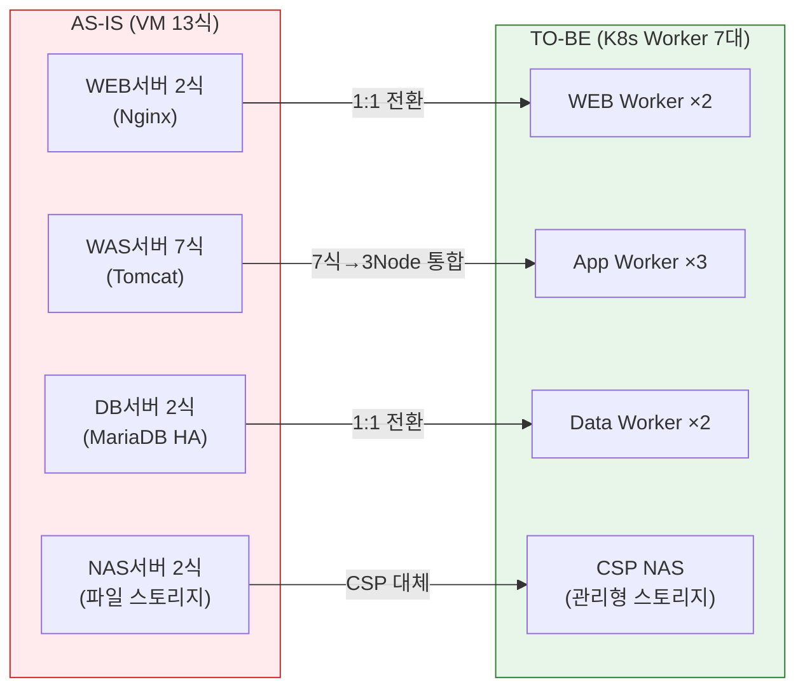

| AS-IS H/W | 수량 | TO-BE Worker | 수량 | 전환 방식 | 전환 근거 |
|-----------|------|-------------|------|---------|---------|
| WEB서버 | 2식 | **WEB Worker** | **2** | Pod (Deployment) | 1:1 매핑, Ingress + Web Pod |
| WAS서버 | 7식 | **App Worker** | **3** | Pod (Deployment) + HPA | 7식 → 3 Node 통합 (Pod 단위 배포) |
| DB서버 | 2식 | **Data Worker** | **2** | StatefulSet (HA) | 1:1 매핑, MariaDB Primary-Standby |
| NAS서버 | 2식 | CSP NAS | - | PVC + CSI Driver | CSP 관리형 스토리지로 대체 |
| **합계** | **13식** | **Worker 합계** | **7** | | Master 3 (CSP) + Worker 7 = **10 Node** |

> **WAS 7식 → App Worker 3대 통합 근거**:
> K8s에서는 VM 단위가 아닌 Pod 단위로 워크로드를 배포한다.
> 현행 7대 VM에 1:1로 할당했던 Tomcat 인스턴스를 Pod로 전환하면,
> 3대의 고사양(8C/32GB) Worker Node에 HPA 기반으로 유연하게 배치할 수 있다.
> HPA 확장 시 Cluster Autoscaler가 자동으로 Worker를 추가한다.

### 3.2 노드 상세 사양

| # | 노드 유형 | 수량 | 사양 (vCPU/RAM/Disk) | 배치 워크로드 | 역할 |
|---|---------|------|---------------------|-----------|------|
| 1 | Master Node | 3 | CSP Managed | etcd, API Server, Scheduler, CM | Control Plane HA (CSP 관리) |
| 2 | WEB Worker | 2 | 4C / 16GB / 100GB SSD | Ingress ×2, Web Pods (영문·국문·사업관리·관리자) | 웹 서비스 |
| 3 | App Worker | 3 | 8C / 32GB / 200GB SSD | WAS Pods, Redis, RabbitMQ, DevOps, 모니터링 | WAS + 관리 도구 |
| 4 | Data Worker | 2 | 8C / 32GB / 500GB SSD | MariaDB HA ×2, DGuard, PVC/CSI | DB + 스토리지 |
| | **합계** | **10** | | | Master 3 + Worker 7 |

### 3.3 노드 리소스 사용율 (PER-002: 평균 90% 이하)

| 노드 | 사양 | 배치 Pod 수 | CPU 사용율 | Memory 사용율 |
|------|------|----------|----------|-------------|
| WEB Worker | 4C / 16GB | 4~5 Pod | **43%** | **19%** |
| App Worker | 8C / 32GB | 5~7 Pod | **54%** | **38%** |
| Data Worker | 8C / 32GB | 2~3 Pod | **36%** | **25%** |

> 모든 노드 **90% 이하** 충족. Cluster Autoscaler 임계 **CPU 70%** 설정.

---

## 4. 접속 사용자 분류

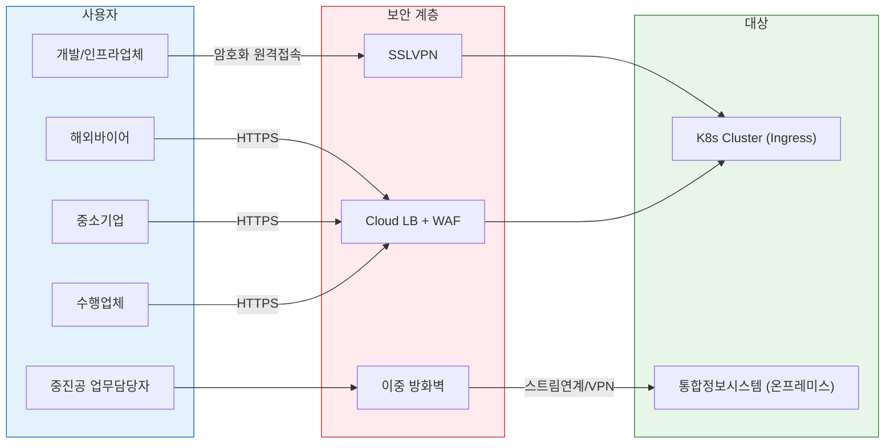

| 사용자 유형 | 접속 방식 | 대상 | 비고 |
|------------|----------|------|------|
| 개발업체, 인프라업체 | **SSLVPN** → K8s Cluster | GitLab, ArgoCD, 모니터링 | 암호화 원격접속 |
| 해외바이어 | HTTPS → Cloud LB → Ingress | 영문 Web → 영문 WAS | Cloud WAF + CDN 경유 |
| 중소기업 (고객/개인) | HTTPS → Cloud LB → Ingress | 국문 Web → 국문 WAS | Cloud WAF + CDN 경유 |
| 수출사업 수행업체 | HTTPS → Cloud LB → Ingress | 사업관리 Web → WAS | Cloud WAF 경유 |
| 중진공 업무담당자 | 중진공 업무망 → 이중방화벽 | 통합정보시스템 (온프레미스) | 내부 업무 전용 |

---

## 5. WEB Worker 상세 (← WEB서버 2식)

### 5.1 구성

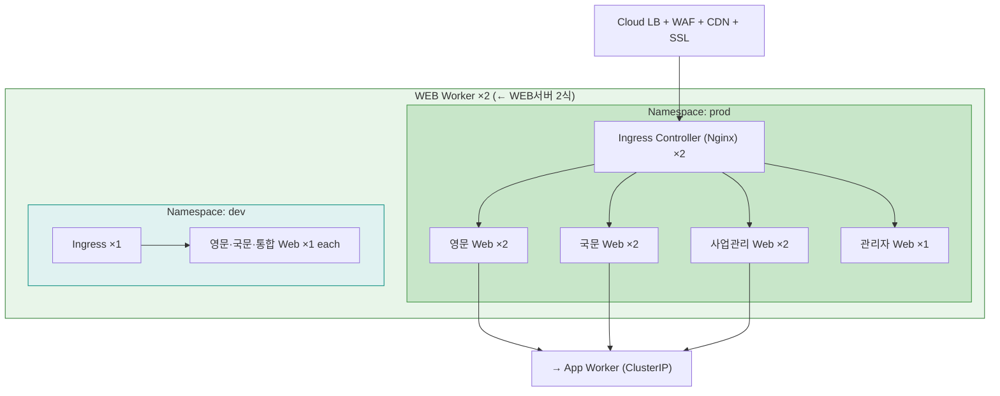

### 5.2 운영(prod) 구성요소

| 구성요소 | K8s 리소스 | Replica | HPA | 역할 |
|---------|-----------|---------|-----|------|
| Ingress Controller | Deployment + LoadBalancer | 2 | 2~4 | L7 호스트 기반 라우팅 |
| 영문 Web | Deployment + ClusterIP | 2 | 2~5 | 영문 웹 서비스 |
| 국문 Web | Deployment + ClusterIP | 2 | 2~5 | 국문 웹 서비스 |
| 사업관리 Web | Deployment + ClusterIP | 2 | 2~4 | 수행업체 사업관리 |
| 관리자 Web | Deployment + ClusterIP | 1 | - | 내부 관리자 전용 |

### 5.3 Ingress 라우팅 규칙

```yaml
# 운영(prod)
rules:
  - host: en.gobizkorea.com     → 영문 Web
  - host: www.gobizkorea.com    → 국문 Web
  - host: biz.gobizkorea.com    → 사업관리 Web
  - host: admin.gobizkorea.com  → 관리자 Web

# 개발(dev)
rules:
  - host: dev-en.gobizkorea.com  → 영문 Web (dev)
  - host: dev.gobizkorea.com     → 국문 Web (dev)
  - host: dev-biz.gobizkorea.com → 통합 Web (dev)
```

---

## 6. App Worker 상세 (← WAS서버 7식)

### 6.1 구성

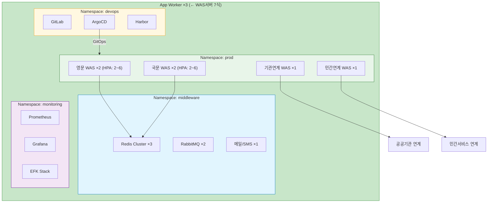

### 6.2 WAS 구성 (Namespace: prod)

| 서버명 | K8s 리소스 | Replica | HPA | 역할 |
|--------|-----------|---------|-----|------|
| 영문 WAS | Deployment + Service | 2 | 2~6 | 해외바이어용 영문 서비스 |
| 국문 WAS | Deployment + Service | 2 | 2~6 | 국내 중소기업용 국문 서비스 |
| 기관 연계 WAS | Deployment + Service | 1 | 1~3 | 공공기관 데이터 연계 |
| 민간 연계 WAS | Deployment + Service | 1 | 1~3 | 민간 서비스 연계 |

### 6.3 미들웨어 (Namespace: middleware)

| 구성요소 | K8s 리소스 | Replica | 역할 |
|---------|-----------|---------|------|
| Redis Cluster | StatefulSet | 3 (M) + 3 (R) | 세션 관리, 캐싱 |
| RabbitMQ | StatefulSet | 2 | 비동기 메시지 처리 |
| 메일/SMS 서비스 | Deployment | 1 | 알림 발송 |

### 6.4 DevOps (Namespace: devops)

| 구성요소 | K8s 리소스 | Replica | 역할 |
|---------|-----------|---------|------|
| GitLab | StatefulSet + PVC | 1 | SCM + CI 파이프라인 |
| ArgoCD | Deployment | 1 | GitOps 기반 CD 배포 |
| Harbor | StatefulSet + PVC | 1 | 컨테이너 이미지 레지스트리 |

### 6.5 모니터링 (Namespace: monitoring)

| 구성요소 | K8s 리소스 | 역할 |
|---------|-----------|------|
| Prometheus | StatefulSet + PVC | 메트릭 수집 |
| Grafana | Deployment | 대시보드 시각화 |
| EFK Stack | ES(SS) + Fluentd(DS) + Kibana | 로그 수집/분석 |
| Alertmanager | Deployment | 장애 알림 |

---

## 7. Data Worker 상세 (← DB서버 2식 + NAS서버 2식)

### 7.1 구성

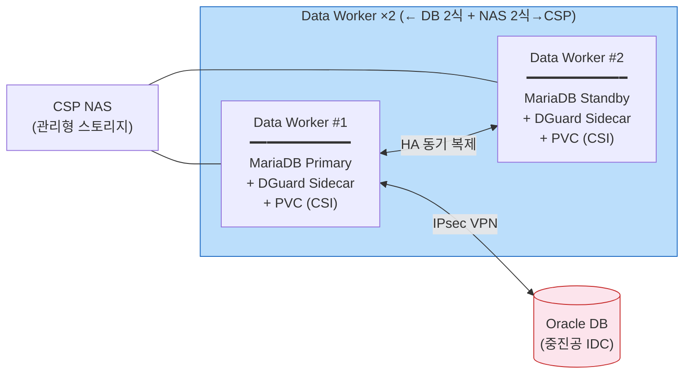

### 7.2 데이터 계층

| 구성요소 | K8s 리소스 | 구성 | 역할 | 비고 |
|---------|-----------|------|------|------|
| MariaDB | StatefulSet | 2 Pod (Primary-Standby) | 운영 DB | DB서버 2식 1:1 매핑 |
| DGuard | Sidecar | MariaDB Pod 연동 | DB 암호화 | 기존 솔루션 유지 |
| NAS | CSP NAS + PVC + CSI | CSP 관리형 | 파일 스토리지 | NAS서버 2식 대체 |
| 공공마이데이터 보안저장소 | Encrypted PV | 암호화 볼륨 | 마이데이터 전용 | - |
| 백업 | CronJob + Object Storage | 정기 백업 | DB 백업 | 일 1회 Full |

### 7.3 하이브리드 DB 구조

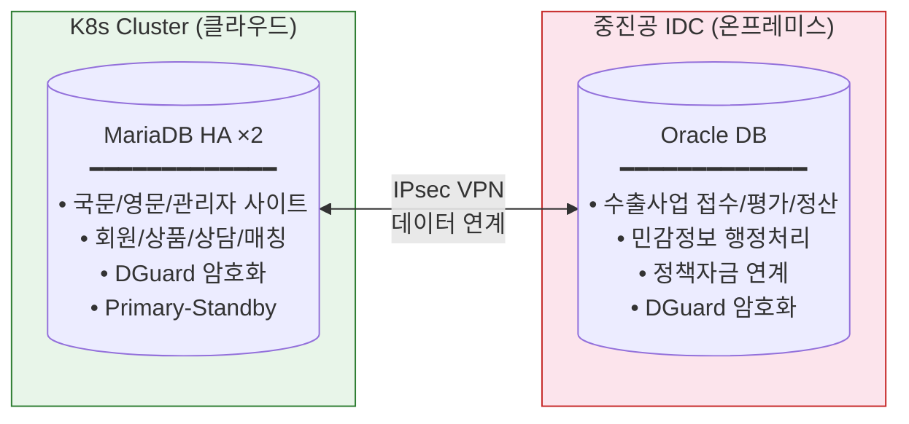

| DB | 위치 | 용도 | HA 방식 | 비고 |
|----|------|------|---------|------|
| **MariaDB** | K8s Data Worker | 국문/영문/관리자 사이트 | StatefulSet ×2 (Primary-Standby) | DB서버 2식 매핑 |
| **Oracle** | 중진공 IDC (온프레미스) | 수출사업 접수/평가/정산, 민감정보 | 기존 구성 유지 | TO-BE 유지 |

---

## 8. 중진공 IDC / 업무망 (온프레미스 유지)

### 8.1 중진공 업무망 → IDC 접속


| 구성요소 | 역할 | 비고 |
|---------|------|------|
| 사용자 방화벽 | 업무담당자 접속 보안 | 1차 보안 |
| 서버 방화벽 | 서버 영역 접근 통제 | 2차 보안 (이중 방화벽) |
| Web/WAS (통합정보시스템) | 수출사업 접수/평가/정산 | Oracle DB |
| 스트림 연계 + VPN | K8s Cluster와 보안 통신 | 암호화 전용 채널 |

---

## 9. 외부 연계 시스템

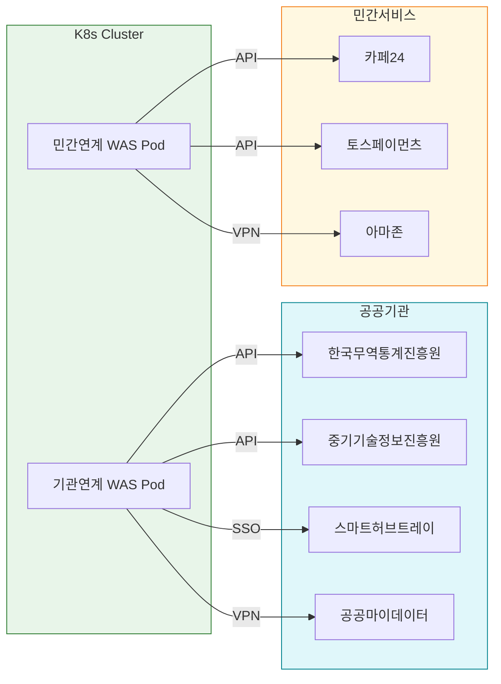

| # | 연계 대상 | 유형 | 연계 방식 | 목적 |
|---|---------|------|---------|------|
| 1 | 한국무역통계진흥원 | 공공 | API | 무역 통계 연동 |
| 2 | 중기기술정보진흥원 | 공공 | API | 기술정보 연동 |
| 3 | 스마트허브트레이 | 공공 | SSO/API | 물류시스템, 회원 공유 |
| 4 | 공공마이데이터 | 공공 | VPN | 본인기업정보 요청/수신 |
| 5 | 카페24 | 민간 | API | 상품 양방향 연동 |
| 6 | 토스페이먼츠 | 민간 | API | 결제/매출 연동 |
| 7 | 아마존 | 민간 | VPN | 글로벌 상품 연동 |

---

## 10. 보안 아키텍처

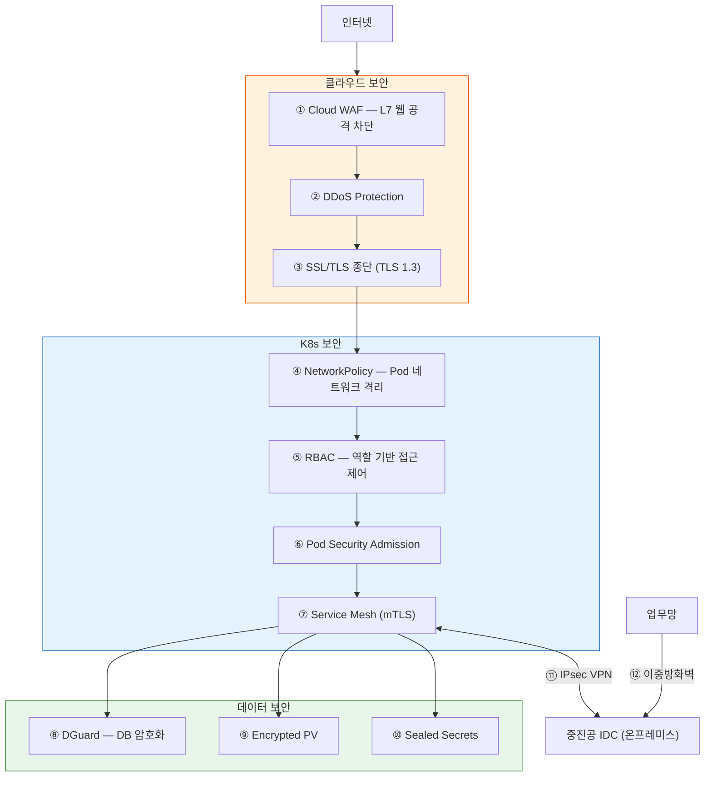

| 보안 요소 | 적용 위치 | 역할 |
|----------|----------|------|
| Cloud WAF | Cloud LB 앞단 | 웹 공격 차단 (SQLi, XSS) |
| DDoS Protection | Cloud 엣지 | 트래픽 공격 방어 |
| SSL/TLS 종단 | Cloud LB | HTTPS 강제 (TLS 1.3) |
| NetworkPolicy | K8s Cluster | Pod 간 네트워크 격리 |
| RBAC | K8s Cluster | 역할 기반 접근 제어 |
| Pod Security (PSA/PSS) | K8s Cluster | 컨테이너 권한 최소화 |
| Service Mesh | K8s Cluster | mTLS Pod 간 암호화 |
| SSLVPN | 개발업체 → K8s | 원격 접속 암호화 |
| IPsec VPN | K8s ↔ 중진공 IDC | 하이브리드 암호화 연계 |
| 이중 방화벽 | 중진공 업무망 | 사용자+서버 방화벽 |
| DGuard | MariaDB(K8s), Oracle(IDC) | DB 암호화 |
| Encrypted PV / Sealed Secrets | K8s 스토리지 | 저장 데이터·설정 암호화 |

---

## 11. 가용성(HA) 및 확장성

### 11.1 HA 구성

| 구성요소 | HA 방식 | Replica | HPA | 비고 |
|---------|--------|---------|-----|------|
| Ingress Controller | Deployment + Anti-Affinity | 2 | 2~4 | Node 분산 |
| 영문/국문 Web | Deployment + HPA | 2 | 2~5 | CPU/Memory 기반 |
| 사업관리 Web | Deployment + HPA | 2 | 2~4 | CPU/Memory 기반 |
| 영문/국문 WAS | Deployment + HPA | 2 | 2~6 | 요청량 기반 |
| 기관/민간 연계 WAS | Deployment + HPA | 1 | 1~3 | 기존 SPOF 개선 |
| MariaDB | StatefulSet (HA) | 2 | 수동 | Primary-Standby |
| Redis | StatefulSet (Cluster) | 3+3 | 수동 | Redis Cluster |
| Control Plane | CSP Managed ×3 | 3 | - | etcd 3중화 |

### 11.2 기존 SPOF 해소

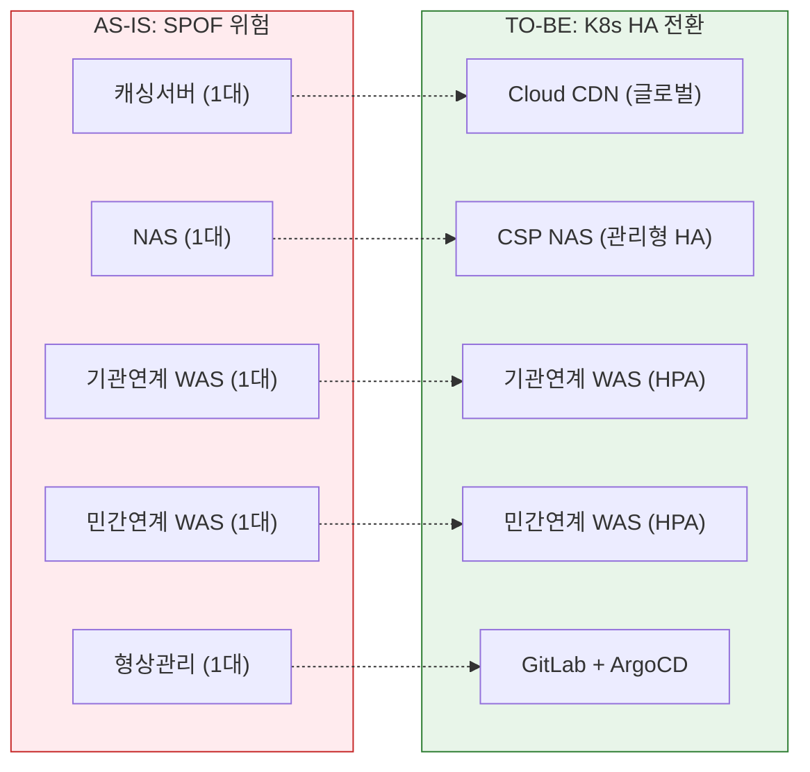

### 11.3 확장성

| 항목 | 구성 | 비고 |
|------|------|------|
| HPA (Pod 수평 확장) | CPU/Memory 임계 기반 Pod 자동 확장 | 모든 Deployment 적용 |
| Cluster Autoscaler | Worker Node 자동 추가 (CPU 70% 임계) | 부하 시 Worker 추가 |
| PDB | 전 운영 Deployment·StatefulSet 적용 | 롤링 업데이트 보장 |
| Node Auto-Repair | CSP 자동 복구 | 장애 Node 교체 |

---

## 12. 자원 총괄표

### 12.1 K8s Cluster (Worker 7 Node)

| # | 환경 | 구성요소 | K8s 리소스 | Replica | HPA | Worker |
|---|------|---------|-----------|---------|-----|--------|
| 1 | prod | Ingress Controller | Deployment | 2 | 2~4 | WEB |
| 2 | prod | 영문 Web | Deployment | 2 | 2~5 | WEB |
| 3 | prod | 국문 Web | Deployment | 2 | 2~5 | WEB |
| 4 | prod | 사업관리 Web | Deployment | 2 | 2~4 | WEB |
| 5 | prod | 관리자 Web | Deployment | 1 | - | WEB |
| 6 | prod | 영문 WAS | Deployment | 2 | 2~6 | App |
| 7 | prod | 국문 WAS | Deployment | 2 | 2~6 | App |
| 8 | prod | 기관 연계 WAS | Deployment | 1 | 1~3 | App |
| 9 | prod | 민간 연계 WAS | Deployment | 1 | 1~3 | App |
| 10 | prod | MariaDB (HA) | StatefulSet | 2 | - | Data |
| 11 | prod | NAS / 보안저장소 | PVC (CSI) | - | - | Data |
| 12 | dev | Web (영문·국문·통합) | Deployment | 각 1 | - | WEB |
| 13 | dev | WAS (영문·국문·연계) | Deployment | 각 1 | - | App |
| 14 | dev | 개발 MariaDB | StatefulSet | 1 | - | Data |
| 15 | middleware | Redis Cluster | StatefulSet | 6 | - | App |
| 16 | middleware | RabbitMQ | StatefulSet | 2 | - | App |
| 17 | middleware | 메일/SMS | Deployment | 1 | - | App |
| 18 | devops | GitLab | StatefulSet | 1 | - | App |
| 19 | devops | ArgoCD | Deployment | 1 | - | App |
| 20 | devops | Harbor | StatefulSet | 1 | - | App |
| 21 | monitoring | Prometheus + Grafana | SS + Deploy | 1+1 | - | App |
| 22 | monitoring | EFK + Alertmanager | SS+DS+Deploy | - | - | App |
| 23 | backup | Velero + DB백업 | Deploy+CronJob | 1 | - | App |

### 12.2 온프레미스 (변경 없음)

| # | 영역 | 구성요소 | 수량 | 용도 |
|---|------|---------|------|------|
| 1 | 중진공 IDC | Web/WAS (통합정보시스템) | 1 | 수출사업 접수/평가/정산 |
| 2 | 중진공 IDC | Oracle DB | 1+ | 민감정보 처리, 정책자금 연계 |
| 3 | 중진공 업무망 | Web/WAS (업무담당자용) | 1 | 중진공 업무 접속 |

---

## 13. AS-IS → TO-BE 전환 요약

| # | 항목 | AS-IS (VM 13식) | TO-BE (K8s 7 Worker) | 효과 |
|---|------|---------------|---------------------|------|
| 1 | **인프라** | VM 13식 | K8s Worker 7대 | VM 46% 감소, 자원 효율화 |
| 2 | **WEB** | WEB서버 2식 | WEB Worker 2대 | 1:1 전환, Ingress 라우팅 |
| 3 | **WAS** | WAS서버 7식 | App Worker 3대 | 7→3 통합, HPA 오토스케일링 |
| 4 | **DB** | DB서버 2식 | Data Worker 2대 | 1:1 전환, StatefulSet HA |
| 5 | **NAS** | NAS서버 2식 | CSP NAS (관리형) | Node 불필요, CSP 위임 |
| 6 | **Oracle** | 중진공 IDC | **온프레미스 유지** | 하이브리드 연계 |
| 7 | **캐싱/세션** | CDN 단일 + WAS 로컬 | Cloud CDN + Redis | SPOF 해소 |
| 8 | **CI/CD** | 형상관리 1대 | GitLab + ArgoCD | GitOps 자동 배포 |
| 9 | **모니터링** | 수동 | Prometheus + Grafana + EFK | 통합 모니터링 |
| 10 | **보안** | WAF + 방화벽 | Cloud WAF + NetworkPolicy + mTLS | Zero Trust |
| 11 | **SPOF** | NAS, 연계WAS 미이중화 | HPA + PDB + CSP HA | 전면 해소 |

### 13.1 데이터 흐름 요약

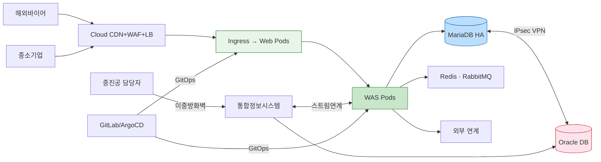
