# 온라인수출플랫폼(고비즈코리아) 현행 시스템 구성도

**사업명**: 온라인수출플랫폼 클라우드 전환 및 재구축
**발주기관**: 중소벤처기업진흥공단 (온라인수출처)
**공고번호**: R26BK01321359-000
**분석일**: 2026-02-21
**원본**: `KakaoTalk_Photo_2026-02-21-12-53-44.png` (2026-02-20 온라인수출처 박*환 작성)

---

## 1. 전체 구성 개요

온라인수출플랫폼(고비즈코리아)은 **6개 네트워크 영역**으로 분리 운영되며, 다국어(영문/국문) 서비스를 물리적으로 분리하고, 공공기관 및 민간 서비스와 VPN/스트림 기반으로 연계한다. 특히 **중진공 IDC 내부망**에는 통합정보시스템(Oracle DB)이 별도 운영되어 고비즈코리아와 하이브리드 구조를 형성한다.

> **전체 구성도 이미지**: [`images/구성도/01_전체_시스템_구성도.png`](images/구성도/01_전체_시스템_구성도.png)

```
┌─────────────────────────────────────────────────────────────────────────────────────────┐
│                                      【 사용자 】                                         │
│  ┌──────────────┐ ┌──────────┐ ┌────────────────┐ ┌────────────────┐   ┌──────────────┐ │
│  │ 개발/인프라업체 │ │ 해외바이어 │ │ 중소기업·개인회원 │ │ 수출사업 수행업체 │   │ 중진공 업무담당자│ │
│  │  (SSLVPN)    │ │ (영문Web) │ │   (국문Web)     │ │  (사업관리Web)  │   │  (내부 업무망) │ │
│  └──────┬───────┘ └────┬─────┘ └───────┬────────┘ └───────┬────────┘   └──────┬───────┘ │
└─────────┼──────────────┼───────────────┼──────────────────┼───────────────────┼─────────┘
          │SSLVPN        │WAF            │WAF               │방화벽             │이중방화벽
          ▼              ▼               ▼                  ▼                   ▼
┌─────────────────────────────────────────────────────────┐  ┌─────────────────────────┐
│                    【 고비즈 DMZ 】                       │  │   【 중진공 업무망 】      │
│                                                         │  │                         │
│  ◆ 보안장비                                              │  │  사용자 방화벽 (1차 보안)  │
│  ┌──────────┐  ┌─────────────┐  ┌──────────┐           │  │         ▼               │
│  │ SSLVPN   │  │ 웹방화벽(WAF)│  │  방화벽   │           │  │  서버 방화벽 (2차 보안)   │
│  │암호화접속 │  │ L7 웹공격차단│  │L3/L4통제 │           │  │         ▼               │
│  └────┬─────┘  └─────┬───────┘  └────┬─────┘           │  │  Web/WAS 통합정보시스템  │
│       └──────────────┼───────────────┘                  │  │         │               │
│                      ▼                                  │  │  스트림연계/VPN ←→ 내부망 │
│           ┌────────────────────┐                        │  └─────────────────────────┘
│           │ 캐싱서버 (CDN 적용) │                        │
│           └─────────┬──────────┘                        │
│       ┌─────────────┼────────────┐                      │
│       ▼             ▼            ▼                      │
│  ┌─────────┐  ┌─────────┐  ┌──────────┐               │
│  │ Web #1  │  │ Web #2  │  │  Web #3  │               │
│  │  영문   │  │  국문   │  │ 사업관리  │               │
│  └────┬────┘  └────┬────┘  └────┬─────┘               │
└───────┼────────────┼────────────┼───────────────────────┘
        ▼            ▼            ▼
┌──────────────────────────────────────────────────────────────────────────────────┐
│                      【 고비즈 내부망 (민간클라우드) 】                             │
│                                                                                  │
│  ◆ WAS 서버군                              ◆ 연계 서버                            │
│  ┌────────────────┐ ┌────────────────┐    ┌─────────────────┐                   │
│  │ 영문 WAS ×2    │ │ 국문 WAS ×2    │    │  기관 연계 WAS   │──→ 공공기관 연계   │
│  │ Active-Active  │ │ Active-Active  │    │  (공공기관 API)  │    (API/VPN)      │
│  │     [HA]       │ │     [HA]       │    ├─────────────────┤                   │
│  └───────┬────────┘ └───────┬────────┘    │  민간 연계 WAS   │──→ 민간서비스 연계  │
│          └─────────┬────────┘             │ (민간서비스 API) │    (연계WEB/VPN)   │
│                    ▼                      └─────────────────┘                   │
│  ◆ 데이터 계층                                                                   │
│  ┌────────────────┐  ┌──────┐  ┌──────────────┐  ┌─────────────┐              │
│  │ MariaDB ×2     │  │ NAS  │  │ 공공마이데이터 │  │ 형상관리/배포│              │
│  │ HA 동기복제     │  │파일   │  │  보안저장소   │  │ 소스 버전관리│              │
│  │ Galera Cluster │  │스토리지│  │   (PDS)      │  └─────────────┘              │
│  │ DGuard 암호화  │  └──────┘  └──────────────┘                                │
│  └───────┬────────┘                                                             │
│          │                                                                       │
└──────────┼───────────────────────────────────────────────────────────────────────┘
           │ IPsec VPN (전용 암호화 터널)
           ▼
┌────────────────────────────────┐  ┌──────────────────────────────────────────────┐
│   【 중진공 IDC 내부망 】        │  │              【 외부 연계 시스템 】             │
│                                │  │                                              │
│  ┌──────────────────────────┐  │  │  ◆ 공공기관 연계                              │
│  │ Web/WAS (통합정보시스템)   │  │  │  한국무역통계진흥원 │ 중기기술정보진흥원       │
│  │ 수출사업 접수/평가/정산    │  │  │  스마트허브트레이   │ 공공마이데이터(VPN)      │
│  └───────────┬──────────────┘  │  │                                              │
│              ▼                 │  │  ◆ 민간 서비스 연계                            │
│  ┌──────────────────────────┐  │  │  카페24(이커머스) │ 토스페이먼츠(결제)         │
│  │     Oracle DB            │  │  │  아마존(글로벌 VPN)                           │
│  │ 민감정보·정책자금 연계     │  │  └──────────────────────────────────────────────┘
│  │ DGuard 암호화 적용        │  │
│  │ ※ TO-BE에서도 유지        │  │  ┌──────────────────────────────────────────────┐
│  └──────────────────────────┘  │  │          【 개발/운영 지원 영역 】              │
│                                │  │  Web·WAS(메일/문자) │ 개발DB │ 백업 │ 개발NAS  │
└────────────────────────────────┘  └──────────────────────────────────────────────┘
```

---

## 2. 네트워크 영역 구분

| # | 영역 | 설명 | 보안 구성 |
|---|------|------|----------|
| 1 | **고비즈 DMZ** | 외부 사용자 접점. 웹서버, 캐싱서버 배치 | 웹방화벽(WAF) + 네트워크 방화벽 |
| 2 | **고비즈 내부망** | WAS, DB(MariaDB), NAS 등 핵심 서비스 운영 | DMZ-내부망 간 방화벽 격리 |
| 3 | **개발/운영 지원 영역** | 개발DB, 백업스토리지, 메일/문자 서비스 | 별도 방화벽으로 분리 |
| 4 | **중진공 IDC 내부망** | 통합정보시스템(Oracle DB), 수출사업 접수/평가/정산 | IPsec VPN으로 고비즈 내부망과 연계 |
| 5 | **중진공 업무망** | 중진공 업무담당자 접속, 관리자/행정 업무 | 사용자방화벽 + 서버방화벽 (이중) |
| 6 | **외부 연계 시스템** | 공공기관 및 민간 서비스 연계 | VPN / 전용 연계 WEB |

---

## 3. 접속 사용자 분류

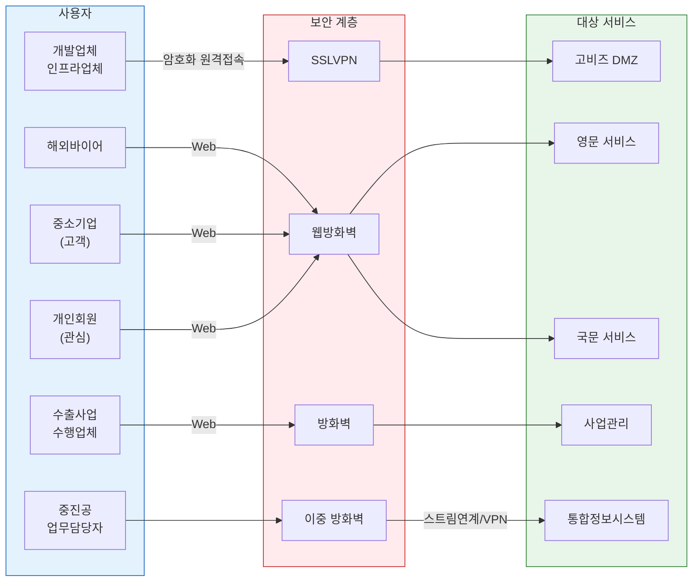

| 사용자 유형 | 접속 방식 | 대상 서비스 | 비고 |
|------------|----------|-----------|------|
| 개발업체, 인프라업체 | **SSLVPN** → DMZ | 개발/운영 관리 | 암호화 원격접속 |
| 해외바이어 | Web → DMZ | 영문 서비스 | 영문 WAS 처리 |
| 중소기업 (고객) | Web → DMZ | 국문 서비스 | 국문 WAS 처리 |
| 개인회원 (관심) | Web → DMZ | 국문 서비스 | 일반 회원 |
| 수출사업 수행업체 | Web → DMZ (사업관리) | 사업관리 시스템 | 계약관계 기반 |
| 중진공 업무담당자 | 중진공 업무망 → 스트림연계 | 통합정보시스템 | 내부 업무 전용 |

---

## 4. 고비즈 DMZ 영역 상세

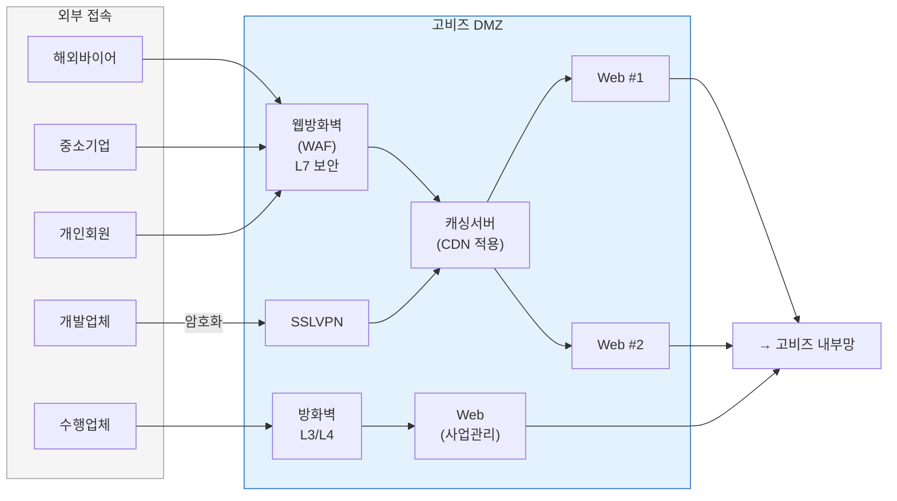

| 구성요소 | 수량 | 역할 | 비고 |
|---------|------|------|------|
| 캐싱서버 (CDN 적용) | 1 | 정적 콘텐츠 캐싱, CDN 연동 | 글로벌 응답속도 최적화 |
| Web 서버 | 2 | 사용자 웹 요청 처리 | 영문/국문 공용 |
| Web 서버 (사업관리) | 1 | 수출사업 수행업체 전용 | 별도 방화벽 경유 |
| 웹방화벽 (WAF) | 1 | 웹 공격 차단 | SQL Injection, XSS 등 |
| 방화벽 | 1 | 네트워크 접근 통제 | L3/L4 레벨 |

---

## 5. 고비즈 내부망 상세

### 5.1 전체 구조

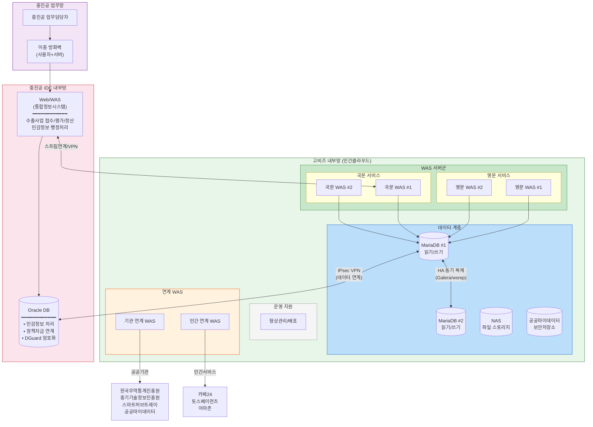

### 5.2 WAS 서버 구성

| 서버명 | 수량 | 용도 | 이중화 |
|--------|------|------|--------|
| 영문 WAS | 2대 (was1, was2) | 해외바이어용 영문 서비스 | Active-Active |
| 국문 WAS | 2대 (was1, was2) | 국내 중소기업용 국문 서비스 | Active-Active |
| 기관 연계 WAS | 1대 | 공공기관 데이터 연계 처리 | 단일 |
| 민간 연계 WAS | 1대 | 민간 서비스 연계 처리 | 단일 |

### 5.3 데이터 계층

| 구성요소 | 구성 | 역할 | 가용성 |
|---------|------|------|--------|
| MariaDB | 2대 (HA 구성) | 운영 데이터베이스 | Active-Standby 이중화 |
| NAS | 1대 | 파일 스토리지 | 단일 |
| 공공마이데이터 보안저장소 | 1대 | 마이데이터 전용 보안 스토리지 | 단일 |

### 5.4 운영 지원

| 구성요소 | 역할 |
|---------|------|
| 형상관리/배포 | 소스코드 버전관리 및 배포 자동화 |

---

## 6. 개발/운영 지원 영역 상세

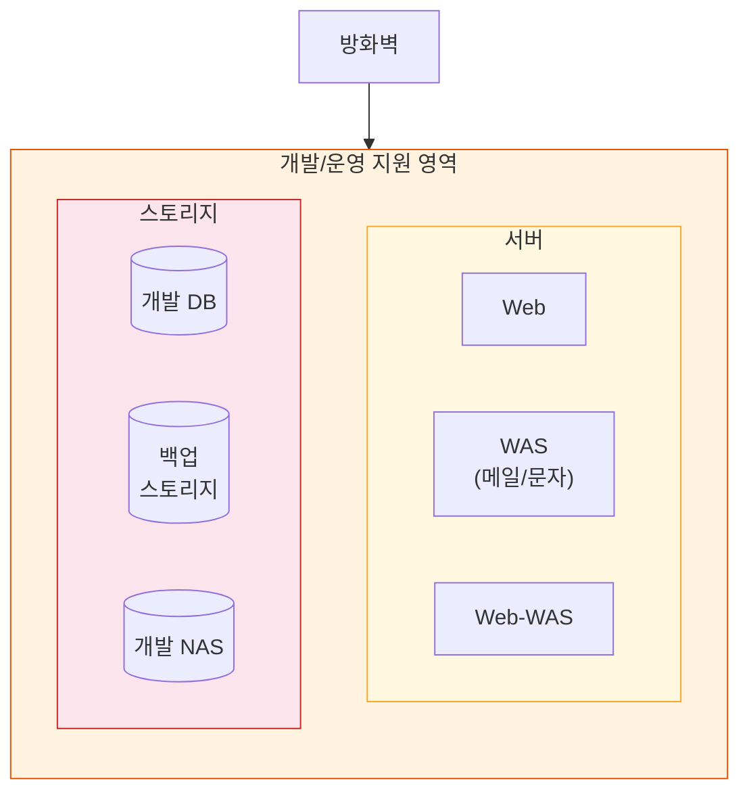

| 구성요소 | 역할 | 비고 |
|---------|------|------|
| Web 서버 | 개발/운영 지원용 웹 | 내부 접근 전용 |
| WAS (메일, 문자) | 메일 발송 및 SMS 문자 서비스 | 알림 서비스 |
| Web-WAS | 웹 애플리케이션 통합 서버 | 개발 환경 |
| 개발 DB | 개발 환경 데이터베이스 | 운영 DB와 분리 |
| 백업 스토리지 | 데이터 백업 저장소 | 재해복구 대비 |
| 개발 NAS | 개발 환경 파일 스토리지 | 운영 NAS와 분리 |

---

## 7. 중진공 IDC 내부망 및 업무망 상세

구성도에서 하단 영역은 **중진공 업무망**과 그 내부의 **통합정보시스템**으로 구성된다. 현행분석서와 종합하면, 중진공 IDC에는 **Oracle DB 기반의 통합정보시스템(수출)**이 별도 운영되며, 이는 고비즈코리아(민간클라우드)의 MariaDB와 **하이브리드 DB 환경**을 형성하고 있다.

### 7.1 중진공 IDC 내부망 — 통합정보시스템

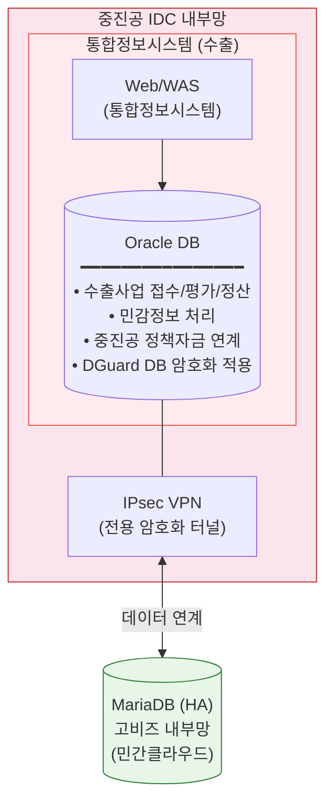

| 구성요소 | 역할 | DB | 비고 |
|---------|------|-----|------|
| Web/WAS (통합정보시스템) | 수출사업 접수, 기업평가, 선정, 정산 처리 | **Oracle** | 중진공 IDC 내 운영 |
| Oracle DB | 민감정보 처리, 중진공 정책자금 등 다양한 서비스 연결 | - | TO-BE에서도 유지 |
| DGuard | DB 암호화 솔루션 | - | 중진공 전용 보안 솔루션 |
| IPsec VPN | 고비즈코리아(민간클라우드) ↔ 중진공 IDC 연계 | - | 전용 암호화 터널 |

### 7.2 하이브리드 DB 구조 (MariaDB + Oracle)

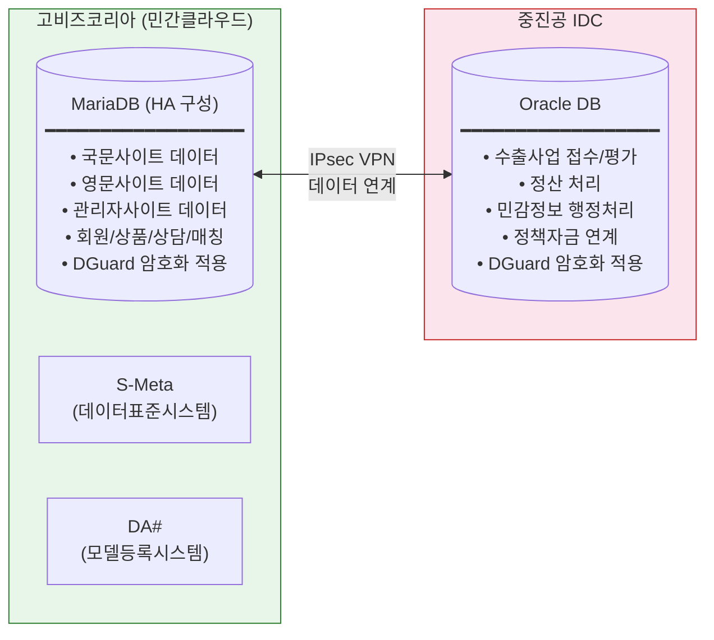

| DB | 위치 | 용도 | HA 방식 | 비고 |
|----|------|------|---------|------|
| **MariaDB** | 민간클라우드 (고비즈 내부망) | 국문/영문/관리자 사이트 데이터 | 2대 HA 구성 (Galera Cluster 권장) | 현행 운영 중 |
| **Oracle** | 중진공 IDC | 통합정보시스템 — 수출사업 접수/평가/정산, 민감정보 처리 | 기존 구성 유지 | TO-BE에서도 유지 |

> **핵심 포인트**: 고비즈코리아는 이미 **하이브리드 DB 환경**(MariaDB + Oracle)으로 운영 중이며, 두 DB 간 IPsec VPN을 통한 데이터 연계가 이루어지고 있다. TO-BE 전환 시 MariaDB는 클라우드 HA 강화, Oracle은 기존 중진공 IDC에서 유지하는 방향이다.

### 7.3 중진공 업무망 — 업무담당자 접속 영역

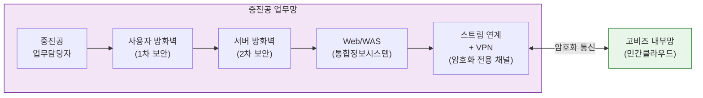

| 구성요소 | 역할 | 비고 |
|---------|------|------|
| 사용자 방화벽 | 업무담당자 접속 보안 | 1차 보안 |
| 서버 방화벽 | 서버 영역 접근 통제 | 2차 보안 (이중 방화벽) |
| Web/WAS (통합정보시스템) | 수출사업 접수/평가/정산, 민감정보 행정 처리 | Oracle DB 사용 |
| 스트림 연계 + VPN | 고비즈 내부망(민간클라우드)과 보안 통신 | 암호화 전용 채널 |

### 7.4 고비즈 ↔ 중진공 연계 흐름 요약

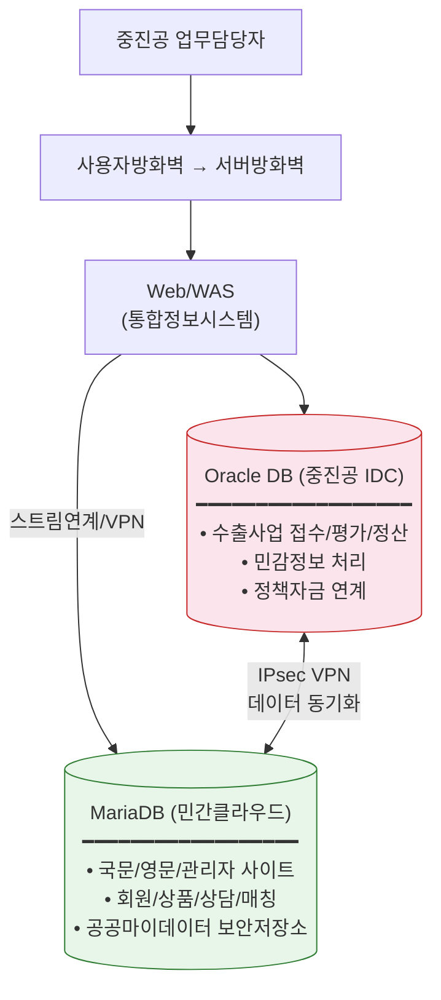

---

## 8. 외부 연계 시스템

### 8.1 연계 구조

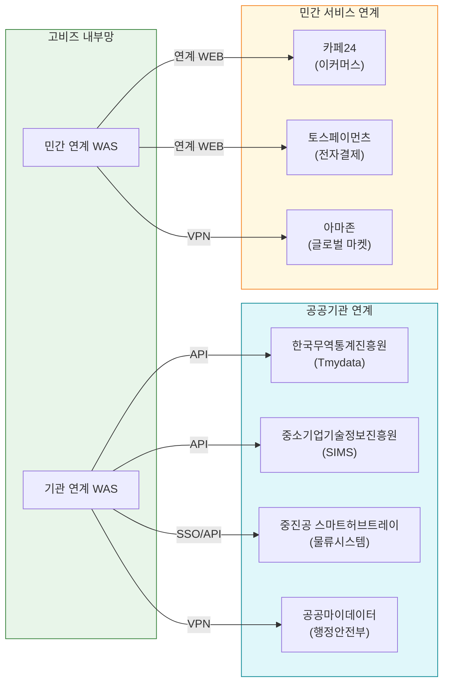

### 8.2 공공기관 연계

| # | 기관명 | 연계 방식 | 연계 목적 |
|---|--------|----------|----------|
| 1 | 한국무역통계진흥원 (Tmydata) | 기관 연계 WAS / API | 무역 통계 데이터 연동 |
| 2 | 중소기업기술정보진흥원 (SIMS) | 기관 연계 WAS / API | 중소기업 기술정보 연동 |
| 3 | 중진공 스마트허브트레이 | 기관 연계 WAS / SSO | 인천공항 물류시스템 연동, 회원데이터 공유 |
| 4 | 공공마이데이터 (행안부) | VPN | 본인기업정보 요청/수신, PDS 보안저장소 |

### 8.3 민간 서비스 연계

| # | 서비스명 | 연계 방식 | 연계 목적 |
|---|---------|----------|----------|
| 1 | 카페24 | 민간연계 WAS → 연계 WEB | 상품 양방향 연동 (카페24 API) |
| 2 | 토스페이먼츠 | 민간연계 WAS → 연계 WEB | 결제 연동, 매출액 통계, 고객키 관리 |
| 3 | 아마존 | 민간연계 WAS → VPN | 상품 양방향 연동 (아마존 API) |

---

## 9. 보안 아키텍처

### 9.1 보안 계층 구조

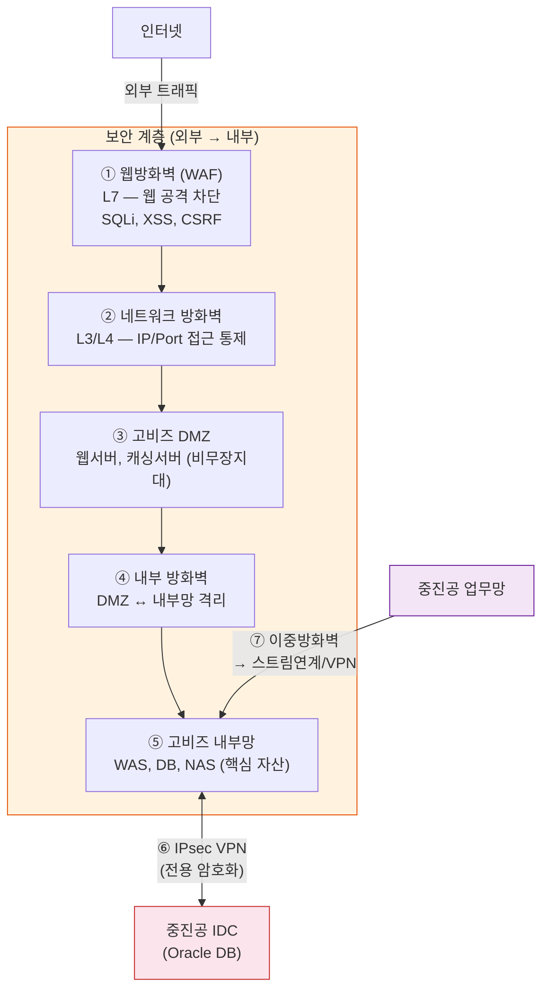

### 9.2 보안 요소 총괄

| 보안 요소 | 적용 위치 | 역할 | 보호 수준 |
|----------|----------|------|----------|
| SSLVPN | 개발/인프라업체 → DMZ | 원격 접속 암호화 | 전송 구간 암호화 |
| 웹방화벽 (WAF) | DMZ 앞단 | 웹 애플리케이션 공격 차단 | L7 보안 |
| 네트워크 방화벽 | DMZ 경계 | IP/Port 기반 접근 통제 | L3/L4 보안 |
| 내부 방화벽 | DMZ ↔ 내부망 경계 | 내부망 진입 통제 | 영역 격리 |
| IPsec VPN | 민간클라우드 ↔ 중진공 IDC | 하이브리드 환경 암호화 연계 | 전용 터널 |
| VPN | 외부 연계 구간 | 기관/민간 연계 암호화 | 전용 터널 |
| 스트림 연계 | 중진공 업무망 ↔ 내부망 | 업무망 전용 데이터 채널 | 전용 암호화 채널 |
| 사용자/서버 방화벽 | 중진공 업무망 | 이중 방화벽 구성 | 다계층 방어 |
| DGuard | MariaDB, Oracle DB | DB 암호화 솔루션 | 데이터 암호화 |
| 보안저장소 | 내부망 | 공공마이데이터 전용 보안 스토리지 | 데이터 격리 |

---

## 10. 가용성(HA) 및 이중화 구성

### 10.1 이중화 현황

| 구성요소 | HA 방식 | 수량 | 비고 |
|---------|--------|------|------|
| Web 서버 | Active-Active | 2대 | DMZ 웹서버 이중화 |
| 영문 WAS | Active-Active | 2대 (was1, was2) | 로드밸런싱 추정 |
| 국문 WAS | Active-Active | 2대 (was1, was2) | 로드밸런싱 추정 |
| MariaDB | Active-Standby (HA) | 2대 | Galera Cluster 권장 |
| 캐싱서버 | 단일 (CDN 보완) | 1대 | CDN이 가용성 보완 |
| NAS | 단일 | 1대 | SPOF 가능성 |
| 기관 연계 WAS | 단일 | 1대 | SPOF 가능성 |
| 민간 연계 WAS | 단일 | 1대 | SPOF 가능성 |

### 10.2 단일 장애점(SPOF) 식별

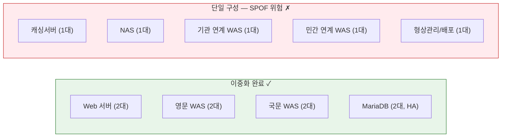

---

## 11. 서버 자원 총괄표

| # | 영역 | 구성요소 | 수량 | 용도 |
|---|------|---------|------|------|
| 1 | DMZ | 캐싱서버 (CDN) | 1 | 정적 콘텐츠 캐싱 |
| 2 | DMZ | Web 서버 | 2 | 사용자 웹 서비스 |
| 3 | DMZ | Web 서버 (사업관리) | 1 | 수행업체 사업관리 |
| 4 | 내부망 | 영문 WAS | 2 | 영문 서비스 |
| 5 | 내부망 | 국문 WAS | 2 | 국문 서비스 |
| 6 | 내부망 | 기관 연계 WAS | 1 | 공공기관 연계 |
| 7 | 내부망 | 민간 연계 WAS | 1 | 민간 서비스 연계 |
| 8 | 내부망 | MariaDB (HA) | 2 | 운영 데이터베이스 |
| 9 | 내부망 | NAS | 1 | 파일 스토리지 |
| 10 | 내부망 | 공공마이데이터 보안저장소 | 1 | 마이데이터 보안 저장 |
| 11 | 내부망 | 형상관리/배포 | 1 | 소스 관리 및 배포 |
| 12 | 운영지원 | Web 서버 | 1 | 개발/운영 지원 |
| 13 | 운영지원 | WAS (메일/문자) | 1 | 알림 서비스 |
| 14 | 운영지원 | Web-WAS | 1 | 개발 환경 |
| 15 | 운영지원 | 개발 DB | 1 | 개발 데이터베이스 |
| 16 | 운영지원 | 백업 스토리지 | 1 | 데이터 백업 |
| 17 | 운영지원 | 개발 NAS | 1 | 개발 파일 스토리지 |
| 18 | 중진공 IDC | Web/WAS (통합정보시스템) | 1 | 수출사업 접수/평가/정산 |
| 19 | 중진공 IDC | Oracle DB | 1+ | 민감정보 처리, 정책자금 연계 |
| 20 | 중진공 업무망 | Web/WAS (업무담당자용) | 1 | 중진공 업무 접속 |
|    | **합계** | | **21+** | |

---

## 12. 주요 특이사항 및 클라우드 전환 시사점

### 12.1 현행 아키텍처 특징

| # | 특징 | 상세 | 클라우드 전환 시사점 |
|---|------|------|-------------------|
| 1 | **하이브리드 DB 환경** | MariaDB(민간클라우드) + Oracle(중진공 IDC) 이원 운영 | 클라우드 전환 시에도 Oracle은 중진공 IDC 유지, MariaDB만 클라우드 HA 강화. IPsec VPN 연계 안정성 필수 |
| 2 | **중진공 IDC 내부망 유지** | 통합정보시스템(수출) — 수출사업 접수/평가/정산, 민감정보 처리 | TO-BE에서도 유지. 클라우드 ↔ IDC 간 안정적 VPN 및 지연시간 관리 필요 |
| 3 | **다국어 서비스 물리적 분리** | 영문/국문 WAS가 별도 서버로 운영 | 컨테이너 기반 서비스 통합 또는 마이크로서비스화 검토 |
| 4 | **CDN 적용** | DMZ 캐싱서버에 CDN 적용 | 클라우드 CDN(CloudFront 등) 전환 |
| 5 | **공공마이데이터 대응** | 전용 보안저장소 내부망 배치 | 클라우드 보안 스토리지(암호화) 요구 |
| 6 | **이중 연계 구조** | 공공(기관연계WAS) / 민간(민간연계WAS) 분리 | API Gateway 기반 통합 연계 계층 구성 |
| 7 | **중진공 업무망 분리** | 스트림연계 + VPN으로 별도 운영 | 전용선 또는 VPN 유지, 클라우드 VPC 피어링 검토 |
| 8 | **DGuard DB 암호화** | MariaDB, Oracle 모두 DGuard 적용 | 클라우드 Managed DB 사용 시 DGuard 호환성 확인 필수 (Galera wsrep 충돌 가능성) |
| 9 | **개발/운영 환경 분리** | 개발DB, 개발NAS 별도 영역 | 클라우드 멀티 환경(Dev/Staging/Prod) 구성 |
| 10 | **단일 장애점 존재** | NAS, 연계WAS 등 미이중화 | 클라우드 전환 시 Auto Scaling, Multi-AZ 적용 |

### 12.2 데이터 흐름 요약

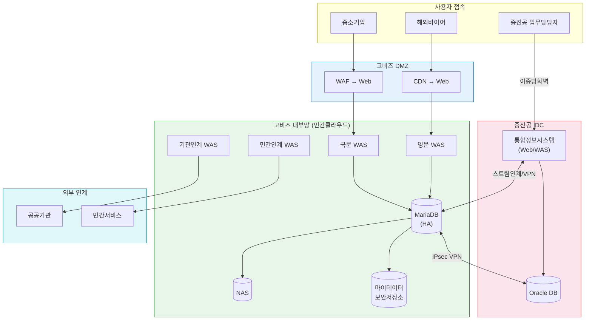
