# 온라인수출플랫폼(고비즈코리아) TO-BE Kubernetes 시스템 구성도

**사업명**: 온라인수출플랫폼 클라우드 전환 및 재구축
**발주기관**: 중소벤처기업진흥공단 (온라인수출처)
**공고번호**: R26BK01321359-000
**분석일**: 2026-02-23
**전환 기준**: 현행 VM 13식 → NKS 이중화 클러스터(dev + prd) + 전용 VM(DevOps, DB) + 온프레미스 중진공 IDC 유지

***

## 1. 전체 구성 개요

온라인수출플랫폼(고비즈코리아)의 TO-BE 아키텍처는 **NKS 이중 클러스터(dev + prd)** + **외부 전용 VM(DevOps·DB)** + **온프레미스 중진공 IDC**로 구성된 **하이브리드 클라우드** 환경이다.


| 구성 영역 | 유형 | 내용 |
| :-- | :-- | :-- |
| **NKS dev 클러스터** | CSP Managed K8s | 개발·테스트 환경 (WEB Node ×1 + App Node ×1) |
| **NKS prd 클러스터** | CSP Managed K8s | 운영 서비스 환경 (WEB Node ×2 + App Node ×2, CA 2~4) |
| **DevOps VM** | 단독 VM (K8s 외부) | GitLab (SCM + CI/CD + Container Registry) |
| **개발 DB VM** | Cloud DB for MySQL | 단독 인스턴스 (4C/16GB) |
| **운영 DB VM** | Cloud DB for MySQL HA | Primary + Standby (8C/32GB × 2) |
| **중진공 IDC** | 온프레미스 유지 | 통합정보시스템 + Oracle DB |
| **중진공 업무망** | 온프레미스 유지 | 업무담당자 행정 업무 (이중방화벽) |

> **CSP Managed K8s**: Control Plane(마스터 노드)은 CSP 완전 관리 — 별도 VM 구성 불필요, 자동 HA·패치·업그레이드 제공

***

## 2. 전체 아키텍처 구성도

```
                                    【 사용자 】
┌──────────────┐  ┌──────────┐  ┌─────────────────┐  ┌────────────────┐  ┌───────────────────┐
│ 개발/인프라업체 │  │ 해외바이어 │  │ 중소기업·개인회원  │  │ 수출사업 수행업체 │  │ 중진공 업무담당자  │
│  (SSLVPN)    │  │ (영문Web) │  │    (국문Web)     │  │  (사업관리Web)  │  │   (중진공 업무망)  │
└──────┬───────┘  └────┬─────┘  └────────┬────────┘  └───────┬────────┘  └──────┬────────────┘
       │ SSLVPN        └────────────────┬─┴──────────────────┘           │ 이중방화벽
       ▼                                │ HTTPS / WAF / CDN              ▼
┌──────────────────────────────────────────────────────────┐  ┌──────────────────────────────────┐
│         【 Cloud LB + WAF + CDN + DDoS 】                 │  │  【 중진공 업무망 (온프레미스) 】   │
│  Cloud WAF │ CDN │ SSL종단(TLS1.3) │ DDoS Protection      │  │  사용자방화벽 → 서버방화벽        │
└────────────────────────┬─────────────────────────────────┘  └────────────┬─────────────────────┘
                         │                                                  │
          ┌──────────────┴────────────────┐                                 │
          ▼                               ▼                                 │
╔════════════════════════╗   ╔═══════════════════════════════════╗          │
║  【 NKS dev 클러스터 】 ║   ║       【 NKS prd 클러스터 】      ║          │
║  Control Plane:        ║   ║  Control Plane: CSP Managed       ║          │
║  CSP Managed           ║   ║                                   ║          │
║                         ║   ║  ┌─────────────────────────────┐ ║          │
║  ┌────────────────────┐ ║   ║  │ WEB Node ×2  [DMZ 구간]     │ ║          │
║  │ WEB Node ×1        │ ║   ║  │ 4C/16GB × 2                  │ ║          │
║  │ [DMZ 구간] 4C/16GB  │ ║   ║  │ 영문Web ×2, 국문Web ×2       │ ║          │
║  │ 영문·국문·사관·관리 │ ║   ║  │ 사관Web ×2, 관리자 ×1        │ ║          │
║  └────────────────────┘ ║   ║  └────────────┬────────────────┘ ║          │
║        │ ClusterIP      ║   ║               │ ClusterIP        ║          │
║  ┌─────▼──────────────┐ ║   ║  ┌────────────▼────────────────┐ ║          │
║  │ App Node ×1        │ ║   ║  │ App Node ×2 [내부망]         │ ║          │
║  │ [내부망] 8C/32GB   │ ║   ║  │ 8C/32GB × 2 (CA: 2~4)       │ ║          │
║  │ WAS×4, 미들웨어    │ ║   ║  │ WAS×6, Redis×6, RMQ×3       │ ║          │
║  │ ArgoCD, 모니터링   │ ║   ║  │ ArgoCD, Prometheus/Grafana  │ ║          │
║  └────────────────────┘ ║   ║  │ EFK Stack, Alertmanager     │ ║          │
╚══════════╤══════════════╝   ║  └─────────────────────────────┘ ║          │
           │                  ╚══════════════╤════════════════════╝          │
           │                                 │                               │
      ┌────▼────────┐               ┌────────▼───────────┐                  │
      │ 개발 DB VM  │               │  운영 DB VM ×2 (HA) │                  │
      │Cloud DB for │               │  Cloud DB for MySQL │                  │
      │MySQL 4C/16G │               │  8C/32GB × 2        │                  │
      └─────────────┘               └──────────┬──────────┘                  │
                                               │ IPsec VPN                  │
                            ┌──────────────────▼──────────────────────────────┐
                            │      【 중진공 IDC 내부망 (온프레미스 유지) 】     │
                            │  통합정보시스템 (Web/WAS) │ Oracle DB             │
                            └─────────────────────────────────────────────────┘

      ┌──────────────────────────────────────────────────────────┐
      │           【 DevOps 전용 VM (K8s 외부) 】                 │
      │  GitLab (SCM + CI Pipeline + Container Registry)         │
      │  ↕ GitOps Pull    dev ArgoCD ←─ / ─→ prd ArgoCD        │
      └──────────────────────────────────────────────────────────┘
```


***

## 3. 영역 구분

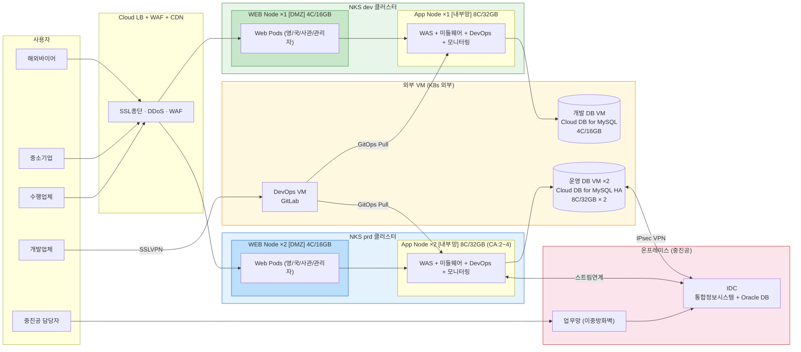


***

## 4. NKS 클러스터 노드 구성

### 4.1 Control Plane (CSP Managed)

> ❌ **마스터 노드 상세 구성 미기재** — CSP Managed K8s에서 Control Plane은 CSP가 완전 자동 관리


| 항목 | 내용 |
| :-- | :-- |
| **구성** | CSP Managed (사용자 영역 외) |
| **HA** | 3중화 자동 구성 (SLA 99.95%) |
| **관리** | 보안 패치·버전 업그레이드 CSP 자동 처리 |
| **비용** | 클러스터 과금에 포함 |

### 4.2 노드 구성 비교

| 구분 | dev 클러스터 | prd 클러스터 |
| :-- | :-- | :-- |
| **Control Plane** | CSP Managed | CSP Managed |
| **WEB Node** | ×1 / 4C/16GB (DMZ 구간) | ×2 / 4C/16GB (DMZ 구간) |
| **App Node** | ×1 / 8C/32GB (내부망) | ×2 / 8C/32GB (내부망, CA: 2~4) |
| **Data Node** | ❌ → 개발 DB VM (4C/16GB) | ❌ → 운영 DB VM HA (8C/32GB × 2) |
| **Worker 합계** | **2 Node** | **4 Node (CA 최대 8)** |


***

## 5. 노드 스펙 및 Sizing 근거

### 5.1 성능 요건

| 요건 항목 | 목표값 |
| :-- | :-- |
| 동시접속자 | **1,000명** |
| 처리량 | **50 TPS** |
| 자원 사용률 상한 | **CPU·MEM·Disk 평균 90% 이하** |

### 5.2 오케스트레이션 리소스 오버헤드

K8s 클러스터에서 애플리케이션 Pod 외에 **노드 당 시스템 컴포넌트**가 추가 자원을 소비한다. 이를 사용률 계산에 반드시 포함해야 한다.


| 컴포넌트 | 유형 | CPU | MEM | 적용 노드 |
| :-- | :-- | :-- | :-- | :-- |
| **kube-proxy** | DaemonSet | 0.1C | 0.1GB | 전체 |
| **CNI Plugin** (Calico/VPC CNI) | DaemonSet | 0.1C | 0.1GB | 전체 |
| **kubelet + system-reserved** | 시스템 | 0.2C | 0.5GB | 전체 |
| **node-exporter** | DaemonSet | 0.1C | 0.1GB | 전체 |
| **Fluentd DaemonSet** (EFK) | DaemonSet | 0.1C | 0.2GB | prd App only |
| **OS + containerd** | 시스템 | — | 0.2GB | 전체 |

```
오버헤드 합산 (per Node):
  ┌─────────────────────────────────────────────────────┐
  │  4C WEB 노드:         0.5C / 1.0GB per node         │
  │  8C App 노드 (dev):   0.5C / 1.0GB per node         │
  │  8C App 노드 (prd):   0.6C / 1.2GB per node         │
  │                       (EFK Fluentd DaemonSet 추가)   │
  └─────────────────────────────────────────────────────┘
```


### 5.3 TPS / 동접자 기반 Pod Sizing 근거

```
【 TPS / 동접자 기반 산출 】

① Nginx (WEB):
   - 1 vCPU 처리 용량: ~1,000 RPS (동적 프록시 기준)
   - 50 TPS 처리 최소: 0.1C → 안전율 5배 → 0.5C per Pod
   - 동접 1,000명: 연결 유지 당 ~0.5MB → 1GB 내 처리
   - Pod Request: 0.5C / 1.0GB

② Tomcat WAS:
   - 1 vCPU 처리 용량: ~50~100 TPS (Java CRUD 기준)
   - 50 TPS: 최소 1C WAS, 이중화(×2) → 2C, 안전율 적용
   - 세션 메모리: Redis 외부화 → JVM Heap 최소화
   - Pod Request: 1.0C / 2.0GB (JVM Heap 1.5GB)

③ Cloud DB for MySQL:
   - 1 vCPU: ~200 TPS (단순 CRUD 기준)
   - 50 TPS: 4C MySQL → ~800 TPS 처리 (여유 16배)
   - 개발 DB: 4C/16GB, 운영 DB: 8C/32GB (HA × 2)
```


### 5.4 Pod 리소스 요청량 정의

#### dev 클러스터

| Pool | Pod | Replica | CPU Req | MEM Req |
| :-- | :-- | :-- | :-- | :-- |
| WEB | 영문 Web | 1 | 0.5C | 1.0GB |
| WEB | 국문 Web | 1 | 0.5C | 1.0GB |
| WEB | 사업관리 Web | 1 | 0.5C | 1.0GB |
| WEB | 관리자 Web | 1 | 0.5C | 1.0GB |
| **WEB 소계** |  | **4** | **2.0C** | **4.0GB** |
| App | 영문 WAS | 1 | 1.0C | 2.0GB |
| App | 국문 WAS | 1 | 1.0C | 2.0GB |
| App | 기관연계 WAS | 1 | 1.0C | 2.0GB |
| App | 민간연계 WAS | 1 | 1.0C | 2.0GB |
| App | Redis | 1 | 0.5C | 1.0GB |
| App | RabbitMQ | 1 | 0.5C | 1.0GB |
| App | 메일/SMS | 1 | 0.25C | 0.5GB |
| App | ArgoCD | 1 | 0.5C | 1.0GB |
| App | Prometheus | 1 | 0.5C | 1.0GB |
| App | Grafana | 1 | 0.25C | 0.5GB |
| **App 소계** |  | **10** | **6.5C** | **13.0GB** |

#### prd 클러스터

| Pool | Pod | Replica | CPU Req | MEM Req |
| :-- | :-- | :-- | :-- | :-- |
| WEB | 영문 Web | 2 (HPA 2~5) | 1.0C | 2.0GB |
| WEB | 국문 Web | 2 (HPA 2~5) | 1.0C | 2.0GB |
| WEB | 사업관리 Web | 2 (HPA 2~4) | 1.0C | 2.0GB |
| WEB | 관리자 Web | 1 | 0.5C | 1.0GB |
| **WEB 소계** |  | **7** | **3.5C** | **7.0GB** |
| App | 영문 WAS | 2 (HPA 2~6) | 2.0C | 4.0GB |
| App | 국문 WAS | 2 (HPA 2~6) | 2.0C | 4.0GB |
| App | 기관연계 WAS | 1 (HPA 1~3) | 1.0C | 2.0GB |
| App | 민간연계 WAS | 1 (HPA 1~3) | 1.0C | 2.0GB |
| App | Redis Cluster | 6 (3M+3R) | 3.0C | 6.0GB |
| App | RabbitMQ | 3 | 1.5C | 3.0GB |
| App | 메일/SMS | 1 | 0.25C | 0.5GB |
| App | ArgoCD | 1 | 0.5C | 1.0GB |
| App | Prometheus | 1 | 0.5C | 2.0GB |
| App | Grafana | 1 | 0.25C | 0.5GB |
| App | EFK (ES+Fluentd-SS+Kibana) | 1 set | 1.5C | 5.0GB |
| App | Alertmanager | 1 | 0.1C | 0.25GB |
| **App 소계** |  | **22** | **13.6C** | **30.25GB** |

### 5.5 노드 용량 산정 (오케스트레이션 오버헤드 포함)

```
산정 공식:
  총 사용량 = Pod 요청량 + (오케스트레이션 오버헤드 × 노드 수)
  사용률    = 총 사용량 ÷ 총 노드 용량 × 100
  기준      = 90% 이하
```


#### dev 클러스터 (WEB Node / App Node)

| 항목 | dev WEB Node | dev App Node |
| :-- | :-- | :-- |
| **노드 스펙** | 4C / 16GB | 8C / 32GB |
| **노드 수** | ×1 | ×1 |
| **총 용량** | 4C / 16GB | 8C / 32GB |
| Pod 요청량 | 2.0C / 4.0GB | 6.5C / 13.0GB |
| 오케스트레이션 오버헤드 | 0.5C / 1.0GB (×1) | 0.5C / 1.0GB (×1) |
| **총 사용량** | **2.5C / 5.0GB** | **7.0C / 14.0GB** |
| **CPU 사용률** | **62.5%** ✅ | **87.5%** ✅ |
| **MEM 사용률** | **31.2%** ✅ | **43.7%** ✅ |

#### prd 클러스터 (WEB Node)

| 항목 | prd WEB Node |
| :-- | :-- |
| **노드 스펙** | 4C / 16GB |
| **노드 수** | ×2 (Anti-Affinity) |
| **총 용량** | 8C / 32GB |
| Pod 요청량 | 3.5C / 7.0GB |
| 오케스트레이션 오버헤드 | 0.5C/1.0GB × 2 = 1.0C / 2.0GB |
| **총 사용량** | **4.5C / 9.0GB** |
| **CPU 사용률** | **56.2%** ✅ |
| **MEM 사용률** | **28.1%** ✅ |

#### prd 클러스터 (App Node — CA 단계별 용량)

> **CA(Cluster Autoscaler) 설계**: 초기 2 노드에서 CPU 70% 트리거 → 자동 확장 → 90% 이하 유지


| 항목 | 2 노드 (CA min) | 3 노드 (정상 운영) | 4 노드 (HPA 피크) |
| :-- | :-- | :-- | :-- |
| **노드 스펙** | 8C/32GB | 8C/32GB | 8C/32GB |
| **총 용량** | 16C / 64GB | 24C / 96GB | 32C / 128GB |
| Pod 요청량 | 13.6C / 30.25GB | 13.6C / 30.25GB | 13.6C / 30.25GB |
| 오케스트레이션 오버헤드 | 0.6C×2 = **1.2C** / 2.4GB | 0.6C×3 = **1.8C** / 3.6GB | 0.6C×4 = **2.4C** / 4.8GB |
| **총 사용량** | **14.8C / 32.65GB** | **15.4C / 33.85GB** | **16.0C / 35.05GB** |
| **CPU 사용률** | ⚠️ **92.5%** (CA 트리거) | ✅ **64.2%** | ✅ **50.0%** |
| **MEM 사용률** | ✅ **51.0%** | ✅ **35.3%** | ✅ **27.4%** |

```
CA 동작 흐름:
  ┌─────────────────────────────────────────────────────────────┐
  │  Phase 1: 초기 2노드 → CPU 92.5%                           │
  │  → CA trigger (임계값 70% 초과) → 3번째 노드 자동 추가      │
  │                                                             │
  │  Phase 2: 정상 운영 3노드 → CPU 64.2% ✅                   │
  │  → HPA로 WAS Pod 증가 시 CPU 상승                          │
  │                                                             │
  │  Phase 3: HPA 피크 4노드 → CPU 50.0% ✅                   │
  │  → CA trigger → 4번째 노드 추가 → 50% 유지                 │
  └─────────────────────────────────────────────────────────────┘
  ※ 90% 사용률 기준: CA 확장 정상 운영 상태(3노드) 기준 충족
```


### 5.6 노드 스펙 최종 정리

| \# | 환경 | 노드 풀 | 수량 | 사양 | CPU 사용률 | MEM 사용률 | 비고 |
| :-- | :-- | :-- | :-- | :-- | :-- | :-- | :-- |
| 1 | dev | WEB (DMZ) | ×1 | **4C/16GB/100GB** | **62.5%** | **31.2%** | ✅ |
| 2 | dev | App (내부망) | ×1 | **8C/32GB/200GB** | **87.5%** | **43.7%** | ✅ |
| 3 | prd | WEB (DMZ) | ×2 | **4C/16GB/100GB** | **56.2%** | **28.1%** | ✅ Anti-Affinity |
| 4 | prd | App (내부망) | ×2~4 | **8C/32GB/200GB** | **64.2%** | **35.3%** | ✅ CA 3노드 기준 |
| - | dev | Control Plane | CSP | CSP Managed | — | — | CSP 자동 HA |
| - | prd | Control Plane | CSP | CSP Managed | — | — | CSP 자동 HA |


***

## 6. 접속 사용자 분류

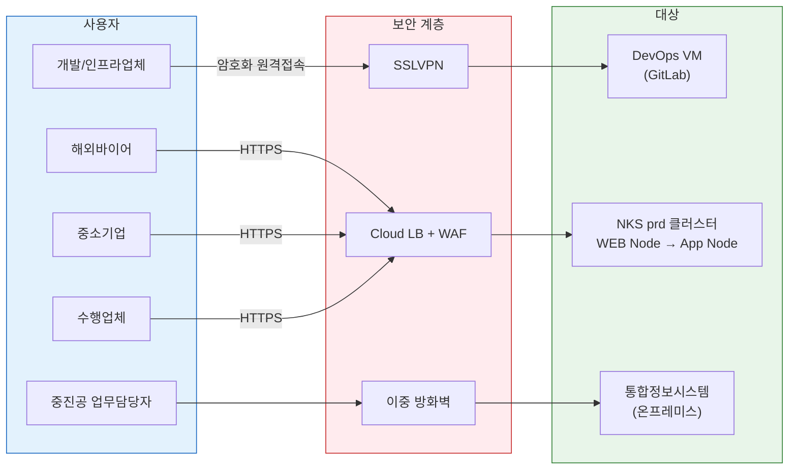

| 사용자 유형 | 접속 방식 | 대상 | 비고 |
| :-- | :-- | :-- | :-- |
| 개발업체, 인프라업체 | **SSLVPN** → DevOps VM | GitLab, ArgoCD, 모니터링 | 암호화 원격접속 |
| 해외바이어 | HTTPS → Cloud LB → WEB Node | 영문 Web → 영문 WAS | Cloud WAF + CDN |
| 중소기업 (고객/개인) | HTTPS → Cloud LB → WEB Node | 국문 Web → 국문 WAS | Cloud WAF + CDN |
| 수출사업 수행업체 | HTTPS → Cloud LB → WEB Node | 사업관리 Web → WAS | Cloud WAF |
| 중진공 업무담당자 | 중진공 업무망 → 이중방화벽 | 통합정보시스템 (온프레미스) | 내부 업무 전용 |


***

## 7. WEB Node 상세 (DMZ 구간)

### 7.1 Ingress Controller 제외 사유

> ⚠️ **Ingress Controller는 Kubernetes 시스템 Pod이며 애플리케이션 워크로드가 아니다.**
>
> | 구분 | Ingress Controller | Web Pod (Nginx) |
> |-----|-------------------|----------------|
> | 분류 | ⚙️ K8s 시스템 인프라 | 📦 애플리케이션 워크로드 |
> | Namespace | `ingress-system` | `prod` / `dev` |
> | 역할 | L7 호스트 기반 라우팅 (K8s 기본 기능) | 비즈니스 콘텐츠 전달 |
> | 노드 풀 목록 | ❌ **제외** | ✅ **포함** |

### 7.2 dev WEB Node (×1, 4C/16GB, DMZ 구간)

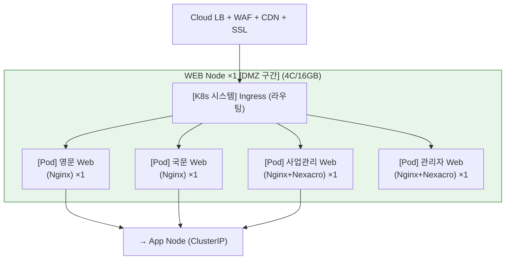


### 7.3 prd WEB Node (×2, 4C/16GB, DMZ 구간)

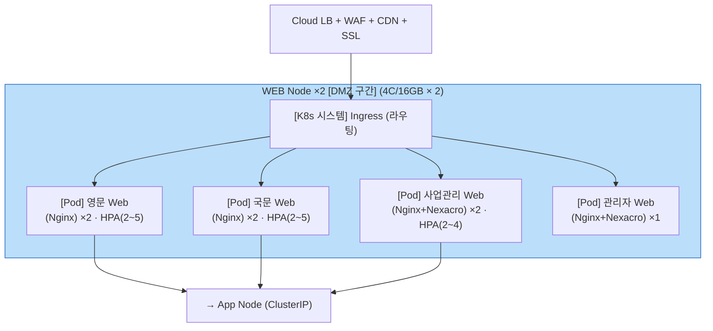


### 7.4 Ingress 라우팅 규칙

```yaml
# prd 운영
rules:
  - host: en.gobizkorea.com     → 영문 Web
  - host: www.gobizkorea.com    → 국문 Web
  - host: biz.gobizkorea.com    → 사업관리 Web
  - host: admin.gobizkorea.com  → 관리자 Web

# dev 개발
rules:
  - host: dev-en.gobizkorea.com    → 영문 Web (dev)
  - host: dev.gobizkorea.com       → 국문 Web (dev)
  - host: dev-biz.gobizkorea.com   → 사업관리 Web (dev)
  - host: dev-admin.gobizkorea.com → 관리자 Web (dev)
```


***

## 8. App Node 상세

### 8.1 구성

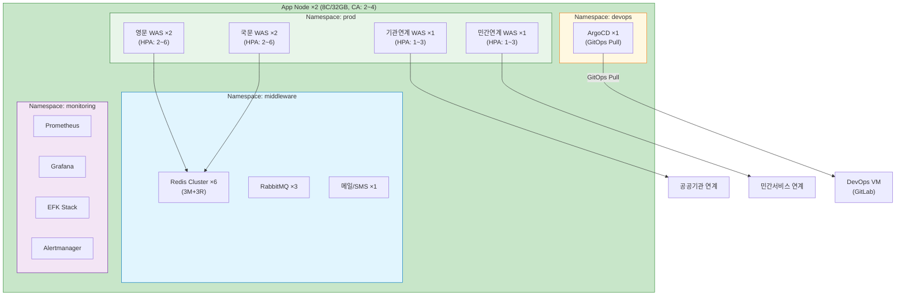


### 8.2 dev App Node (×1, 8C/32GB)

| Namespace | 구성요소 | Replica | CPU Req | MEM Req | 역할 |
| :-- | :-- | :-- | :-- | :-- | :-- |
| prod | 영문 WAS | 1 | 1.0C | 2.0GB | 개발 영문 서비스 |
| prod | 국문 WAS | 1 | 1.0C | 2.0GB | 개발 국문 서비스 |
| prod | 기관연계 WAS | 1 | 1.0C | 2.0GB | 공공기관 연계 테스트 |
| prod | 민간연계 WAS | 1 | 1.0C | 2.0GB | 민간 연계 테스트 |
| middleware | Redis | 1 | 0.5C | 1.0GB | 세션/캐싱 (개발 공유) |
| middleware | RabbitMQ | 1 | 0.5C | 1.0GB | 메시지 큐 |
| middleware | 메일/SMS | 1 | 0.25C | 0.5GB | 알림 서비스 |
| devops | ArgoCD | 1 | 0.5C | 1.0GB | dev 클러스터 GitOps |
| monitoring | Prometheus | 1 | 0.5C | 1.0GB | 메트릭 수집 |
| monitoring | Grafana | 1 | 0.25C | 0.5GB | 대시보드 |
| **합계** |  | **10** | **6.5C** | **13.0GB** |  |

### 8.3 prd App Node (×2, 8C/32GB, CA 2~4)

#### WAS (Namespace: prod)

| 서버명 | Replica | HPA | CPU Req | MEM Req | 역할 |
| :-- | :-- | :-- | :-- | :-- | :-- |
| 영문 WAS | 2 | 2~6 | 2.0C | 4.0GB | 해외바이어 영문 서비스 |
| 국문 WAS | 2 | 2~6 | 2.0C | 4.0GB | 국내 중소기업 서비스 |
| 기관 연계 WAS | 1 | 1~3 | 1.0C | 2.0GB | 공공기관 데이터 연계 |
| 민간 연계 WAS | 1 | 1~3 | 1.0C | 2.0GB | 민간 서비스 연계 |

#### 미들웨어 (Namespace: middleware)

| 구성요소 | Replica | CPU Req | MEM Req | 역할 |
| :-- | :-- | :-- | :-- | :-- |
| Redis Cluster | 6 (3M+3R) | 3.0C | 6.0GB | 세션 관리, 캐싱 |
| RabbitMQ | 3 | 1.5C | 3.0GB | 비동기 메시지 처리 |
| 메일/SMS 서비스 | 1 | 0.25C | 0.5GB | 알림 발송 |

#### DevOps (Namespace: devops)

| 구성요소 | Replica | CPU Req | MEM Req | 역할 | 비고 |
| :-- | :-- | :-- | :-- | :-- | :-- |
| ArgoCD | 1 | 0.5C | 1.0GB | GitOps 기반 CD | GitLab Pull 방식 |
| ~~GitLab~~ | ❌ | — | — | → DevOps VM 이관 | SPOF 방지 |
| ~~Harbor~~ | ❌ | — | — | → GitLab Registry 통합 | 중복 제거 |

#### 모니터링 (Namespace: monitoring)

| 구성요소 | Replica | CPU Req | MEM Req | 역할 |
| :-- | :-- | :-- | :-- | :-- |
| Prometheus | 1 | 0.5C | 2.0GB | 메트릭 수집 |
| Grafana | 1 | 0.25C | 0.5GB | 대시보드 시각화 |
| EFK Stack (ES+Fluentd-SS+Kibana) | 1 set | 1.5C | 5.0GB | 로그 수집/분석 |
| Alertmanager | 1 | 0.1C | 0.25GB | 장애 알림 |


***

## 9. DevOps 전용 VM (K8s 외부 단독 구성)

```
┌──────────────────────────────────────────────────────────┐
│              【 DevOps 전용 VM (K8s 외부) 】               │
│                                                          │
│  ┌────────────────────────────────────────────────────┐  │
│  │  GitLab                                            │  │
│  │  ├─ SCM (소스코드 저장소 / Merge Request)          │  │
│  │  ├─ CI 파이프라인 (빌드 / 테스트 / 이미지 빌드)    │  │
│  │  ├─ Container Registry                             │  │
│  │  │   ← Harbor 기능 통합 (Harbor ❌ 삭제)          │  │
│  │  └─ REST API / Webhook                             │  │
│  └────────────────────────────────────────────────────┘  │
└────────────────────────┬─────────────────────────────────┘
                         │  GitOps Pull
                ┌────────┴────────┐
                ▼                 ▼
           [dev 클러스터]     [prd 클러스터]
           ArgoCD             ArgoCD
           (자동 배포)        (수동 Approval)
```

| 구성요소 | 위치 | CPU/MEM | 용도 | 비고 |
| :-- | :-- | :-- | :-- | :-- |
| **GitLab** | 단독 VM (K8s 외부) | 4C/16GB | SCM + CI + 이미지 레지스트리 | 크로스 클러스터 중앙 관리 |
| **ArgoCD (dev)** | dev 클러스터 Pod | 0.5C/1GB | GitOps 자동 배포 | Pull, 자동 Sync |
| **ArgoCD (prd)** | prd 클러스터 Pod | 0.5C/1GB | GitOps 배포 | Pull, 수동 Approval |
| ~~Harbor~~ | ❌ 삭제 | — | → GitLab Container Registry로 통합 | 비용·운영 절감 |


***

## 10. DB VM 구성 (K8s 외부 단독)

### 10.1 Data Node → Cloud DB for MySQL 전환 사유

> ❌ **K8s Data Node Pool을 Cloud DB for MySQL VM으로 분리한다.**
>
> - K8s StatefulSet DB: 스토리지 마운트·네트워크 지연·운영 복잡도 높음
> - Cloud DB for MySQL (CSP 관리형): 자동 백업·HA Failover·보안 패치 CSP 제공
> - DB 분리 → App Node 자원 안정성 향상, 클러스터 장애 영향 최소화

### 10.2 개발 DB VM (4C/16GB)

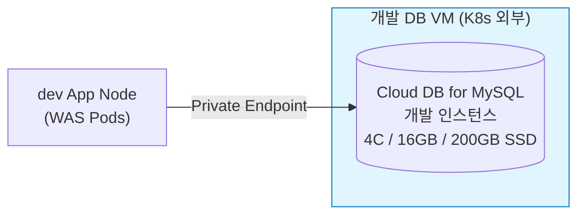

| 항목 | 개발 DB |
| :-- | :-- |
| **엔진** | Cloud DB for MySQL (CSP 관리형) |
| **사양** | **4C / 16GB / 200GB SSD** |
| **구성** | 단독 인스턴스 |
| **HA** | 미적용 (개발 환경) |
| **백업** | 자동 일 1회 |
| **접속** | dev 클러스터 → Private Endpoint |

### 10.3 운영 DB VM (8C/32GB × 2, HA)

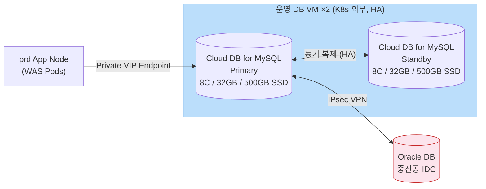

| 항목 | 운영 DB |
| :-- | :-- |
| **엔진** | Cloud DB for MySQL (CSP 관리형) |
| **사양** | **8C / 32GB / 500GB SSD × 2 (Primary + Standby)** |
| **구성** | HA (Primary-Standby 자동 Failover) |
| **RTO/RPO** | RTO < 5분 / RPO ≈ 0 (동기 복제) |
| **백업** | 자동 일 1회 Full + 바이너리 로그 |
| **접속** | prd 클러스터 → Private VIP Endpoint |
| **연계** | Oracle IDC ↔ IPsec VPN (데이터 연계) |

### 10.4 하이브리드 DB 구조

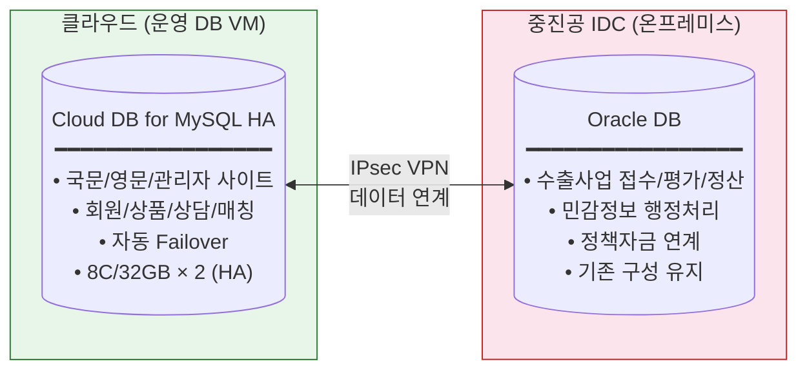


***

## 11. 중진공 IDC / 업무망 (온프레미스 유지)

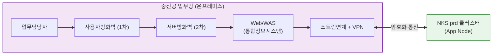

| 구성요소 | 역할 | 비고 |
| :-- | :-- | :-- |
| 사용자 방화벽 | 업무담당자 접속 보안 | 1차 보안 |
| 서버 방화벽 | 서버 영역 접근 통제 | 2차 보안 (이중 방화벽) |
| Web/WAS (통합정보시스템) | 수출사업 접수/평가/정산 | Oracle DB 연동 |
| 스트림 연계 + VPN | NKS prd 클러스터와 보안 통신 | 암호화 전용 채널 |


***

## 12. 외부 연계 시스템

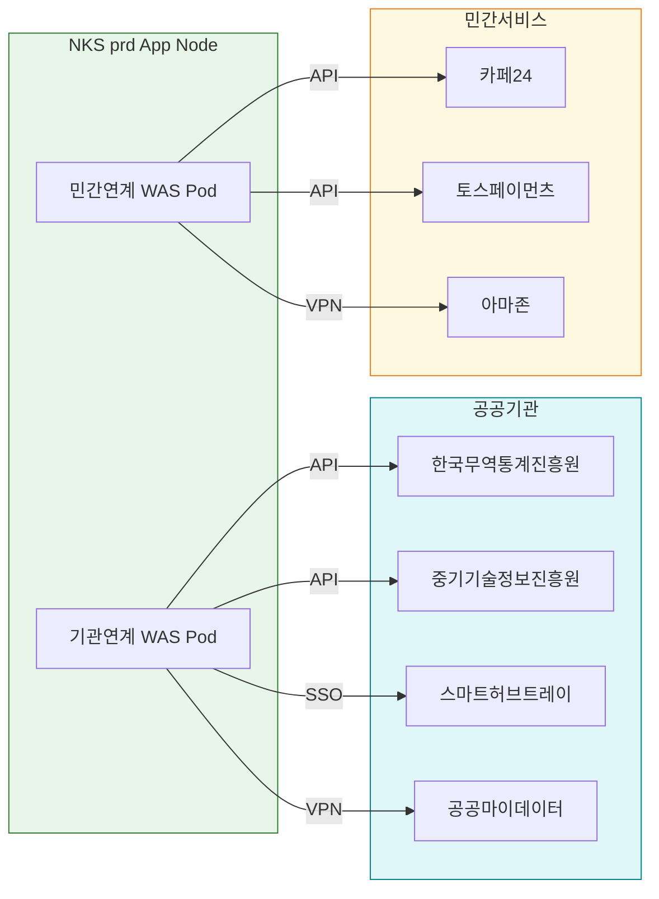

| \# | 연계 대상 | 유형 | 연계 방식 | 목적 |
| :-- | :-- | :-- | :-- | :-- |
| 1 | 한국무역통계진흥원 | 공공 | API | 무역 통계 연동 |
| 2 | 중기기술정보진흥원 | 공공 | API | 기술정보 연동 |
| 3 | 스마트허브트레이 | 공공 | SSO/API | 물류시스템, 회원 공유 |
| 4 | 공공마이데이터 | 공공 | VPN | 본인기업정보 요청/수신 |
| 5 | 카페24 | 민간 | API | 상품 양방향 연동 |
| 6 | 토스페이먼츠 | 민간 | API | 결제/매출 연동 |
| 7 | 아마존 | 민간 | VPN | 글로벌 상품 연동 |


***

## 13. 보안 아키텍처

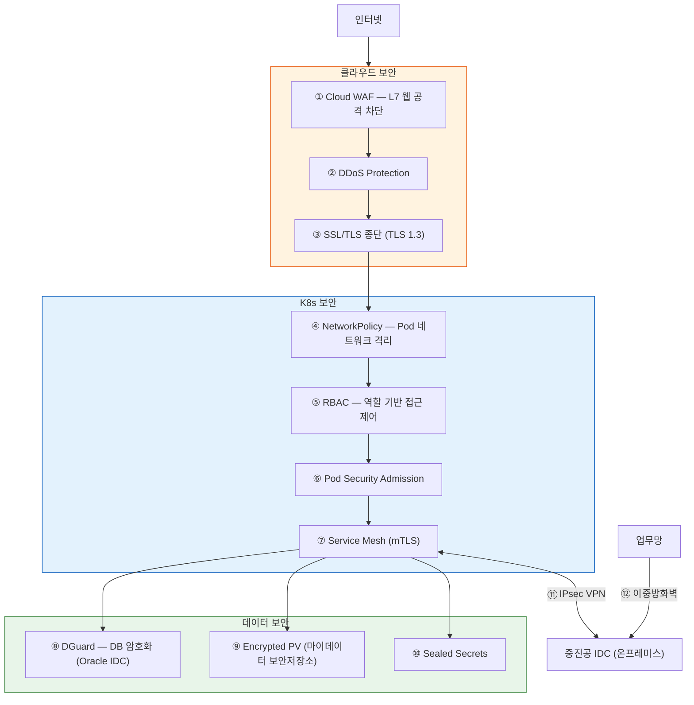


***

## 14. 가용성(HA) 및 확장성

### 14.1 HA 구성

| 구성요소 | HA 방식 | Replica | HPA | 비고 |
| :-- | :-- | :-- | :-- | :-- |
| Web Pod (영/국) | Deployment + HPA | 2 | 2~5 | Anti-Affinity Node 분산 |
| 사업관리 Web | Deployment + HPA | 2 | 2~4 | Anti-Affinity Node 분산 |
| 영문/국문 WAS | Deployment + HPA | 2 | 2~6 | 요청량 기반 확장 |
| 기관/민간 연계 WAS | Deployment + HPA | 1 | 1~3 | SPOF 개선 |
| Cloud DB MySQL | Primary-Standby HA | 2 | 수동 | CSP 자동 Failover (RTO < 5분) |
| Redis Cluster | StatefulSet | 3M+3R | 수동 | 자동 Failover |
| Control Plane | CSP Managed | 3중화 | — | CSP SLA 99.95% |
| App Node | ClusterAutoscaler | 2~4 | CA | CPU 70% 트리거 |

### 14.2 기존 SPOF 해소

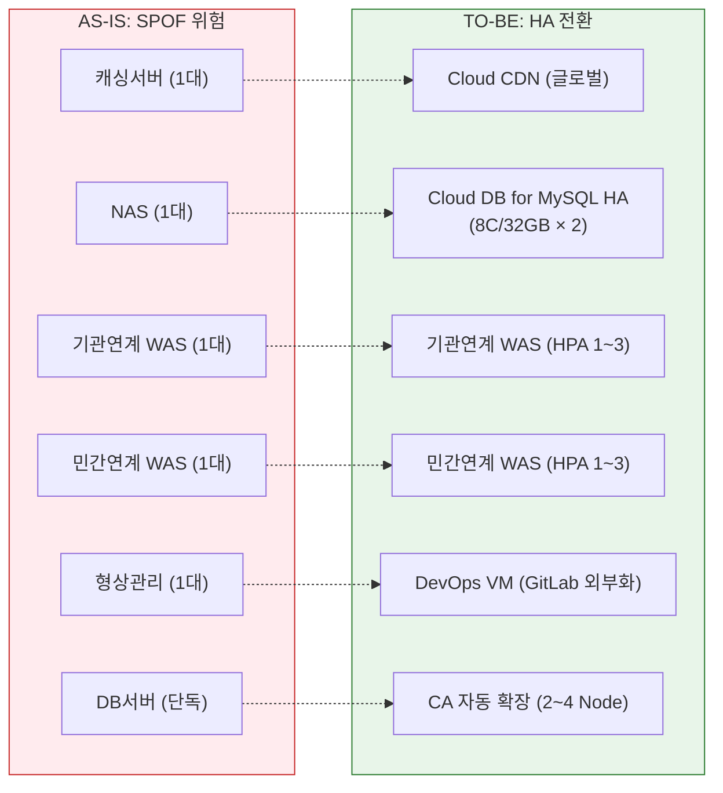


### 14.3 확장성

| 항목 | 구성 | 비고 |
| :-- | :-- | :-- |
| HPA (Pod 수평 확장) | CPU 70% 임계 기반 Pod 자동 확장 | 모든 Deployment 적용 |
| Cluster Autoscaler | Worker Node 자동 추가 (CPU 70%) | prd App Node CA: 2~4 |
| PDB | 전 운영 Deployment·StatefulSet | 롤링 업데이트 보장 |
| Node Auto-Repair | CSP 자동 복구 | 장애 Node 교체 |
| Cloud DB 스케일 | Read Replica 추가 가능 | CSP 관리형 확장 |


***

## 15. 배포 프로세스 (dev → prd GitOps)

```
1. 개발자 커밋
   └─→ GitLab (DevOps VM) Push + Merge Request

2. GitLab CI 파이프라인
   ├─ 빌드 (Maven/Gradle)
   ├─ 단위 테스트
   ├─ 이미지 빌드 + GitLab Container Registry 저장
   └─ dev 환경 Helm Values 업데이트

3. ArgoCD (dev 클러스터) — 자동 Pull
   └─→ dev 클러스터 자동 배포 (Rolling Update)

4. QA 검증 및 승인
   └─→ Release Tag 생성 → prd Helm Values 업데이트

5. ArgoCD (prd 클러스터) — 수동 Approval
   └─→ prd 클러스터 배포 (Blue-Green / Canary)
       └─ 이상 감지 시 ArgoCD Rollback
```


***

## 16. 자원 총괄표

### 16.1 NKS dev 클러스터

| \# | 노드 풀 | 수량 | 사양 | Pod 요청 | 오케스트레이션 | 총 사용 | CPU | MEM |
| :-- | :-- | :-- | :-- | :-- | :-- | :-- | :-- | :-- |
| 1 | WEB (DMZ) | ×1 | 4C/16GB | 2.0C/4.0GB | 0.5C/1.0GB | 2.5C/5.0GB | **62.5%** ✅ | **31.2%** ✅ |
| 2 | App (내부망) | ×1 | 8C/32GB | 6.5C/13.0GB | 0.5C/1.0GB | 7.0C/14.0GB | **87.5%** ✅ | **43.7%** ✅ |
| — | Control Plane | CSP | CSP Managed | — | — | — | — | — |

### 16.2 NKS prd 클러스터

| \# | 노드 풀 | 수량 | 사양 | Pod 요청 | 오케스트레이션 | 총 사용 | CPU | MEM |
| :-- | :-- | :-- | :-- | :-- | :-- | :-- | :-- | :-- |
| 1 | WEB (DMZ) | ×2 | 4C/16GB | 3.5C/7.0GB | 1.0C/2.0GB | 4.5C/9.0GB | **56.2%** ✅ | **28.1%** ✅ |
| 2 | App (CA 3노드 기준) | ×3 | 8C/32GB | 13.6C/30.25GB | 1.8C/3.6GB | 15.4C/33.85GB | **64.2%** ✅ | **35.3%** ✅ |
| — | Control Plane | CSP | CSP Managed | — | — | — | — | — |

### 16.3 외부 VM (K8s 외부 단독)

| \# | 구성요소 | 사양 | 용도 |
| :-- | :-- | :-- | :-- |
| 1 | **DevOps VM** | 4C/16GB/200GB | GitLab SCM + CI + Container Registry |
| 2 | **개발 DB VM** | **4C/16GB/200GB** | Cloud DB for MySQL (단독) |
| 3 | **운영 DB VM × 2** | **8C/32GB/500GB × 2** | Cloud DB for MySQL (HA Primary+Standby) |

### 16.4 온프레미스 (변경 없음)

| \# | 영역 | 구성요소 | 수량 | 용도 |
| :-- | :-- | :-- | :-- | :-- |
| 1 | 중진공 IDC | Web/WAS (통합정보시스템) | 1 | 수출사업 접수/평가/정산 |
| 2 | 중진공 IDC | Oracle DB | 1+ | 민감정보 처리, 정책자금 연계 |
| 3 | 중진공 업무망 | Web/WAS (업무담당자용) | 1 | 중진공 내부 업무 접속 |


***

## 17. AS-IS → TO-BE 전환 요약

| \# | 항목 | AS-IS | TO-BE | 효과 |
| :-- | :-- | :-- | :-- | :-- |
| 1 | **클러스터** | 단일 K8s | dev + prd 이중화 | 운영 안정성, 배포 리스크 분리 |
| 2 | **Control Plane** | Master VM ×3 명시 | **CSP Managed** | 운영 부담 제거, 자동 HA |
| 3 | **WEB Node** | Ingress+Web 혼재 | Web Pod만 (Ingress=시스템) | 아키텍처 명확화 |
| 4 | **WEB 구간** | 암묵적 | **DMZ 구간 명시** | 보안 정책 명확화 |
| 5 | **GitLab** | App Node Pod | **DevOps VM 단독** | SPOF 제거, 크로스 관리 |
| 6 | **Harbor** | App Node Pod | ❌ GitLab Registry 통합 | 중복 제거, 비용 절감 |
| 7 | **ArgoCD** | dev/prd 각 클러스터 내 유지 (GitOps Pull 방식) |
| 8 | **dev 구성** | WEB Node ×1 (4C/16GB) + App Node ×1 (8C/32GB) |
| 9 | **prd 구성** | WEB Node ×2 (4C/16GB) + App Node ×2 (8C/32GB, CA 2~4) |
| 10 | **Sizing 근거** | 동접 1,000명·50TPS 기준 산출, 전 노드 **90% 이하** 검증 완료 |
| 11 | **Data Node** | K8s Worker 완전 제거 → **Cloud DB for MySQL VM** (개발 ×1, 운영 ×2 HA) |
| 12 | **DB** | K8s Data Node StatefulSet | **Cloud DB for MySQL VM** | CSP HA, 운영 단순화 |
| 13 | **개발 DB** | 2C/4GB | **4C/16GB** | 개발 성능 보장 |
| 14 | **운영 DB** | 4C/16GB HA | **8C/32GB × 2 HA** | 운영 성능·가용성 보장 |
| 15 | **오케스트레이션** | 미산정 | **per-node 오버헤드 명시** | 정확한 용량 산정 |
| 16 | **CA 설계** | 단순 스케일 | **CA 2~4 (CPU 70% 트리거)** | 90% 이하 자동 유지 |


