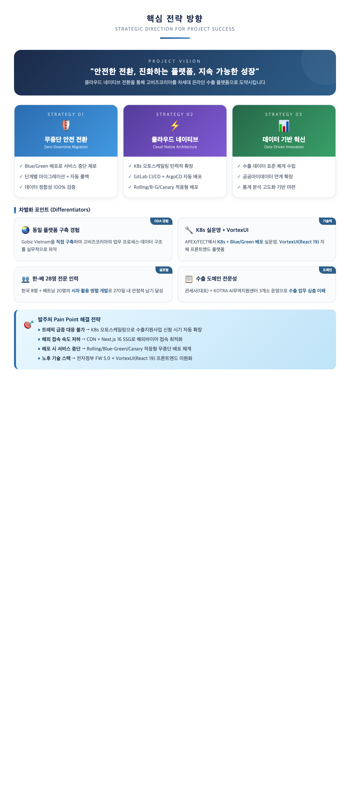
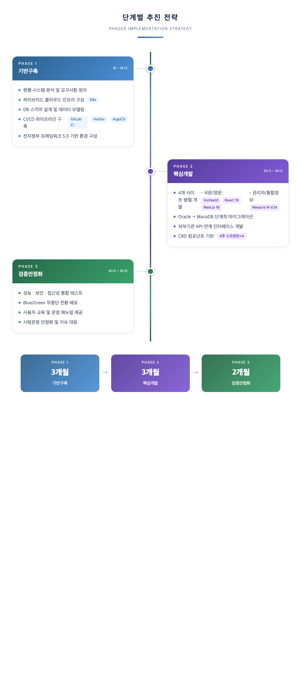
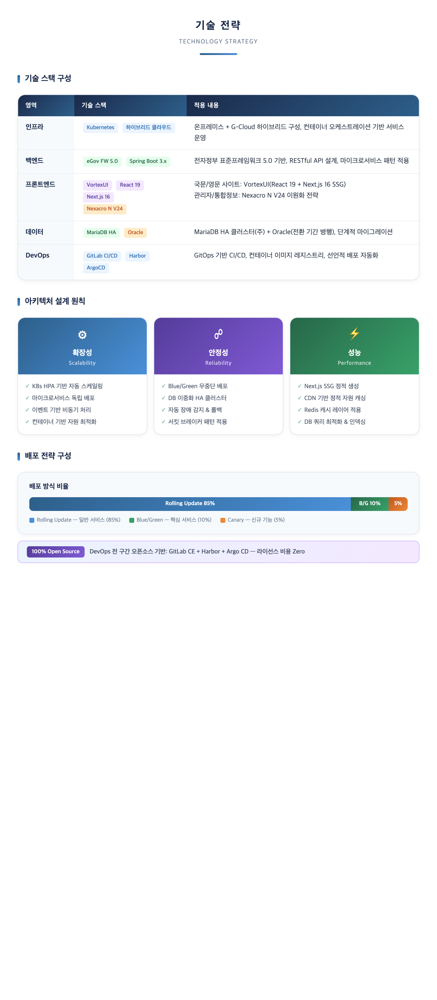
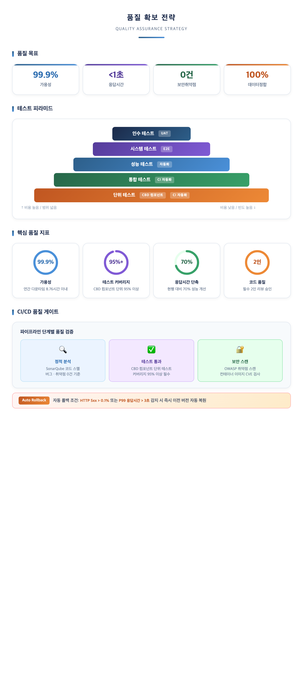
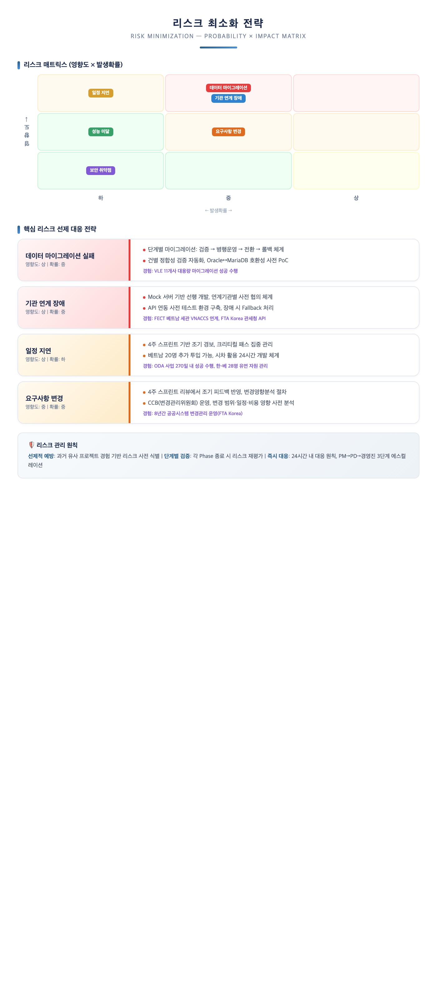
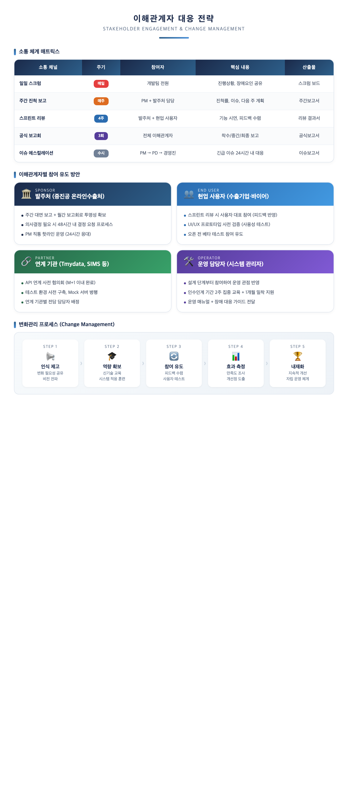
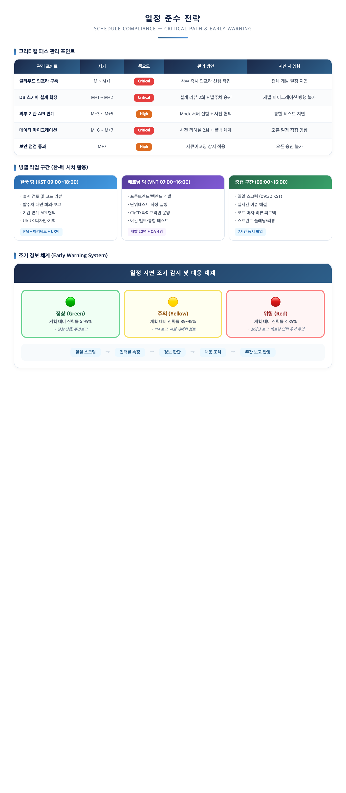

### 2.2 추진전략

---

#### 2.2.1 핵심 전략 방향 (Strategic Direction)

본 컨소시엄은 **"안전한 전환, 진화하는 플랫폼, 지속 가능한 성장"** 이라는 비전 아래, 고비즈코리아를 차세대 온라인 수출 플랫폼으로 도약시키기 위한 3대 핵심 전략을 수립하였습니다.

##### 전략적 접근 방향

본 사업의 핵심 목표인 **클라우드 전환**과 **플랫폼 재구축**을 동시에 달성하기 위해, 다음 3대 전략 원칙을 적용합니다.

| 전략 원칙 | 핵심 목표 | 구현 방안 | 대응 요구사항 |
|---------|---------|---------|----------|
| **무중단 안전 전환** | 서비스 중단 제로 | Blue/Green 배포 + 단계적 마이그레이션 + 자동 롤백 | SFR-001, SFR-002 |
| **클라우드 네이티브** | 탄력적 인프라 확보 | K8s 오토스케일링 + GitLab CI/CD + ArgoCD 자동 배포 | SFR-001, PER-001 |
| **데이터 기반 혁신** | 수출 데이터 가치 창출 | 데이터 표준 체계 + 공공마이데이터 연계 + 통계 고도화 | SFR-006, DAR-001 |

##### 차별화 포인트

| 차별화 요소 | 내용 | 근거 |
|---------|------|------|
| **동일 플랫폼 구축 경험** | Gobiz Vietnam(고비즈코리아 베트남 버전)을 직접 구축하여 업무 프로세스·데이터 구조 실무 파악 | ODA 사업 467백만원, 동일 발주기관 |
| **K8s 실운영 + VortexUI** | APEX/FECT에서 K8s + Blue/Green 배포 실운영, VortexUI(React 19 + Next.js 16) 자체 프론트엔드 플랫폼 보유 | SFR-001, COR-001 |
| **수출 도메인 전문성** | 관세사(대표) + KOTRA AI무역지원센터 3개소 운영, 수출 업무 심층 이해 | 8년 연속 FTA Korea 운영 |

##### 발주처 Pain Point 해결 전략

| 발주처 Pain Point | 해결 전략 | 기대 효과 |
|---------|---------|---------|
| 수출지원사업 신청 시기 트래픽 급증 | K8s HPA 오토스케일링으로 자동 확장 | 동시 접속 무제한 확장 |
| 해외바이어 접속 속도 저하 | CDN + Next.js 16 SSG 정적 사이트 배포 | 글로벌 접속 70%+ 개선 |
| 배포 시 서비스 중단 | Rolling/Blue-Green/Canary 적응형 무중단 배포 | 서비스 중단 제로 |
| 노후 기술 스택 | 전자정부 FW 5.0 + VortexUI(React 19 + Next.js 16) 프론트엔드 이원화 | 기술부채 해소 |

---

#### 2.2.2 단계별 추진 전략

프로젝트를 **기반 구축 → 핵심 개발 → 검증·안정화**의 3단계로 나누어, 각 단계의 핵심 목표에 집중하는 점진적 접근 전략을 적용합니다.

| 단계 | 기간 | 핵심 목표 | 주요 활동 | 마일스톤 |
|------|------|---------|---------|---------|
| **PHASE 1: 기반 구축** | M ~ M+3 | 안전한 전환 기반 확보 | 현행 분석, 하이브리드 클라우드 인프라 구축, DB 스키마 설계, CI/CD 구축(GitLab CI + Harbor + ArgoCD), 전자정부 FW 5.0 환경 구성 | 착수보고회 |
| **PHASE 2: 핵심 개발** | M+3 ~ M+6 | 4개 사이트 기능 구현 | 국문/영문 VortexUI(React 19 + Next.js 16) 개발, 관리자/통합정보 Nexacro N V24 개발, Oracle→MariaDB 마이그레이션, 외부기관 API 연계, CBD 4주 스프린트×4 | 중간보고회 |
| **PHASE 3: 검증·안정화** | M+6 ~ M+8 | 무결점 오픈 | 성능·보안·접근성 통합 테스트, Blue/Green 무중단 전환 실행, 사용자 교육, 시범운영 및 안정화 | 최종보고회 |

##### 각 단계의 전략적 초점

**PHASE 1 — "실패 없는 전환 기반 확보"**
- 착수 즉시 클라우드 인프라를 선행 구축하여 개발 환경 조기 확보
- DB 스키마 설계 리뷰 2회 + 발주처 승인으로 마이그레이션 리스크 선제 해소
- CI/CD 파이프라인(GitLab CE → Harbor → ArgoCD) 구축으로 자동 빌드/배포 체계 확립
- **KPI**: 요구사항 확정률 100%, PoC(기술 검증) 완료

**PHASE 2 — "CBD 컴포넌트 기반 민첩한 구축"**
- CBD 방법론 기반 컴포넌트 단위 재사용으로 4개 사이트 효율적 개발
- 프론트엔드 이원화: 국문/영문은 VortexUI(React 19 + Next.js 16 SSG), 관리자/통합정보는 Nexacro N V24
- 4주 스프린트 리뷰에서 발주처 피드백 조기 반영
- **KPI**: 스프린트당 기능 완료율 90%+, 스프린트 리뷰 4회

**PHASE 3 — "안전한 오픈, 무결점 인수인계"**
- 5단계 테스트(단위→통합→성능→시스템→인수) 체계적 수행
- Blue/Green 배포로 무중단 전환, Canary 배포로 리스크 사전 검증
- 사이트별 단계적 전환(관리자 → 국문 → 영문 → 통합정보) 안전성 확보
- **KPI**: 가용성 99.9%, 응답시간 1초 이내, 국정원 보안점검 통과

---

#### 2.2.3 기술 전략

##### (1) 기술 스택 선정 근거 및 방향성

본 사업의 기술 스택은 **RFP 지정 요건**과 **클라우드 네이티브 최적화**를 기준으로 선정하였습니다.

| 영역 | 기술 스택 | 선정 근거 | 기대 효과 |
|------|---------|---------|---------|
| **인프라** | K8s + 하이브리드 클라우드 | RFP 지정 민간클라우드 + 중진공 IDC 연계 필수(SFR-001) | 오토스케일링, 가용성 99.9% |
| **백엔드** | eGov FW 5.0 + Spring Boot 3.x | RFP 의무사항, 공공시스템 표준 준수(COR-001) | 기술부채 해소, 최신 보안 패치 |
| **프론트(대민)** | VortexUI — React 19 + Next.js 16 SSG | 반응형 웹, SEO 최적화, 디지털정부서비스 가이드라인 | CDN 글로벌 배포, 디자인 유연성 |
| **프론트(행정)** | Nexacro N V24 | RFP 지정 SW, 대량 데이터 그리드 처리 최적화 | 업무 양식 표준화, 업무 효율성 |
| **데이터** | MariaDB HA + Oracle(기존) | 공개SW 전환 요구, 기존 Oracle 병행(SFR-006) | 라이선스 비용 절감 |
| **DevOps** | GitLab CE + Harbor + ArgoCD | 100% 오픈소스, SCM+CI 통합 단일 플랫폼 | 배포 주기 30배 단축 |

##### (2) 아키텍처 전략 — 3대 설계 원칙

| 설계 원칙 | 구현 방안 | 대응 요구사항 |
|---------|---------|----------|
| **확장성 (Scalability)** | K8s HPA로 CPU/메모리 기반 자동 스케일링, 수출지원사업 신청 시기 트래픽 급증 자동 대응 | SFR-001, PER-004 |
| **안정성 (Reliability)** | MariaDB HA 이중화, Blue/Green 무중단 배포, 자동 Health Check 및 장애 복구, 수 초 이내 롤백 | PER-001, SFR-002 |
| **성능 (Performance)** | CDN 글로벌 캐싱 + Next.js 16 SSG 정적 배포, Nginx 리버스 프록시, 응답시간 1초 이내 | PER-003, SFR-005 |

##### (3) 적응형 무중단 배포 전략

배포 규모와 위험도에 따라 **3대 배포 전략을 선택 적용**하는 적응형 배포 체계를 구축합니다.

| 배포 전략 | 적용 비율 | 핵심 가치 | 적용 대상 | 롤백 소요시간 |
|---------|---------|---------|---------|---------|
| **Rolling Update** | ~85% | 안정성 + 효율성 | 일상적 패치, 설정 변경, 버그 수정 | 1~3분 |
| **Blue/Green** | ~10% | 즉시 전환 + 즉시 롤백 | 대규모 릴리스, DB 스키마 변경 | **수 초** |
| **Canary** | ~5% | 리스크 사전 검증 | 신규 기능, 성능 영향 불확실 변경 | **수 초** |

> **자동 롤백 조건**: ① HTTP 5xx 에러율 배포 전 대비 2배 이상 ② P99 응답시간 3초 초과 ③ Health Check 연속 실패 3회 → **사람 개입 없이 즉시 자동 롤백**

---

#### 2.2.4 품질 확보 전략

##### (1) 품질 목표 및 품질 보증 접근 방식

본 컨소시엄은 **"사후 품질관리가 아닌, 사전 품질 내재화"** 를 원칙으로 CBD 컴포넌트 단위 품질 검증과 CI/CD 자동화 품질 게이트를 적용합니다.

| 품질 목표 | 목표치 | 달성 방안 | 대응 요구사항 |
|---------|------|---------|----------|
| **시스템 가용성** | 99.9% 이상 | K8s HA 구성 + 자동 복구 + Blue/Green 배포 | PER-001 |
| **페이지 응답시간** | 1초 이내 | CDN + Next.js 16 SSG + Nginx 캐싱 + 오토스케일링 | PER-003 |
| **보안 취약점** | 0건 | 시큐어코딩 + 정적/동적 보안 분석 + 국정원 보안성 검토 | SER-001~007 |
| **데이터 정합성** | 100% | Oracle→MariaDB 건별 자동 검증 + 정합성 리포트 | DAR-001 |
| **테스트 커버리지** | 95%+ | CBD 컴포넌트 단위 테스트 + CI/CD 품질 게이트 | TER-001~004 |

##### (2) 5단계 테스트 전략

| 단계 | 테스트 유형 | 방법 | 자동화 수준 | 도구 |
|------|---------|------|---------|------|
| 1 | **단위 테스트** | CBD 컴포넌트별 메서드 단위 검증 | 자동화 (CI 연동) | JUnit 5, Vitest |
| 2 | **통합 테스트** | API 연계·DB 트랜잭션·컴포넌트 간 연계 검증 | 자동화 (CI 연동) | Spring Test, Mockito |
| 3 | **성능 테스트** | 부하·스트레스·동시접속 검증 | 반자동 | JMeter, K6 |
| 4 | **시스템 테스트** | 보안점검·접근성·호환성 종합 검증 | 반자동 | SonarQube, OWASP ZAP |
| 5 | **인수 테스트(UAT)** | 발주처 현업 사용자 최종 검증 | 수동 | 업무 시나리오 기반 |

##### (3) CI/CD 품질 게이트

CI/CD 파이프라인에 **품질 게이트**를 설정하여, 기준 미달 시 배포를 자동 차단합니다.

| 품질 게이트 | 검증 내용 | 통과 기준 | 미달 시 조치 |
|---------|---------|---------|---------|
| **정적 분석** | SonarQube 코드 품질 검증 | 버그 0건, 코드 스멜 A등급 | 빌드 차단, 개발자 알림 |
| **테스트 통과** | CBD 컴포넌트 단위·통합 테스트 | 커버리지 80% 이상, 전 테스트 통과 | 빌드 차단 |
| **보안 스캔** | OWASP 취약점 + CVE 스캔 | Critical/High 0건 | 배포 차단, 보안팀 알림 |

---

#### 2.2.5 리스크 최소화 전략

##### (1) 핵심 리스크 식별 및 선제적 대응

본 컨소시엄은 유사 프로젝트 경험을 기반으로 핵심 리스크를 사전 식별하고, 선제적 대응 전략을 수립하였습니다.

| 리스크 | 영향도 | 확률 | 선제적 대응 전략 | 컨소시엄 경험 근거 |
|--------|------|------|---------|------------|
| **데이터 마이그레이션 실패** | 상 | 중 | 단계별 마이그레이션(검증→병행운영→전환→롤백), 건별 정합성 자동 검증, Oracle↔MariaDB 호환성 사전 PoC | VLE 11개사 대용량 마이그레이션 성공 |
| **기관 연계 장애** | 상 | 중 | Mock 서버 기반 선행 개발, 연계기관별 사전 협의, API 장애 시 Fallback 처리 | FECT 베트남 세관 VNACCS 연계, FTA Korea 관세청 API |
| **일정 지연** | 상 | 하 | 4주 스프린트 기반 조기 경보, 크리티컬 패스 집중 관리, 인력 추가 투입 체계 확보 | ODA 사업 270일 내 성공 수행 |
| **요구사항 변경** | 중 | 중 | 4주 스프린트 리뷰 조기 피드백, CCB(변경관리위원회) 운영, 변경 영향분석 절차 | FTA Korea 8년간 공공시스템 변경관리 |
| **성능 미달** | 중 | 하 | 성능 테스트 자동화(JMeter/K6), 병목 구간 사전 식별, 오토스케일링 정책 최적화 | APEX 250개 기업 동시 서비스 |
| **보안 취약점** | 상 | 하 | 시큐어코딩 상시 적용, 정적/동적 보안 분석, 국정원 보안성 검토 대비 | FTA Korea 8년간 보안 준수 실적 |

##### (2) 리스크 관리 원칙

| 원칙 | 적용 방법 |
|------|---------|
| **선제적 예방** | 과거 유사 프로젝트 경험 기반 리스크 사전 식별, PoC 수행 |
| **단계별 검증** | 각 Phase 종료 시 리스크 재평가, 리스크 등록부 갱신 |
| **즉시 대응** | 24시간 내 대응 원칙, PM→PD→경영진 3단계 에스컬레이션 |

---

#### 2.2.6 이해관계자 대응 전략

##### (1) 소통 체계 매트릭스

| 소통 채널 | 주기 | 참여자 | 핵심 내용 | 산출물 |
|---------|------|--------|---------|--------|
| **일일 스크럼** | 매일 | 개발팀 전원 | 진행상황, 장애요인 공유 | 스크럼 보드 |
| **주간 진척 보고** | 매주 | PM + 발주처 담당 | 진척률, 이슈, 다음 주 계획 | 주간보고서 |
| **스프린트 리뷰** | 4주 | 발주처 + 현업 사용자 | 기능 시연, 피드백 수렴 | 리뷰 결과서 |
| **공식 보고회** | 3회 | 전체 이해관계자 | 착수/중간/최종 보고 | 공식보고서 |
| **이슈 에스컬레이션** | 수시 | PM → PD → 경영진 | 긴급 이슈 24시간 내 대응 | 이슈보고서 |

##### (2) 현업 사용자 참여 유도 방안

| 이해관계자 | 참여 방식 | 핵심 활동 |
|---------|---------|---------|
| **발주처 (중진공)** | 주간 대면 보고 + 월간 보고회 | 의사결정 48시간 내 요청, PM 직통 핫라인 24시간 |
| **현업 사용자** | 스프린트 리뷰 참여 | UI/UX 프로토타입 검증, 오픈 전 베타 테스트 |
| **연계 기관** | API 연계 사전 협의회 | 테스트 환경 구축, 기관별 전담 담당자 배정 |
| **운영 담당자** | 설계 단계부터 참여 | 인수인계 2주 집중 교육 + 1개월 밀착 지원 |

##### (3) 변화관리(Change Management) 프로세스

인식 제고(비전 전파) → 역량 확보(신기술 교육) → 참여 유도(피드백 수렴·사용자 테스트) → 효과 측정(만족도 조사) → 내재화(자립 운영 체계)

---

#### 2.2.7 일정 준수 전략

##### (1) 크리티컬 패스 관리

| 관리 포인트 | 시기 | 중요도 | 관리 방안 | 지연 시 영향 |
|---------|------|--------|---------|---------|
| **클라우드 인프라 구축** | M ~ M+1 | Critical | 착수 즉시 인프라 선행 작업 | 전체 개발 일정 지연 |
| **DB 스키마 설계 확정** | M+1 ~ M+2 | Critical | 설계 리뷰 2회 + 발주처 승인 | 개발·마이그레이션 병행 불가 |
| **외부 기관 API 연계** | M+3 ~ M+5 | High | Mock 서버 선행 + 사전 협의 | 통합 테스트 지연 |
| **데이터 마이그레이션** | M+6 ~ M+7 | Critical | 사전 리허설 2회 + 롤백 체계 | 오픈 일정 직접 영향 |
| **보안 점검 통과** | M+7 | High | 시큐어코딩 상시 적용 | 오픈 승인 불가 |

##### (2) 조기 경보 체계 (Early Warning System)

| 경보 수준 | 조건 | 대응 조치 |
|---------|------|---------|
| **🟢 정상 (Green)** | 계획 대비 진척률 ≥ 95% | 정상 진행, 주간보고 |
| **🟡 주의 (Yellow)** | 계획 대비 진척률 85~95% | PM 보고, 자원 재배치 검토 |
| **🔴 위험 (Red)** | 계획 대비 진척률 < 85% | 경영진 보고, 인력 추가 투입 |

> **경보 프로세스**: 일일 스크럼 → 진척률 측정 → 경보 판단 → 대응 조치 → 주간 보고 반영

---

#### 2.2.8 안정적 전환/오픈 전략

##### (1) 전환 방식 비교 및 선정

| 비교 항목 | 빅뱅(일괄 전환) | 단계적 전환 (Phased Rollout) |
|---------|---------|---------|
| 서비스 중단 위험 | 높음 (전면 중단) | **낮음** (사이트별 순차 전환) |
| 롤백 용이성 | 어려움 (전체 롤백) | **용이** (개별 사이트 롤백) |
| 리스크 수준 | 높음 | **단계별 분산** |
| 전환 기간 | 짧음 (1회) | 길지만 안전 (4단계) |
| **본 사업 적합성** | 미선정 | **✓ 채택** |

> 본 사업은 5만여 개 중소기업과 글로벌 바이어가 실시간 거래하는 플랫폼 특성을 고려하여, **단계적 전환(Phased Rollout) + Blue/Green 배포**를 채택합니다.

##### (2) 단계적 전환 로드맵

| STEP | 대상 | 주요 활동 | 검증 기간 |
|------|------|---------|---------|
| **1. 사전 검증** | 전체 | 전환 리허설 2회, 데이터 정합성 검증, 롤백 시나리오 확인 | 2주 |
| **2. 관리자 전환** | 관리자사이트 | 내부 사용자 우선 전환, 1주간 안정성 확인 | 1주 |
| **3. 국문사이트** | 국문사이트 | Blue/Green 전환, 트래픽 모니터링, 사용자 피드백 수집 | 1주 |
| **4. 영문사이트** | 영문사이트 | CDN 글로벌 캐싱 확인, 해외 접속 성능 검증 | 1주 |
| **5. 통합정보** | 통합정보시스템 | 기관 연계 최종 확인, 전체 안정화 선언 | 1주 |

##### (3) 데이터 마이그레이션 전략 (Oracle → MariaDB)

**Oracle(중진공 IDC)** → **ETL 변환**(스키마 변환·데이터 정제·매핑) → **정합성 검증**(건별 자동 비교·무결성 확인) → **MariaDB HA**(민간클라우드 이중화 신규 DB)

| 마이그레이션 단계 | 내용 | 리스크 대응 |
|---------|------|---------|
| **사전 분석** | Oracle 프로시저/함수 호환성 매핑표 작성 | Oracle↔MariaDB PoC 수행 |
| **데이터 추출** | ETL 도구 기반 스키마 변환, 데이터 정제 | 변환 규칙 사전 검증 |
| **정합성 검증** | 건별 자동 비교, 무결성 리포트 생성 | 100% 일치 확인 후 진행 |
| **전환 실행** | 병행 운영 기간 후 최종 전환 | 5분 이내 롤백 체계 구축 |

##### (4) 오픈 전후 안정화 대응

| 시점 | 기간 | 핵심 활동 |
|------|------|---------|
| **오픈 전 (D-14)** | 2주 | 전환 리허설, 성능 부하 테스트, 롤백 시나리오 확인, 비상 연락망 구성 |
| **오픈 당일 (D-Day)** | 1일 | Blue/Green 전환, 전담팀 24시간 대기, 실시간 모니터링, 5분 롤백 대기 |
| **오픈 후 (D+30)** | 30일 | 집중 모니터링, 긴급 패치 체계, 사용자 피드백 대응, 성능 최적화 |

