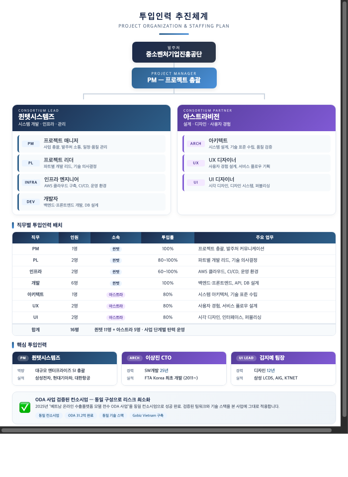
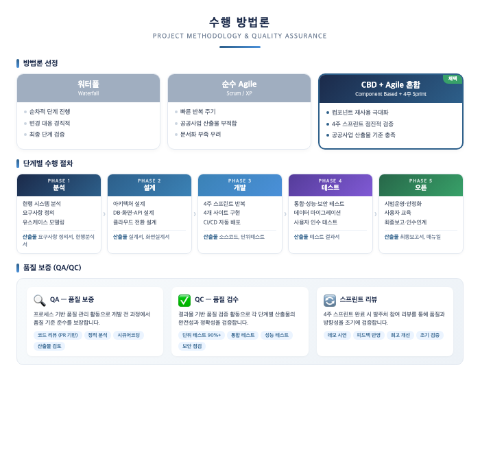
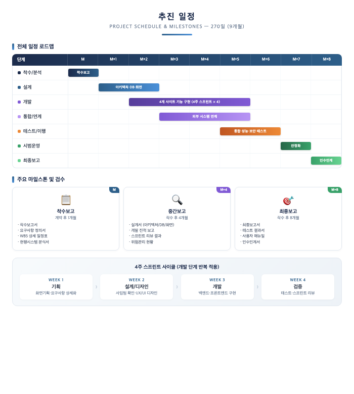
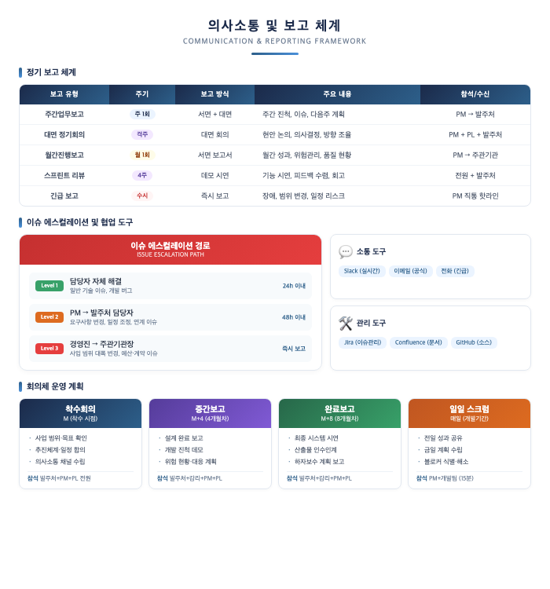

## II. 추진전략 및 방법

### 2.6 추진체계

#### 2.6.1 조직 구성

본 사업은 **퀸텟시스템즈(총괄)**와 **아스트라비전**이 공동수급 컨소시엄을 구성하여 수행합니다. 퀸텟시스템즈가 PM·PL·인프라·개발을 담당하고, 아스트라비전이 아키텍처 설계·UX/UI 디자인을 전담하는 명확한 역할 분담 체계를 적용합니다.

*[그림 2-7] 프로젝트 투입인력 추진체계*

---

#### 2.6.2 수행 방법론

본 사업은 **CBD(Component Based Development) 기반 반복적/점진적 개발 방법론**을 적용합니다. CBD 방법론은 재사용 가능한 컴포넌트 단위로 시스템을 설계/개발하여 개발 생산성과 품질을 동시에 확보하는 방법론으로, 본 사업의 4개 사이트 재구축 및 하이브리드 클라우드 전환에 최적화된 접근 방식입니다. 4주 스프린트 단위 반복을 통해 조기에 품질과 방향성을 검증합니다.

*[그림 2-8] 수행 방법론 및 품질 보증 체계*

---

#### 2.6.3 추진 일정

계약체결일로부터 **270일(약 9개월)** 이내에 완료하며, 착수보고(M) → 중간보고(M+4) → 최종보고(M+8) 3대 마일스톤을 중심으로 체계적으로 관리합니다.

*[그림 2-9] 추진 일정 로드맵 및 마일스톤*

---

#### 2.6.4 의사소통 및 보고 체계

PM을 중심으로 주간/월간 정기 보고, 격주 대면 회의, 3단계 에스컬레이션 경로를 운영하여 발주처와의 원활한 소통을 보장합니다.

*[그림 2-10] 의사소통 및 보고 체계*
