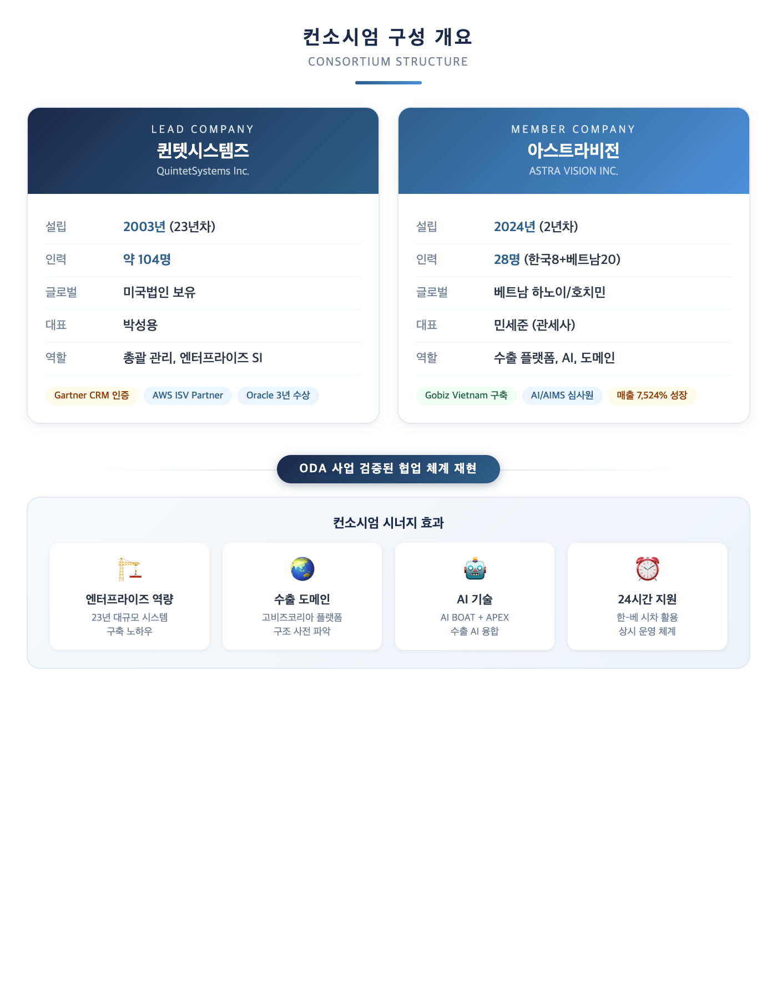
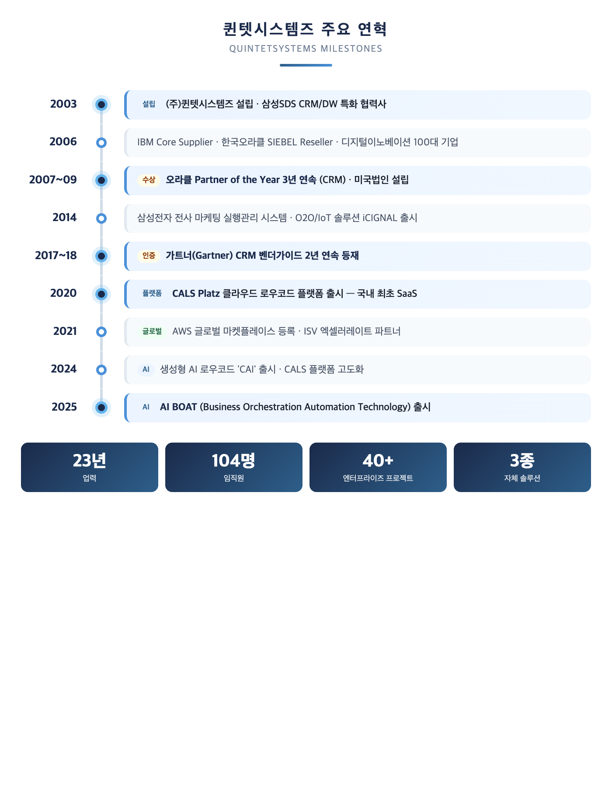
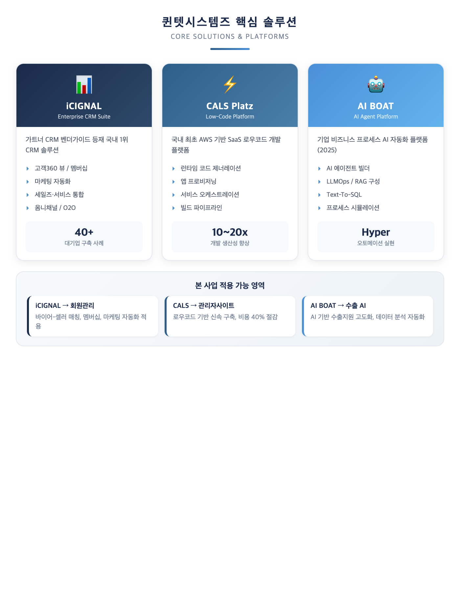
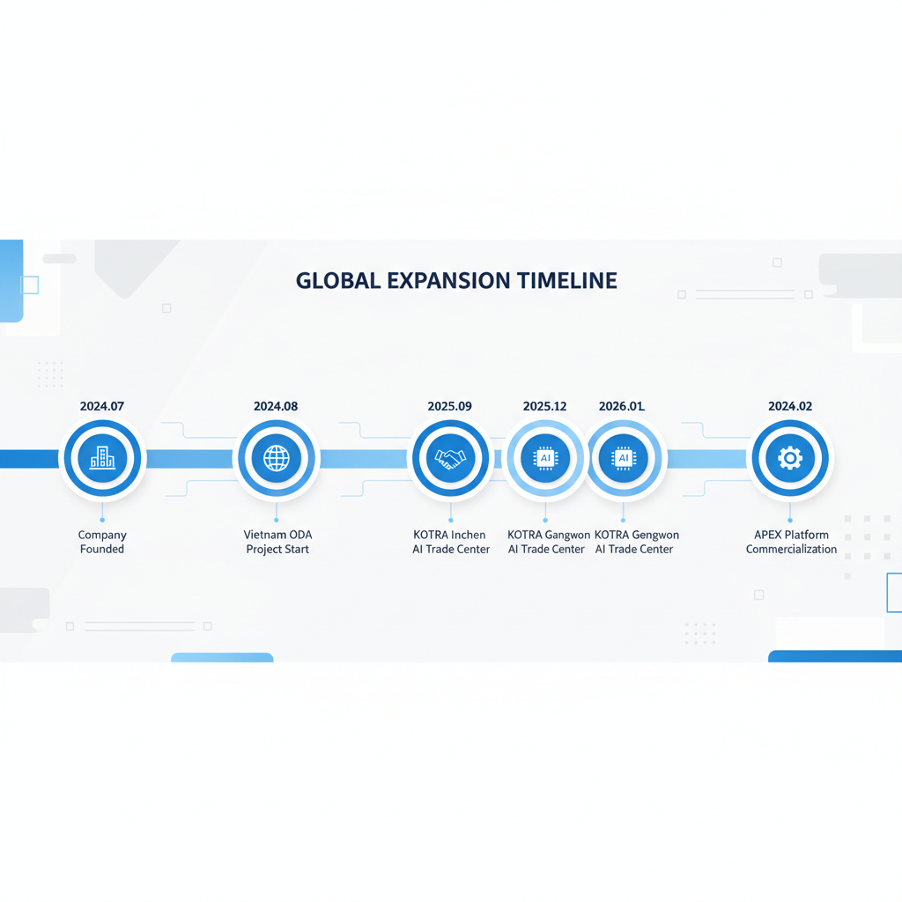
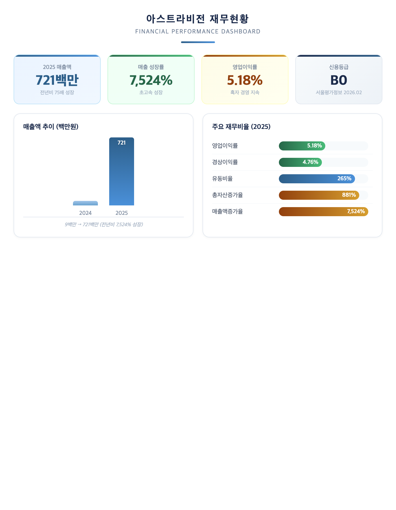
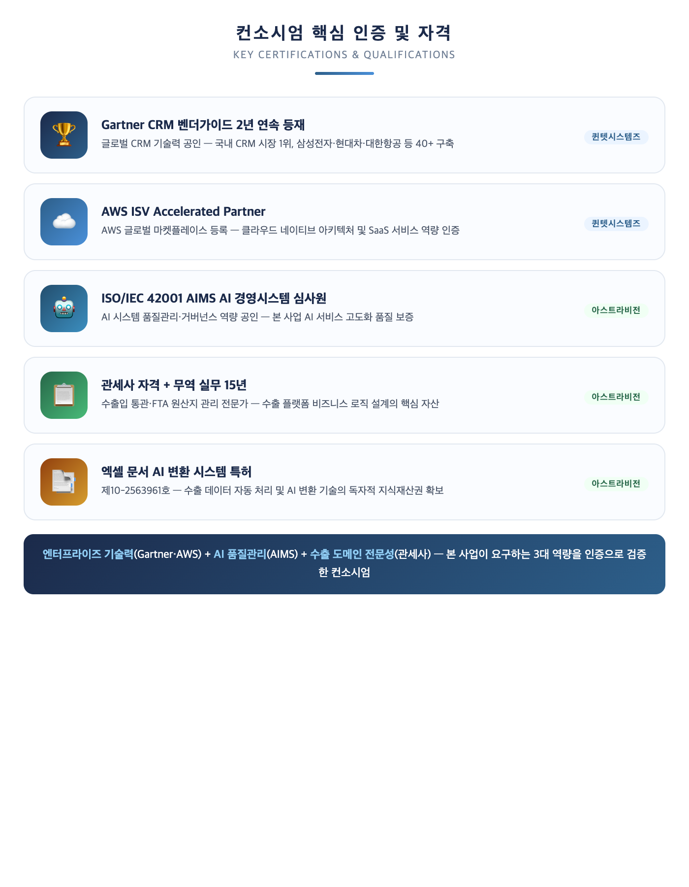
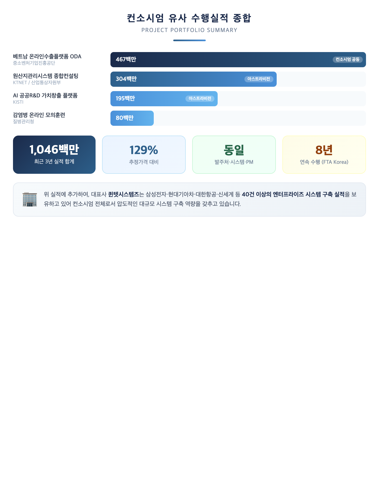

## I. 일반현황

### 1.1 제안사 일반현황

> **핵심 메시지**: CRM 시장 1위·가트너 인증 기업 퀸텟시스템즈(총괄)와 고비즈코리아 베트남 버전(Gobiz Vietnam)을 직접 구축한 수출 플랫폼 전문 기업 아스트라비전이 결합한 컨소시엄. 23년 엔터프라이즈 시스템 구축 역량과 수출 도메인 전문성의 최적 조합

---

#### 1.1.1 컨소시엄 구성 개요

본 사업은 **퀸텟시스템즈(총괄)**와 **아스트라비전**이 공동수급 컨소시엄을 구성하여 제안합니다. 양사는 2025년 중소벤처기업진흥공단 발주 "베트남 온라인 수출플랫폼 모델 전수 ODA 사업"을 동일 컨소시엄으로 성공 수행한 바 있으며, 이번 사업에서도 검증된 협업 체계를 그대로 재현합니다.

*[그림 1-1] 컨소시엄 구성 개요 — 퀸텟시스템즈(대표사) + 아스트라비전(참여사)*

---

#### 1.1.2 대표사: 퀸텟시스템즈

**(1) 기업 개요**

주식회사 퀸텟시스템즈는 2003년 설립된 CRM 솔루션 및 로우코드 플랫폼 전문 기업으로, **국내 CRM 시장 1위**, **가트너(Gartner) CRM 벤더가이드 2년 연속 등재**(2017~2018)의 글로벌 수준 기술력을 보유하고 있습니다. 삼성전자, 현대기아자동차, SK텔레콤, 대한항공 등 국내 대표 기업 대다수를 고객사로 확보하고 있으며, 미국법인을 포함한 글로벌 사업을 영위하고 있습니다.

| 항목 | 내용 |
|------|------|
| **회사명** | 주식회사 퀸텟시스템즈 (QuintetSystems Inc.) |
| **대표이사** | 박성용 |
| **설립일** | 2003년 5월 21일 |
| **소재지** | 서울특별시 영등포구 여의나루로 71, 동화빌딩 16층 |
| **업종** | 응용 소프트웨어 개발 및 공급업 (정보통신업) |
| **기업 유형** | 중소기업 |
| **인력 규모** | **약 104명** |
| **주요 사업** | CRM 솔루션, 로우코드 개발 플랫폼, AI 에이전트 플랫폼, SaaS 서비스 |
| **해외 법인** | 미국법인 (2008년 설립) |

**(2) 주요 연혁**

퀸텟시스템즈는 2003년 설립 이래 23년간 CRM 솔루션, 클라우드 로우코드 플랫폼, AI 에이전트 플랫폼 영역에서 지속적으로 기술 혁신을 이뤄왔습니다.

*[그림 1-2] 퀸텟시스템즈 주요 연혁 타임라인*

**(3) 핵심 솔루션 및 차별화 요소**

퀸텟시스템즈는 자체 개발한 3대 핵심 솔루션을 보유하고 있으며, 본 사업의 대규모 엔터프라이즈 시스템 구축에 직접 활용 가능한 기술 역량을 갖추고 있습니다.

*[그림 1-3] 퀸텟시스템즈 핵심 솔루션 3종 및 본 사업 적용 영역*

**(4) 대표 수행 실적**

퀸텟시스템즈는 통신, 자동차, 항공, 유통, 에너지 등 전 산업군에 걸쳐 국내 대표 기업들의 엔터프라이즈 시스템을 구축해왔습니다.

| 고객사 | 업종 | 프로젝트 내용 |
|--------|------|--------------|
| **삼성전자** | 전자 | 블루멤버십, 전사 마케팅·멤버십·BI 시스템, SAP CRM 마케팅 실행관리 |
| **현대기아자동차** | 자동차 | 전사 통합 CRM, 미국법인 CRM, 통합포인트 서비스마스터 |
| **SK텔레콤** | 통신 | 옴니채널 마케팅, 디지털 마케팅 솔루션 |
| **대한항공** | 항공 | SKY PASS 멤버십 시스템 재구축 |
| **신세계 이마트** | 유통 | S-POINT 그룹통합 멤버십 관리 시스템 신규 구축 |
| **KT** | 통신 | 통합 세일즈·AI 기반 마케팅·멤버십, BIT CRM 구축 |
| **다이소** | 유통 | CRM 기반 멤버십(Loyalty) 및 개인화 마케팅 시스템 |
| **롯데GRS** | 외식 | iCIGNAL CRM 롯데잇츠(Lotte Eatz) 멤버십 리뉴얼 |

> 퀸텟시스템즈는 **40건 이상**의 엔터프라이즈 CRM/마케팅 시스템 구축 실적을 보유하고 있으며, 이는 본 사업에서 요구하는 대규모 웹 시스템 구축, 회원 관리, 마케팅 자동화 역량을 입증합니다.

---

#### 1.1.3 참여사: 아스트라비전

**(1) 기업 개요**

주식회사 아스트라비전은 AI 기반 수출 플랫폼 전문 기업으로서, 중소벤처기업진흥공단이 발주한 "베트남 온라인 수출플랫폼 모델 전수 ODA 사업"을 성공적으로 수행한 실적을 보유하고 있습니다. 본 사업의 대상 시스템인 온라인수출플랫폼(고비즈코리아)의 베트남 버전을 직접 설계하고 구축한 경험을 바탕으로, 수출 플랫폼의 기술 아키텍처와 비즈니스 로직에 대한 깊은 이해를 갖추고 있습니다.

| 항목 | 내용 |
|------|------|
| **회사명** | 주식회사 아스트라비전 (ASTRA VISION INC.) |
| **대표이사** | 민세준 |
| **설립일** | 2024년 7월 1일 |
| **사업자등록번호** | 821-87-03142 |
| **업종** | 응용 소프트웨어 개발 및 공급업 (JS8222) |
| **기업 유형** | 중소기업 (일반법인) |
| **주요 매출 품목** | 제조기업 무역 AI 플랫폼 서비스(SaaS) |
| **총 인력** | 28명 (한국 8명 + 베트남 20명) |

**(2) 글로벌 4개 거점 운영 체계**

아스트라비전은 한국 본사와 서울 연구소, 베트남 하노이 및 호치민 등 4개 거점을 운영하여 글로벌 협업 체계를 갖추고 있습니다. 이는 본 사업의 클라우드 전환 및 재구축 과정에서 24시간 운영 지원 체계를 구현하는 데 직접적으로 기여합니다.

| 거점 | 주소 | 역할 |
|------|------|------|
| **본사** | 경기도 성남시 수정구 창업로40번길 20, 10-1호 | 경영총괄, 사업운영 |
| **서울 연구소** | 서울특별시 서대문구 세무서3길 19, 1층 | AI R&D, 기술 개발 |
| **베트남 하노이** | 86 Me Tri Ha, Tu Liem, Hanoi | 해외 개발 및 운영 |
| **베트남 호치민** | 72 Le Thanh Ton, District 1, HCMC | 남부 거점 |

**(3) 주요 연혁**

아스트라비전은 2024년 7월 설립 이후 빠르게 성장하며 수출 플랫폼 분야에서 핵심 사업자로 자리매김하고 있습니다. 본 컨소시엄의 핵심 인력은 2011년부터 FTA Korea 시스템을 개발해온 경험을 보유하고 있으며, 이 기술 역량을 기반으로 설립 직후부터 대형 공공사업을 수주하고 성공적으로 수행하고 있습니다.

*[그림 1-4] 아스트라비전 주요 연혁 타임라인*

| 시기 | 내용 |
|------|------|
| **2024.07** | **주식회사 아스트라비전 법인 설립** |
| 2024.08 | FECT(관세무역 원활화 지원 포털) 상용 서비스 개시 |
| 2024.09 | 베트남 공공 온라인 수출플랫폼 모델 전수 ODA 사업 착수 (중소벤처기업진흥공단) |
| 2024.12 | 원산지관리시스템 종합컨설팅 시스템 개발용역 완료 (KTNET, 304백만원) |
| 2025.06 | ODA 사업 용역 계약 체결 (467백만원, 담사 지분) |
| 2025.09 | KOTRA 인천 AI무역지원센터 운영 개시 |
| 2025.11 | ODA 사업 성공적 완료 |
| 2025.12 | KOTRA 강원 AI무역지원센터 운영 개시 |
| **2026.01** | **KOTRA 경북 AI무역지원센터 운영 개시 (3개소 운영)** |
| 2026.02 | 수출 전주기 AI 통합 플랫폼(APEX) 상용화 추진 |

> 본 컨소시엄의 핵심 인력은 **FTA Korea 원산지관리시스템 최초 개발(2011년)**부터 **8년 연속(2018~2025) 원산지관리시스템 종합컨설팅 사업** 수행에 이르기까지, 무역 IT 분야에서 15년 이상의 기술 역량을 축적해 왔습니다.

---

#### 1.1.4 재무현황 및 경영상태

**(1) 매출 및 수익 현황**

아스트라비전은 설립 2년차인 2025년에 매출액 721백만원을 달성하며, 전년 대비 **7,524%의 초고속 성장**을 기록하였습니다. 이는 단순한 수치적 성장이 아니라, 중소벤처기업진흥공단 ODA 사업(467백만원), KTNET 원산지관리시스템(304백만원) 등 대형 공공사업을 성공적으로 수행한 결과입니다.

*[그림 1-5] 아스트라비전 재무현황 대시보드*

| 구분 | 2023년 | 2024년 | 2025년 |
|------|--------|--------|--------|
| 총자산(백만원) | 0 | 24 | **238** |
| 자기자본(백만원) | 0 | 20 | **51** |
| 매출액(백만원) | 0 | 9 | **721** |
| 당기순이익(백만원) | 0 | 0 | **30** |

**(2) 신용 평가**

| 항목 | 내용 |
|------|------|
| **신용등급** | **B0** (서울평가정보) |
| 등급 평가일 | 2026년 2월 2일 |
| 등급 유효기한 | 2027년 2월 1일 |
| 재무결산 기준일 | 2025년 12월 31일 |

> 설립 2년차에 매출액 7.2억원을 달성하며, 영업이익률 5.18%의 흑자 경영을 유지하고 있습니다. 이는 기술력 기반의 건전한 성장을 의미합니다.

---

#### 1.1.5 보유 인증 및 자격

본 컨소시엄은 엔터프라이즈 시스템 기술력, AI 품질관리, 수출 도메인 전문성을 공인하는 핵심 인증과 자격을 보유하고 있습니다.

*[그림 1-6] 컨소시엄 핵심 인증 및 자격*

---

#### 1.1.6 정보화사업 유사 수행실적

본 컨소시엄은 본 사업과 직접적으로 관련된 수출 플랫폼 구축, 대규모 엔터프라이즈 시스템 개발, AI 시스템 구축, 공공 정보화사업 분야에서 풍부한 수행 실적을 보유하고 있습니다.

**(1) 컨소시엄 공동 수행실적: 베트남 온라인 수출플랫폼 모델 전수 ODA 사업**

| 항목 | 내용 |
|------|------|
| **용역명** | 2025년 베트남 온라인 수출플랫폼 모델 전수 ODA 사업 용역 |
| **발주처** | **중소벤처기업진흥공단** (본 사업 동일 발주처) |
| **수행기간** | 2025.06.17 ~ 2025.11.30 |
| **전체 사업규모** | 3,116,500,000원 |
| **계약금액** | **467,475,000원** (담사 지분 15%) |
| **계약번호** | R25TA00620777 (나라장터 등록) |
| **컨소시엄** | **퀸텟시스템즈(총괄) + 아스트라비전** (본 사업 동일 구성) |
| **PM** | 임진규 (본 사업 동일 PM) |

본 실적은 다음과 같은 점에서 본 사업과 **직접적 연관성**이 있습니다:

- **동일 발주처**: 중소벤처기업진흥공단 온라인수출처
- **동일 대상 시스템**: 온라인수출플랫폼(고비즈코리아)의 해외 버전(Gobiz Vietnam)
- **동일 컨소시엄**: 퀸텟시스템즈(총괄) + 아스트라비전
- **동일 PM**: 임진규 부장
- **기술 연속성**: 전자정부 표준프레임워크 기반 Spring Boot, Docker, GitHub Action, Nginx 활용

> Gobiz Vietnam 시스템은 고비즈코리아의 핵심 기능(공공 이마켓플레이스, 바이어-셀러 매칭, 온라인 전시, 운영센터)을 베트남 환경에 맞게 구현한 시스템으로, 본 사업에서 재구축할 온라인수출플랫폼의 구조와 기능을 가장 정확히 이해하고 있는 팀이 수행하였습니다.

**(2) 퀸텟시스템즈 주요 유사실적**

퀸텟시스템즈는 대규모 엔터프라이즈 웹 시스템 구축 분야에서 다음과 같은 대표 실적을 보유하고 있습니다.

| 고객사 | 프로젝트 | 핵심 내용 |
|--------|---------|----------|
| **삼성전자** | 블루멤버십/전사 마케팅 시스템 | 대규모 회원관리, 멤버십, BI 시스템 구축 |
| **현대기아자동차** | 전사 통합 CRM, 통합포인트 서비스마스터 | 멀티채널 고객관리, 포인트 시스템 |
| **대한항공** | SKY PASS 멤버십 시스템 재구축 | 대규모 멤버십 시스템 재구축 경험 |
| **신세계 이마트** | S-POINT 그룹통합 멤버십 | 대규모 회원·포인트 통합 시스템 신규 구축 |
| **이랜드리테일** | 차세대 CRM 멤버십/캠페인 자동화 리뉴얼 | 레거시 시스템 차세대 전환 |
| **다이소** | CRM 멤버십 및 개인화 마케팅 | 대규모 고객 기반 마케팅 자동화 |

> 퀸텟시스템즈의 **40건 이상** 엔터프라이즈 시스템 구축 실적은, 본 사업에서 요구하는 대규모 웹 플랫폼 재구축, 회원 관리 시스템, 데이터 분석/마케팅 자동화 기능 구현 역량을 입증합니다.

**(3) 아스트라비전 유사실적: 원산지관리시스템 종합컨설팅 시스템 개발용역**

| 항목 | 내용 |
|------|------|
| **용역명** | 2024 원산지관리시스템 종합컨설팅 시스템 개발용역 |
| **발주처** | (주)한국무역정보통신(KTNET) / 산업통상자원부 |
| **수행기간** | 2024년 |
| **계약금액** | **304,000,000원** |
| **수행방식** | 단독 수행 |

**전자정부 표준프레임워크** 기반의 대규모 웹 시스템 개발 사업으로, Java, Spring Boot, Angular, REST API, JPA 기술 스택을 적용하였습니다. FTA Korea 시스템은 관세청(UNI-PASS), 대한상공회의소 등 주요 공공기관과의 연계 인터페이스를 포함하는 엔터프라이즈급 시스템이며, 본 사업에서 요구하는 전자정부 표준프레임워크 기반 개발 역량을 입증합니다.

**(4) 아스트라비전 유사실적: 인공지능 기반 공공R&D 가치창출 플랫폼 구축**

| 항목 | 내용 |
|------|------|
| **용역명** | 인공지능 기반 공공R&D 가치창출 플랫폼 구축 사업 |
| **발주처** | 한국과학기술정보연구원(KISTI) |
| **수행기간** | 2023년 |
| **계약금액** | **195,000,000원** |
| **수행방식** | 공동 수행 |

AI 기반 플랫폼 구축 사업으로서, 본 사업의 "AI 기반 수출 지원 서비스 고도화" 요구사항에 직접 대응하는 기술 역량을 검증하는 실적입니다.

**(5) 아스트라비전 추가 유사실적: 질병관리청 모의훈련 시스템 구축**

| 항목 | 내용 |
|------|------|
| **용역명** | 인수공통감염병 대응 온라인 모의훈련 시스템 구축 |
| **발주처** | 질병관리청 |
| **수행기간** | 2023년 |
| **계약금액** | **80,000,000원** |
| **수행방식** | 공동 수행 |

공공기관 정보화사업으로서, 보안 요구사항과 품질 관리 기준을 충족하는 시스템 개발 역량을 검증합니다.

**(6) 유사실적 요약**

*[그림 1-7] 컨소시엄 유사 수행실적 종합*

**(7) 8년 연속 수행 실적 (원산지관리시스템 분야)**

본 컨소시엄의 핵심 인력은 산업통상자원부/KTNET 발주 원산지관리시스템 분야에서 다음과 같이 **8년 연속** 사업을 수행하며 안정적인 기술 역량과 사업 연속성을 입증하였습니다:

- **원산지관리시스템 종합컨설팅 사업** (2018~2024, 매년 수행)
- **FTA Korea 원산지관리시스템 유지보수 사업** (2018~2023, 매년 수행)
- **FTA 특혜관세 활용지원사업** (2018~2021, 매년 수행)

> 이러한 장기 연속 수행 실적은 발주처와의 신뢰 관계, 기술력의 안정성, 그리고 도메인 전문성을 동시에 증명합니다.

---

> **작성 메모** (검토용 -- 최종본 작성 시 삭제)
> - 평가 포인트: 경영상태 5점(신용등급 B0, 매출 721백만원, 흑자 경영) + 유사용역수행실적 5점(최근 3년 1,046백만원, 동일 발주처/동일 시스템 실적 보유)
> - 구조 변경: 퀸텟시스템즈(대표사)를 먼저 배치, 아스트라비전(참여사)을 다음으로 배치하여 컨소시엄 대표사 중심 구성
> - 퀸텟시스템즈 데이터 출처: 퀸텟시스템즈 시드 문서 (기업개요 1장, 연혁 1.2, 핵심사업 2장, 수행실적 3장, 차별화 5장, 인증 7장)
> - 활용한 아스트라비전 시드 데이터: 재무현황 2.1, 신용평가 2.3, 보유인증 2.4, 수행실적 5.1~5.3, 연혁 9장
> - 확인 필요 항목: (1) 퀸텟시스템즈 재무현황 데이터 보완 필요, (2) 나라장터 실적증명서 첨부 여부 확인, (3) ODA 사업 계약금액 467백만원의 담사 지분율(15%) 정확성 재확인, (4) KISTI/질병관리청 실적의 정확한 수행기간 확인, (5) 경영상태 평가 시 부채비율 371.36%에 대한 소명 자료 준비 필요 (성장 투자 단계 설명)
