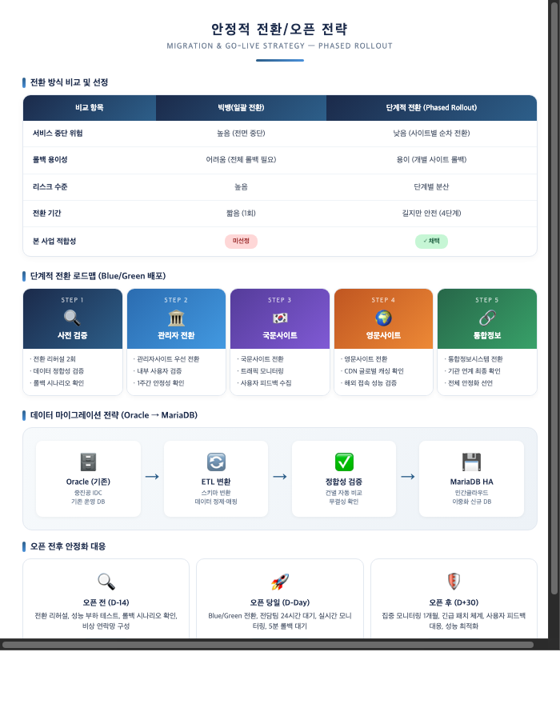
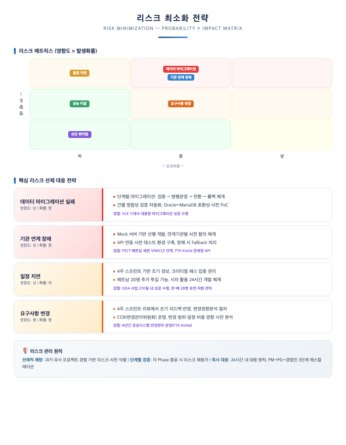
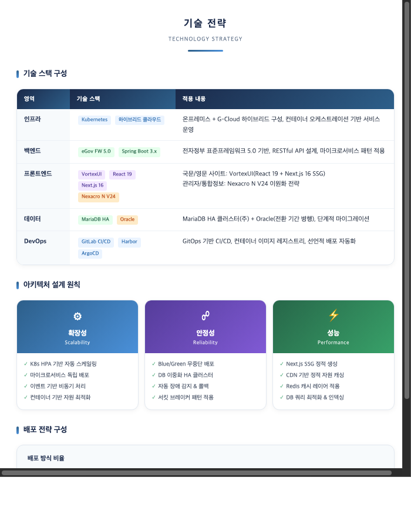
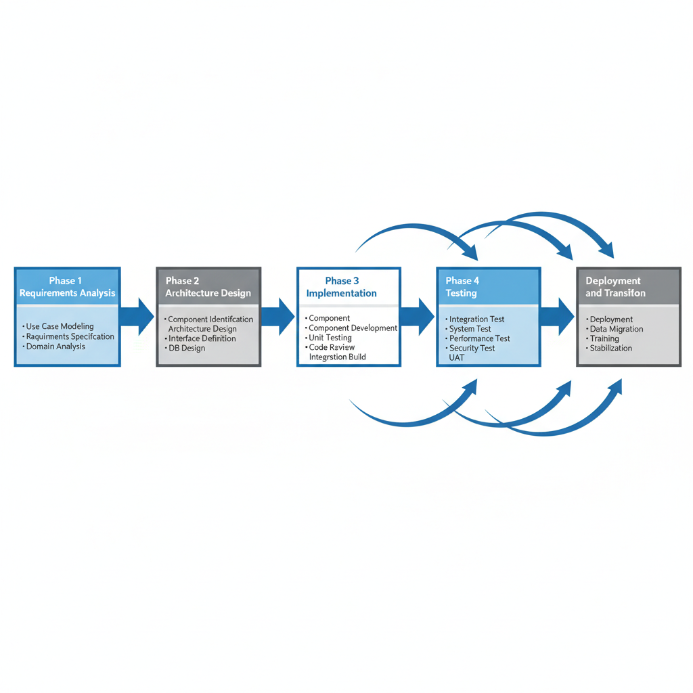
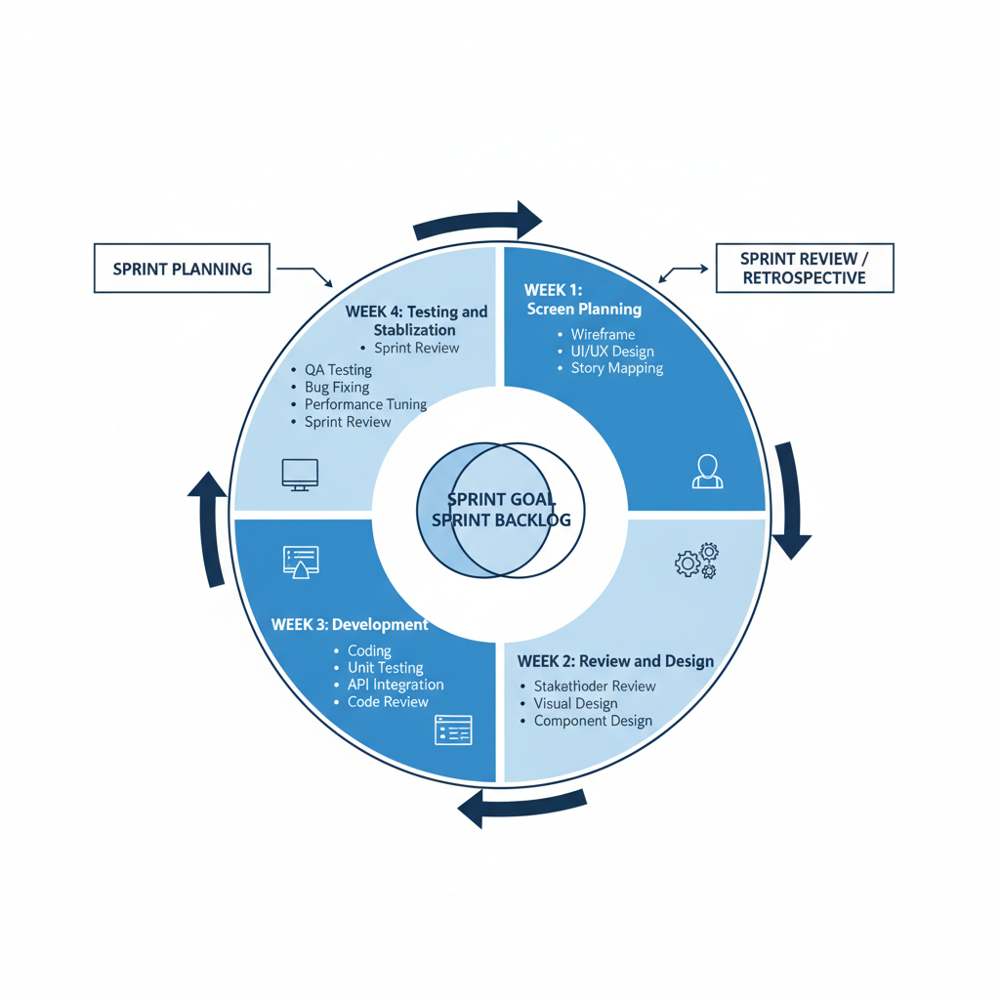

# II. 추진전략 및 방법

## 1. 사업이해도

### 1.1 제안요청 내용 이해

본 사업은 중소벤처기업진흥공단(온라인수출처)이 운영하는 **온라인수출플랫폼(고비즈코리아)** 의 전면 재구축과 클라우드 전환을 목적으로 합니다. 디지털 무역의 급격한 성장에 따라 국내 중소기업의 온라인 수출 참여가 확대되고 있으며, 이에 발맞추어 고비즈코리아가 차세대 플랫폼으로 도약하기 위해 **데이터 표준 체계 수립**, **문서관리 고도화**, **기술 스택 현대화**, **클라우드 전환**이 필요한 시점입니다.

본 컨소시엄은 **베트남 온라인 수출플랫폼 모델 전수 ODA 사업**(중진공 발주, 2024.09 착수~2025.11 완료, 전체 사업규모 3,116,500천원)을 통해 Gobiz Vietnam을 직접 구축하여 고비즈코리아의 업무 프로세스와 데이터 구조를 실무적으로 파악하고 있습니다.

| 사업 목적 | 내용 | 대응 요구사항 |
|---------|------|------------|
| 플랫폼 현대화 | 4개 사이트(국문/영문/관리자/통합정보) 전면 재구축 | SFR-004, 005, 009, 012 |
| 클라우드 전환 | 민간클라우드 기반 하이브리드 인프라 구성 | SFR-001, 002 |
| 데이터 표준화 | 수출 데이터 아키텍처 수립 및 통계 고도화 | SFR-006, 007, DAR-001~009 |
| 사용자 경험 혁신 | 디지털 정부서비스 UI/UX 가이드라인 준수 재설계 | INR-001~012 |
| 기관 연계 강화 | 수출유관기관 API 기반 통합 연계 | SFR-011, 013 |

---

### 1.2 사업 목적 / 범위 / 전제조건

#### (1) 플랫폼 발전을 위한 4대 핵심 과제

고비즈코리아가 차세대 온라인 수출 플랫폼으로 도약하기 위해 다음 **4대 핵심 과제**의 전략적 추진이 필요합니다. 각 과제는 상호 유기적으로 연결되어, 데이터 표준화는 정확한 수출 통계로, 문서관리 체계화는 효율적 유지보수로, 기술 현대화는 안전한 서비스로, 클라우드 전환은 민첩한 대응력으로 이어집니다.

*[그림 2-1] 플랫폼 발전을 위한 4대 핵심 과제*

#### (2) 기술 스택 현대화 방향

운영체제부터 프레임워크, 데이터베이스, 프론트엔드에 이르기까지 **전 영역에 걸친 기술 현대화**를 통해 현대 기술력을 소화할 수 있는 구조로 전환합니다. 특히 전자정부 표준프레임워크 5.0 업그레이드(Spring Boot 3.x, Open JDK 17/21/23)와 Git 기반 형상관리·CI/CD 도입은 보안 강화와 개발 생산성 향상을 동시에 달성하는 핵심 전환 포인트입니다.

*[그림 2-2] 기술 스택 현대화 비교 (AS-IS → TO-BE)*

#### (3) 클라우드 전환 필요성

현행 인프라 구조에서는 수출지원사업 신청 시기의 트래픽 급증이나 해외바이어의 다양한 시간대 접속 등 **다양한 상황에 빠르게 대처하기 어렵습니다**. 클라우드 전환은 비즈니스 요구, 기술 환경 변화, 정부 정책 방향이라는 3가지 동인에 의해 추진되며, 구체적 기대효과를 제시합니다.

*[그림 2-3] 클라우드 전환 필요성 및 기대효과*

#### (4) 사업 범위 및 전제조건

| 구분 | 내용 |
|------|------|
| **사업 범위** | 4개 사이트(국문/영문/관리자/통합정보) 전면 재구축, 민간클라우드 전환, Oracle→MariaDB 마이그레이션, 외부기관 API 연계 |
| **사업 기간** | 계약체결일로부터 270일(약 9개월) |
| **전제조건** | 전자정부 표준프레임워크 5.0 적용, 민간클라우드 + 중진공 IDC 하이브리드 구성, 디지털정부서비스 UI/UX 가이드라인 준수 |
| **제외 범위** | 기존 시스템 운영/유지보수, 하드웨어 조달, 외부기관 시스템 개발 |

---

### 1.3 본 사업의 특징 및 당사 강점

#### (1) 목표시스템 TO-BE 구성

민간클라우드와 중진공 IDC를 IPsec VPN으로 연결하는 하이브리드 클라우드 환경 위에, K8s 컨테이너 오케스트레이션을 적용하여 오토스케일링·무중단 배포·자동 복구가 가능한 인프라를 구축합니다.

*[그림 2-4] TO-BE 목표 시스템 구성 개요*

#### (2) 사업 추진 방향 3대 축

본 컨소시엄은 **플랫폼 전면 재구축**, **클라우드 전환**, **통합정보 고도화**의 3대 축으로 차별화된 사업 추진 방향을 제시합니다.

*[그림 2-5] 사업 추진 방향 3대 축*

#### (3) 컨소시엄 차별화 역량

| 차별화 요소 | 내용 | 근거 |
|---------|------|------|
| **동일 플랫폼 구축 경험** | Gobiz Vietnam(고비즈코리아 베트남 버전)을 직접 구축하여 업무 프로세스·데이터 구조 실무 파악 | ODA 사업 467백만원, 동일 발주기관 |
| **K8s 실운영 + VortexUI** | APEX/FECT에서 K8s + Blue/Green 배포 실운영, VortexUI(React 19 + Next.js 16) 자체 프론트엔드 플랫폼 보유 | SFR-001, COR-001 |
| **수출 도메인 전문성** | 관세사(대표) + KOTRA AI무역지원센터 3개소 운영, 수출 업무 심층 이해 | 8년 연속 FTA Korea 운영 |

> **컨소시엄 강점**: 아스트라비전은 ODA 사업으로 Gobiz Vietnam을 구축하고, KOTRA AI무역지원센터 3개소를 운영하여 고비즈코리아의 업무 프로세스를 실무적으로 파악하고 있습니다. 퀸텟시스템즈는 AWS ISV Partner로서 MSA/멀티테넌트 아키텍처 운영 경험을 보유하고 있습니다.

---

## 2. 추진전략

### 2.1 사업 추진전략 및 방향

#### (1) 핵심 전략 방향

본 컨소시엄은 **"안전한 전환, 진화하는 플랫폼, 지속 가능한 성장"** 이라는 비전 아래, 고비즈코리아를 차세대 온라인 수출 플랫폼으로 도약시키기 위한 3대 핵심 전략을 수립하였습니다.

*[그림 2-6] 핵심 전략 방향*

| 전략 원칙 | 핵심 목표 | 구현 방안 | 대응 요구사항 |
|---------|---------|---------|----------|
| **무중단 안전 전환** | 서비스 중단 제로 | Blue/Green 배포 + 단계적 마이그레이션 + 자동 롤백 | SFR-001, SFR-002 |
| **클라우드 네이티브** | 탄력적 인프라 확보 | K8s 오토스케일링 + GitLab CI/CD + ArgoCD 자동 배포 | SFR-001, PER-001 |
| **데이터 기반 혁신** | 수출 데이터 가치 창출 | 데이터 표준 체계 + 공공마이데이터 연계 + 통계 고도화 | SFR-006, DAR-001 |

#### (2) 발주처 Pain Point 해결 전략

| 발주처 Pain Point | 해결 전략 | 기대 효과 |
|---------|---------|---------|
| 수출지원사업 신청 시기 트래픽 급증 | K8s HPA 오토스케일링으로 자동 확장 | 동시 접속 무제한 확장 |
| 해외바이어 접속 속도 저하 | CDN + Next.js 16 SSG 정적 사이트 배포 | 글로벌 접속 70%+ 개선 |
| 배포 시 서비스 중단 | Rolling/Blue-Green/Canary 적응형 무중단 배포 | 서비스 중단 제로 |
| 노후 기술 스택 | 전자정부 FW 5.0 + VortexUI(React 19 + Next.js 16) 프론트엔드 이원화 | 기술부채 해소 |

#### (3) 단계별 추진 전략

프로젝트를 **기반 구축 → 핵심 개발 → 검증·안정화**의 3단계로 나누어, 각 단계의 핵심 목표에 집중하는 점진적 접근 전략을 적용합니다.

*[그림 2-7] 단계별 추진 전략*

| 단계 | 기간 | 핵심 목표 | 주요 활동 | 마일스톤 |
|------|------|---------|---------|---------|
| **PHASE 1: 기반 구축** | M ~ M+3 | 안전한 전환 기반 확보 | 현행 분석, 하이브리드 클라우드 인프라 구축, DB 스키마 설계, CI/CD 구축(GitLab CI + Harbor + ArgoCD), 전자정부 FW 5.0 환경 구성 | 착수보고회 |
| **PHASE 2: 핵심 개발** | M+3 ~ M+6 | 4개 사이트 기능 구현 | 국문/영문 VortexUI(React 19 + Next.js 16) 개발, 관리자/통합정보 Nexacro N V24 개발, Oracle→MariaDB 마이그레이션, 외부기관 API 연계, CBD 4주 스프린트×4 | 중간보고회 |
| **PHASE 3: 검증·안정화** | M+6 ~ M+8 | 무결점 오픈 | 성능·보안·접근성 통합 테스트, Blue/Green 무중단 전환 실행, 사용자 교육, 시범운영 및 안정화 | 최종보고회 |

**PHASE 1 — "실패 없는 전환 기반 확보"**
- 착수 즉시 클라우드 인프라를 선행 구축하여 개발 환경 조기 확보
- DB 스키마 설계 리뷰 2회 + 발주처 승인으로 마이그레이션 리스크 선제 해소
- CI/CD 파이프라인(GitLab CE → Harbor → ArgoCD) 구축으로 자동 빌드/배포 체계 확립
- **KPI**: 요구사항 확정률 100%, PoC(기술 검증) 완료

**PHASE 2 — "CBD 컴포넌트 기반 민첩한 구축"**
- CBD 방법론 기반 컴포넌트 단위 재사용으로 4개 사이트 효율적 개발
- 프론트엔드 이원화: 국문/영문은 VortexUI(React 19 + Next.js 16 SSG), 관리자/통합정보는 Nexacro N V24
- 4주 스프린트 리뷰에서 발주처 피드백 조기 반영
- **KPI**: 스프린트당 기능 완료율 90%+, 스프린트 리뷰 4회

**PHASE 3 — "안전한 오픈, 무결점 인수인계"**
- 5단계 테스트(단위→통합→성능→시스템→인수) 체계적 수행
- Blue/Green 배포로 무중단 전환, Canary 배포로 리스크 사전 검증
- 사이트별 단계적 전환(관리자 → 국문 → 영문 → 통합정보) 안전성 확보
- **KPI**: 가용성 99.9%, 응답시간 3초 이내(CDN 정적 페이지 1초 이내), 국정원 보안점검 통과

#### (4) 안정적 전환/오픈 전략

본 사업은 5만여 개 중소기업과 글로벌 바이어가 실시간 거래하는 플랫폼 특성을 고려하여, **단계적 전환(Phased Rollout) + Blue/Green 배포**를 채택합니다.

*[그림 2-8] 안정적 전환/오픈 전략*

| 비교 항목 | 빅뱅(일괄 전환) | 단계적 전환 (Phased Rollout) |
|---------|---------|---------|
| 서비스 중단 위험 | 높음 (전면 중단) | **낮음** (사이트별 순차 전환) |
| 롤백 용이성 | 어려움 (전체 롤백) | **용이** (개별 사이트 롤백) |
| 리스크 수준 | 높음 | **단계별 분산** |
| 전환 기간 | 짧음 (1회) | 길지만 안전 (4단계) |
| **본 사업 적합성** | 미선정 | **채택** |

**단계적 전환 로드맵**

| STEP | 대상 | 주요 활동 | 검증 기간 |
|------|------|---------|---------|
| **1. 사전 검증** | 전체 | 전환 리허설 2회, 데이터 정합성 검증, 롤백 시나리오 확인 | 2주 |
| **2. 관리자 전환** | 관리자사이트 | 내부 사용자 우선 전환, 1주간 안정성 확인 | 1주 |
| **3. 국문사이트** | 국문사이트 | Blue/Green 전환, 트래픽 모니터링, 사용자 피드백 수집 | 1주 |
| **4. 영문사이트** | 영문사이트 | CDN 글로벌 캐싱 확인, 해외 접속 성능 검증 | 1주 |
| **5. 통합정보** | 통합정보시스템 | 기관 연계 최종 확인, 전체 안정화 선언 | 1주 |

**오픈 전후 안정화 대응**

| 시점 | 기간 | 핵심 활동 |
|------|------|---------|
| **오픈 전 (D-14)** | 2주 | 전환 리허설, 성능 부하 테스트, 롤백 시나리오 확인, 비상 연락망 구성 |
| **오픈 당일 (D-Day)** | 1일 | Blue/Green 전환, 전담팀 24시간 대기, 실시간 모니터링, 5분 롤백 대기 |
| **오픈 후 (D+30)** | 30일 | 집중 모니터링, 긴급 패치 체계, 사용자 피드백 대응, 성능 최적화 |

---

### 2.2 기대효과

본 사업 추진을 통해 다음과 같은 정량적·정성적 기대효과를 달성합니다.

| 구분 | 기대효과 | 목표 수치 | 달성 방안 |
|------|---------|---------|---------|
| **서비스 안정성** | 시스템 가용성 향상 | 99.9% 이상 | K8s HA 구성 + Blue/Green 무중단 배포 + 자동 복구 |
| **사용자 경험** | 페이지 응답시간 단축 | 3초 이내(CDN 정적 1초 이내) | CDN + Next.js 16 SSG + Nginx 캐싱 + 오토스케일링 |
| **글로벌 접근성** | 해외 접속 속도 개선 | 70%+ 개선 | CDN 글로벌 캐싱 + 정적 사이트 배포 |
| **운영 효율성** | 배포 주기 단축 | 30배 단축 | GitLab CI + Harbor + ArgoCD 자동 배포 |
| **비용 절감** | DB 라이선스 비용 절감 | Oracle→MariaDB | 공개SW 전환으로 연간 라이선스 비용 절감 |
| **보안 강화** | 보안 취약점 제로 | 0건 | 시큐어코딩 상시 적용 + 정적/동적 보안 분석 |
| **데이터 활용** | 수출 통계 정확도 향상 | 데이터 표준 체계 수립 | 표준 코드 체계 + 공공마이데이터 연계 |
| **확장성 확보** | 트래픽 급증 자동 대응 | 무제한 확장 | K8s HPA 오토스케일링 |

---

### 2.3 위험요소 및 대응방안

#### (1) 핵심 리스크 식별 및 선제적 대응

본 컨소시엄은 유사 프로젝트 경험을 기반으로 핵심 리스크를 사전 식별하고, 선제적 대응 전략을 수립하였습니다.

*[그림 2-9] 리스크 최소화 전략*

| 리스크 | 영향도 | 확률 | 선제적 대응 전략 | 컨소시엄 경험 근거 |
|--------|------|------|---------|------------|
| **데이터 마이그레이션 실패** | 상 | 중 | 단계별 마이그레이션(검증→병행운영→전환→롤백), 건별 정합성 자동 검증, Oracle↔MariaDB 호환성 사전 PoC | VLE 11개사 대용량 마이그레이션 성공 |
| **기관 연계 장애** | 상 | 중 | Mock 서버 기반 선행 개발, 연계기관별 사전 협의, API 장애 시 Fallback 처리 | FECT 베트남 세관 VNACCS 연계, FTA Korea 관세청 API |
| **일정 지연** | 상 | 하 | 4주 스프린트 기반 조기 경보, 크리티컬 패스 집중 관리, 인력 추가 투입 체계 확보 | ODA 사업 270일 내 성공 수행 |
| **요구사항 변경** | 중 | 중 | 4주 스프린트 리뷰 조기 피드백, CCB(변경관리위원회) 운영, 변경 영향분석 절차 | FTA Korea 8년간 공공시스템 변경관리 |
| **성능 미달** | 중 | 하 | 성능 테스트 자동화(JMeter/K6), 병목 구간 사전 식별, 오토스케일링 정책 최적화 | APEX 250개 기업 동시 서비스 |
| **보안 취약점** | 상 | 하 | 시큐어코딩 상시 적용, 정적/동적 보안 분석, 국정원 보안성 검토 대비 | FTA Korea 8년간 보안 준수 실적 |

#### (2) 리스크 관리 원칙

| 원칙 | 적용 방법 |
|------|---------|
| **선제적 예방** | 과거 유사 프로젝트 경험 기반 리스크 사전 식별, PoC 수행 |
| **단계별 검증** | 각 Phase 종료 시 리스크 재평가, 리스크 등록부 갱신 |
| **즉시 대응** | 24시간 내 대응 원칙, PM→PD→경영진 3단계 에스컬레이션 |

> 리스크 관리의 상세 절차(리스크 등록부 관리, 에스컬레이션 경로, 대응 이력 추적)는 **V. 프로젝트 관리 > 1.1 위험 관리**에서 상세히 기술합니다.

---

## 3. 적용기술

### 3.1 핵심 적용기술

#### (1) 기술 스택 선정 근거 및 방향성

*[그림 2-10] 기술 전략 개요*

본 사업의 기술 스택은 **RFP 지정 요건**과 **클라우드 네이티브 최적화**를 기준으로 선정하였습니다.

| 영역 | 기술 스택 | 선정 근거 | 기대 효과 |
|------|---------|---------|---------|
| **인프라** | K8s + 하이브리드 클라우드 | RFP 지정 민간클라우드 + 중진공 IDC 연계 필수(SFR-001) | 오토스케일링, 가용성 99.9% |
| **백엔드** | eGov FW 5.0 + Spring Boot 3.x | RFP 의무사항, 공공시스템 표준 준수(COR-001) | 기술부채 해소, 최신 보안 패치 |
| **프론트(대민)** | VortexUI — React 19 + Next.js 16 SSG | 반응형 웹, SEO 최적화, 디지털정부서비스 가이드라인 | CDN 글로벌 배포, 디자인 유연성 |
| **프론트(행정)** | Nexacro N V24 | RFP 지정 SW, 대량 데이터 그리드 처리 최적화 | 업무 양식 표준화, 업무 효율성 |
| **데이터** | MariaDB HA + Oracle(기존) | 공개SW 전환 요구, 기존 Oracle 병행(SFR-006) | 라이선스 비용 절감 |
| **DevOps** | GitLab CE + Harbor + ArgoCD | 100% 오픈소스, SCM+CI 통합 단일 플랫폼 | 배포 주기 30배 단축 |

#### (2) 아키텍처 3대 설계 원칙

| 설계 원칙 | 구현 방안 | 대응 요구사항 |
|---------|---------|----------|
| **확장성 (Scalability)** | K8s HPA로 CPU/메모리 기반 자동 스케일링, 수출지원사업 신청 시기 트래픽 급증 자동 대응 | SFR-001, PER-004 |
| **안정성 (Reliability)** | MariaDB HA 이중화, Blue/Green 무중단 배포, 자동 Health Check 및 장애 복구, 수 초 이내 롤백 | PER-001, SFR-002 |
| **성능 (Performance)** | CDN 글로벌 캐싱 + Next.js 16 SSG 정적 배포, Nginx 리버스 프록시, 응답시간 3초 이내(CDN 정적 1초 이내) | PER-003, SFR-005 |

---

### 3.2 대상 업무별 개발방안

#### (1) 프론트엔드 이원화 전략

본 사업은 4개 사이트의 특성에 따라 프론트엔드 기술을 이원화하여 적용합니다.

| 사이트 | 사용자 | 기술 스택 | 선정 이유 |
|--------|--------|---------|---------|
| **국문사이트** | 국내 중소기업 | VortexUI (React 19 + Next.js 16 SSG) | 반응형 웹, SEO, 디지털정부서비스 가이드라인 |
| **영문사이트** | 해외 바이어 | VortexUI (React 19 + Next.js 16 SSG) | CDN 글로벌 배포, 다국어, 빠른 로딩 |
| **관리자사이트** | 내부 운영자 | Nexacro N V24 | 대량 데이터 그리드, 업무 양식 표준화 |
| **통합정보시스템** | 기관 담당자 | Nexacro N V24 | 통계 대시보드, 대용량 데이터 처리 |

#### (2) 적응형 무중단 배포 전략

배포 규모와 위험도에 따라 **3대 배포 전략을 선택 적용**하는 적응형 배포 체계를 구축합니다.

| 배포 전략 | 적용 비율 | 핵심 가치 | 적용 대상 | 롤백 소요시간 |
|---------|---------|---------|---------|---------|
| **Rolling Update** | ~85% | 안정성 + 효율성 | 일상적 패치, 설정 변경, 버그 수정 | 1~3분 |
| **Blue/Green** | ~10% | 즉시 전환 + 즉시 롤백 | 대규모 릴리스, DB 스키마 변경 | 수 초 |
| **Canary** | ~5% | 리스크 사전 검증 | 신규 기능, 성능 영향 불확실 변경 | 수 초 |

> **자동 롤백 조건**: HTTP 5xx 에러율 배포 전 대비 2배 이상, P99 응답시간 3초 초과, Health Check 연속 실패 3회 → **사람 개입 없이 즉시 자동 롤백**

#### (3) 데이터 마이그레이션 전략 (Oracle → MariaDB)

**Oracle(중진공 IDC)** → **ETL 변환**(스키마 변환·데이터 정제·매핑) → **정합성 검증**(건별 자동 비교·무결성 확인) → **MariaDB HA**(민간클라우드 이중화 신규 DB)

| 마이그레이션 단계 | 내용 | 리스크 대응 |
|---------|------|---------|
| **사전 분석** | Oracle 프로시저/함수 호환성 매핑표 작성 | Oracle↔MariaDB PoC 수행 |
| **데이터 추출** | ETL 도구 기반 스키마 변환, 데이터 정제 | 변환 규칙 사전 검증 |
| **정합성 검증** | 건별 자동 비교, 무결성 리포트 생성 | 100% 일치 확인 후 진행 |
| **전환 실행** | 병행 운영 기간 후 최종 전환 | 5분 이내 롤백 체계 구축 |

> 데이터 마이그레이션의 상세 검증 방안 및 에러 처리 절차는 **III. 기술 및 기능 > 2. 데이터 요구사항**에서 상세히 기술합니다.

---

### 3.3 Prototype

#### (1) 프로토타입 개발 계획

PHASE 1 기반 구축 단계에서 핵심 기술 요소에 대한 **PoC(Proof of Concept) 및 프로토타입**을 개발하여 기술 리스크를 사전 검증합니다.

| 프로토타입 영역 | 검증 목표 | 시기 | 산출물 |
|---------|---------|------|--------|
| **VortexUI 국문사이트** | React 19 + Next.js 16 SSG 기반 국문사이트 메인 페이지 프로토타입 | M+1 ~ M+2 | UI 프로토타입, 디자인 시안 |
| **K8s 오토스케일링** | HPA 기반 트래픽 급증 대응 검증 | M+1 | 부하테스트 결과 리포트 |
| **Oracle→MariaDB** | 프로시저/함수 호환성 검증, 데이터 정합성 확인 | M+1 ~ M+2 | 호환성 매핑표, PoC 리포트 |
| **Blue/Green 배포** | 무중단 전환 및 롤백 시나리오 검증 | M+2 | 배포 시나리오 결과서 |
| **외부기관 API 연계** | 수출유관기관 API Mock 서버 기반 연계 검증 | M+2 ~ M+3 | API 연계 테스트 결과 |

#### (2) 프로토타입 검증 프로세스

프로토타입 개발 → 발주처 시연 및 피드백 → 보완 반영 → 설계 확정의 프로세스를 통해, 본 개발 착수 전에 핵심 기술 요소의 적합성을 확인합니다. 프로토타입 검증 결과는 착수보고회에서 발주처에 보고하고, PHASE 2 본개발 설계에 직접 반영합니다.

---

## 4. 표준 프레임워크 적용

### 4.1 표준프레임워크 적용 방안

#### (1) 전자정부 표준프레임워크 5.0 적용

본 사업은 RFP 의무사항에 따라 **전자정부 표준프레임워크 5.0**을 적용합니다. 표준프레임워크 5.0은 Spring Boot 3.x 기반으로 전면 재구성되어, 클라우드 네이티브 환경에 최적화된 구조를 제공합니다.

| 구분 | 표준프레임워크 4.2 (현행) | 표준프레임워크 5.0 (목표) |
|------|---------|---------|
| **기반 프레임워크** | Spring Framework 5.x | **Spring Boot 3.x** |
| **Java 버전** | JDK 8/11 | **Open JDK 17/21/23** |
| **빌드 도구** | Maven 중심 | **Gradle + Maven** |
| **컨테이너 지원** | 제한적 | **Docker/K8s 네이티브** |
| **보안** | Spring Security 기존 | **Spring Security 6.x** |
| **성능** | 동기 방식 중심 | **WebFlux 리액티브 지원** |

#### (2) 적용 범위

| 적용 영역 | 적용 내용 | 비고 |
|---------|---------|------|
| **실행 환경** | Spring Boot 3.x 기반 서버 실행 환경 | 백엔드 전체 |
| **개발 환경** | eGovFrame IDE, 코드 생성기, 디버깅 도구 | 개발자 공통 |
| **운영 환경** | 배포 관리, 모니터링, 로그 관리 | K8s 환경 연동 |
| **관리 환경** | 사용자 인증/권한, 메뉴 관리, 코드 관리 | 관리자사이트 |
| **공통 컴포넌트** | 표준프레임워크 제공 공통기능 재사용 | 아래 4.2절 상세 |

---

### 4.2 공통컴포넌트 활용 방안

#### (1) 표준프레임워크 공통컴포넌트 활용

전자정부 표준프레임워크가 제공하는 공통컴포넌트를 최대한 활용하여 개발 생산성을 높이고, 공공시스템 표준 준수를 보장합니다.

| 공통컴포넌트 영역 | 활용 컴포넌트 | 적용 대상 |
|---------|---------|---------|
| **사용자 디렉토리/통합인증** | 로그인, 세션 관리, SSO, 권한 관리 | 4개 사이트 공통 |
| **통계/리포팅** | 통계 조회, 차트 생성, 리포트 출력 | 통합정보시스템 |
| **협업** | 게시판, 공지사항, FAQ, QnA | 국문/영문사이트 |
| **시스템 관리** | 코드 관리, 메뉴 관리, 배치 관리 | 관리자사이트 |
| **연계/통합** | 외부시스템 연계 어댑터, 메시지 큐 | 기관 연계 |

#### (2) 커스텀 공통 컴포넌트 개발

표준프레임워크 공통컴포넌트로 충족되지 않는 본 사업 고유의 기능은 CBD 방법론에 따라 재사용 가능한 커스텀 컴포넌트로 개발합니다.

| 커스텀 컴포넌트 | 기능 | 재사용 대상 |
|---------|------|---------|
| **수출 데이터 표준 코드** | 수출 관련 표준 코드 체계(HS코드, 국가코드 등) 관리 | 4개 사이트 공통 |
| **다국어 처리 엔진** | 한/영/베트남어 다국어 콘텐츠 관리 | 국문/영문사이트 |
| **파일 관리 서비스** | 대용량 파일 업로드/다운로드, 이미지 리사이징 | 4개 사이트 공통 |
| **API Gateway 연동** | 외부기관 API 호출 표준 인터페이스 | 기관 연계 전체 |

---

### 4.3 문제점 및 대응방안

#### (1) 프레임워크 전환 시 예상 문제점 및 대응

| 예상 문제점 | 영향 범위 | 대응 방안 |
|---------|---------|---------|
| **Spring Boot 3.x 전환 시 API 호환성** | Jakarta EE 전환으로 javax→jakarta 패키지 변경 | 코드 자동 변환 도구 적용, 사전 호환성 테스트 수행 |
| **Open JDK 17 전환 시 라이브러리 호환** | 일부 라이브러리 JDK 17 미지원 가능 | 사전 라이브러리 호환성 검증, 대체 라이브러리 매핑표 작성 |
| **보안 정책 변경** | Spring Security 6.x의 변경된 설정 체계 | 보안 설정 마이그레이션 가이드 작성, 단계별 적용 |
| **빌드 환경 전환** | Gradle 전환 시 기존 Maven 빌드 스크립트 비호환 | Gradle 빌드 스크립트 신규 작성, CI/CD 파이프라인 연동 |
| **공통컴포넌트 버전 차이** | 표준프레임워크 4.2→5.0 공통컴포넌트 API 변경 | 변경 사항 분석 후 커스터마이징, 하위호환 래퍼 제공 |

#### (2) 문제 해결 프로세스

1. **사전 분석** (PHASE 1): 현행 시스템 코드 분석 → 호환성 이슈 목록 작성 → 대응 방안 수립
2. **PoC 검증** (PHASE 1): 핵심 이슈에 대한 기술 검증 → 검증 결과 기반 설계 확정
3. **점진적 적용** (PHASE 2): 컴포넌트 단위 순차 전환 → 단위 테스트 통과 후 통합
4. **통합 검증** (PHASE 3): 전체 시스템 통합 테스트 → 성능·보안·호환성 최종 확인

---

## 5. 개발 방법론

### 5.1 적용 방법론 및 수행 경험

#### (1) 방법론 개요

본 사업은 **CBD(Component Based Development) 기반 반복적/점진적 개발 방법론**을 적용합니다. CBD 방법론은 재사용 가능한 컴포넌트 단위로 시스템을 설계/개발하여 개발 생산성과 품질을 동시에 확보하는 방법론으로, 본 사업의 4개 사이트 재구축 및 하이브리드 클라우드 전환에 최적화된 접근 방식입니다(PMR-003, PMR-004).

**방법론 선정 근거**

| 선정 기준 | CBD 방법론 적합성 | 본 사업 적용 |
|---------|------------|---------|
| **재사용성** | 컴포넌트 단위 재사용으로 개발 효율 극대화 | 4개 사이트 공통 컴포넌트(회원관리, 권한관리, 게시판 등) 재활용 |
| **점진적 개발** | 반복 사이클을 통한 위험 조기 발견 | 4주 스프린트 단위 점진적 기능 구현/검증 |
| **아키텍처 중심** | 시스템 구조 우선 설계로 안정성 확보 | 하이브리드 클라우드 아키텍처 선행 설계 후 기능 구현 |
| **공공사업 적합성** | 정부 SW개발사업 방법론 가이드라인 준수 | 전자정부 표준프레임워크 5.0과 자연스러운 통합 |

> **컨소시엄 강점**: 아스트라비전은 CBD 방법론을 **FTA Korea(8년 연속)**, **FECT 플랫폼**, **KISTI 공공R&D 플랫폼** 등 다수 공공사업에서 적용한 경험을 보유하고 있습니다. 4주 스프린트 기반 반복적 개발 프로세스를 자체적으로 수립하여 운영 중이며, CI/CD 파이프라인(GitHub Actions)을 통한 배포 자동화를 실현하고 있습니다.

#### (2) 방법론 적용 경험

본 컨소시엄은 CBD 기반 개발 방법론을 다수의 프로젝트에서 성공적으로 적용한 경험을 보유하고 있습니다.

| 프로젝트 | 적용 방법론 | 규모 | 핵심 성과 |
|---------|---------|------|---------|
| **Gobiz Vietnam (ODA)** | CBD + 스프린트 | 31.2억원 | 270일 내 4개 사이트 성공 구축 |
| **FTA Korea** | CBD + 폭포수 혼합 | 연간 3억원 | 8년 연속 안정적 운영/개발 |
| **FECT** | CBD + 애자일 | K8s 기반 | Blue/Green 배포 실운영 |
| **삼성전자 블루멤버십** | CBD | 대규모 | 전사 마케팅·멤버십 시스템 구축 |

---

### 5.2 단계별 활동 및 산출물

*[그림 2-11] CBD 기반 개발 프로세스 다이어그램*

##### 1단계: 요구사항 분석

| 활동 | 세부 내용 | 산출물 |
|------|---------|--------|
| **요구사항 수집** | 발주처 인터뷰, RFP 68개 요구사항 분석, 현행 시스템 분석 | 요구사항 정의서 |
| **유스케이스 모델링** | 4개 사이트별 유스케이스 다이어그램, 액터 식별 | 유스케이스 명세서 |
| **도메인 분석** | 수출 업무 프로세스 분석, 데이터 흐름 분석 | 업무 분석서 |
| **요구사항 추적** | 요구사항-설계-구현-테스트 추적 매트릭스 수립 | 요구사항 추적표(RTM) |

##### 2단계: 아키텍처/설계

| 활동 | 세부 내용 | 산출물 |
|------|---------|--------|
| **아키텍처 설계** | 하이브리드 클라우드 아키텍처, 네트워크 구성, 보안 아키텍처 | 시스템 아키텍처 설계서 |
| **컴포넌트 식별** | 재사용 컴포넌트 식별, 인터페이스 정의, 의존관계 분석 | 컴포넌트 설계서 |
| **DB 설계** | ERD, 테이블 정의서, MariaDB/Oracle 듀얼 스키마 | DB 설계서 |
| **UI/UX 설계** | 화면 설계서, 스타일 가이드, 디지털 정부서비스 UI/UX 가이드라인 적용 | 화면 설계서 |
| **API 설계** | API 명세서, API Gateway 라우팅 정책 | API 설계서 |

##### 3단계: 구현

| 활동 | 세부 내용 | 산출물 |
|------|---------|--------|
| **컴포넌트 개발** | 전자정부 FW 5.0 기반 컴포넌트 단위 개발, 코딩 표준 준수 | 소스코드 |
| **단위 테스트** | JUnit 5 기반 컴포넌트별 단위 테스트, 코드 커버리지 80% 이상 | 단위 테스트 결과서 |
| **코드 리뷰** | 2인 이상 코드 리뷰, 시큐어코딩 가이드 준수 확인 | 코드 리뷰 결과서 |
| **통합 빌드** | CI/CD 파이프라인을 통한 자동 빌드/테스트/패키징 | 빌드 결과서 |

##### 4단계: 테스트

| 활동 | 세부 내용 | 산출물 | 대응 요구사항 |
|------|---------|--------|----------|
| **통합 테스트** | 컴포넌트 간 연계 테스트, API 연동 테스트 | 통합 테스트 결과서 | TER-003 |
| **시스템 테스트** | 4개 사이트 전체 기능 테스트, 시나리오 기반 테스트 | 시스템 테스트 결과서 | TER-003 |
| **성능 테스트** | 부하 테스트(JMeter/K6), 응답시간/동시처리 검증 | 성능 테스트 결과서 | TER-003, PER-001~004 |
| **보안 테스트** | 정적/동적 보안 분석, 웹 취약점 점검, 시큐어코딩 검증 | 보안 점검 결과서 | SER-001~007 |
| **인수 테스트(UAT)** | 발주처 참여 인수 테스트, 업무 시나리오 검증 | 인수 테스트 결과서 | TER-004 |

##### 5단계: 이행

| 활동 | 세부 내용 | 산출물 |
|------|---------|--------|
| **데이터 마이그레이션** | Oracle→MariaDB 데이터 이관, 정합성 검증, 롤백 체계 | 마이그레이션 결과서 |
| **시스템 배포** | Blue/Green 무중단 배포, 운영 환경 전환 | 배포 결과서 |
| **사용자 교육** | 관리자/운영자 대상 시스템 교육, 매뉴얼 제공 | 교육 결과서, 운영 매뉴얼 |
| **안정화** | 서비스 모니터링, 장애 대응, 성능 최적화 | 안정화 보고서 |

---

### 5.3 4주 스프린트 사이클

본 사업의 개발 단계(M+2~M+6, 약 4개월)에서 **4주 스프린트** 단위로 반복적/점진적 개발을 수행합니다.

*[그림 2-12] 4주 스프린트 사이클*

| 주차 | 활동 | 주요 내용 | 참여자 |
|------|------|---------|--------|
| **1주차: 화면기획** | 와이어프레임 작성, UI/UX 설계, 스토리 매핑 | 해당 스프린트 대상 화면/기능 기획 | PM, PL, 기획자, 디자이너 |
| **2주차: 사업팀 확인 및 디자인** | 발주처 리뷰, 비주얼 디자인, 컴포넌트 설계 | 발주처 피드백 반영, 디자인 확정 | PM, 발주처, 디자이너, PL |
| **3주차: 시스템 개발** | 코딩, 단위테스트, API 연동, 코드 리뷰 | 컴포넌트 단위 개발 및 단위 테스트 | 개발팀 전원 |
| **4주차: 테스트 및 안정화** | QA 테스트, 버그 수정, 성능 튜닝, 스프린트 리뷰 | 품질 검증 후 개발 환경 배포 | QA, 개발팀, PM |

**스프린트 관리 체계**

| 관리 항목 | 방법 |
|---------|------|
| **스프린트 계획** | 스프린트 시작 시 백로그 우선순위 지정, 스토리 포인트 산정, 목표 합의 |
| **일일 스탠드업** | 매일 15분 진행 상황 공유, 블로커 식별/해소 |
| **스프린트 리뷰** | 스프린트 종료 시 데모, 발주처 피드백, 백로그 갱신 |
| **회고** | 개선사항 도출, 다음 스프린트에 반영 |

---

### 5.4 기대효과 및 차별성

#### (1) 전략적 기대효과 — CBD 기반 구조 안정성 × 4주 Sprint 실행 민첩성

| 기대효과 | 핵심 내용 | 달성 방안 |
|---------|---------|---------|
| **구조적 완성도 확보** | 모듈 독립성 확보, 기능 확장 시 영향도 최소화, 장기 운영 효율성 극대화 | CBD 기반 컴포넌트 아키텍처, 재사용 가능한 구조 설계 |
| **실행 민첩성 확보** | 4주 Sprint 단위 실행 가능한 Increment 제공, 요구사항 변경 유연 대응 | 우선순위 기반 점진적 기능 고도화, 매 Sprint 실사용 가능 결과물 |
| **품질 내재화 체계** | 사후 품질관리가 아닌 사전 품질 내재화로 전환 | 단위 테스트 자동화 80%+, CI 기반 상시 검증, 코드 리뷰/정적 분석 |
| **리스크 선제적 통제** | 리스크를 "관리"하는 것이 아니라 "선제 차단" | Sprint 단위 조기 오류 발견, 단계별 고객 검증, 리스크 등록부 상시 관리 |

#### (2) 당사 차별화 전략

**차별성 1 — CBD 기반 선(先) 아키텍처 고도화**

| 일반 Agile 방식 | 당사 적용 방식 |
|-----------------|----------------|
| 기능 중심 개발 | 아키텍처 중심 설계 후 개발 |
| Sprint 내 설계/개발 혼재 | 사전 구조 안정화 후 Sprint 실행 |
| 단기 결과 중심 | 장기 확장성 고려 구조 설계 |
| 기능 단위 구현 우선 | 플랫폼 관점 구조 설계 우선 |

**차별성 2 — 4주 완결형 Sprint 체계**

- 설계 → 구현 → 테스트 → 통합 → 시연까지 1 Sprint 내 완료
- Sprint 종료 시 실행 가능한 서비스 수준 확보
- 기능 단위 실사용 검증 가능
- 점진적 통합 및 안정화 구조 적용

> 단순 개발 완료가 아닌, **"운영 가능한 수준"** 제공

**차별성 3 — DevOps 기반 자동화 품질체계**

- CI/CD 자동화 환경 운영 (GitLab CE + Harbor + ArgoCD)
- 코드 표준·정적 분석(SonarQube)·자동 테스트 통합 관리
- 자동 빌드 및 배포 검증 체계 구축
- 배포 리스크 최소화 및 장애 대응 시간 단축

> 사람 중심 품질 → **시스템 중심 품질 통제**

---

### 5.5 산출물 종류 및 내역

#### (1) 개발 단계별 산출물

| 단계 | 산출물 | 형식 |
|------|--------|------|
| **분석** | 요구사항 정의서, 유스케이스 명세서, 업무 분석서, 요구사항 추적표(RTM) | 문서 |
| **설계** | 시스템 아키텍처 설계서, 컴포넌트 설계서, DB 설계서, 화면 설계서, API 설계서 | 문서/다이어그램 |
| **구현** | 소스코드, 단위 테스트 결과서, 코드 리뷰 결과서, 빌드 결과서 | 코드/문서 |
| **테스트** | 테스트 계획서, 통합/시스템/성능/보안/인수 테스트 결과서 | 문서 |
| **이행** | 마이그레이션 결과서, 배포 결과서, 교육 결과서, 운영 매뉴얼, 안정화 보고서 | 문서 |
| **관리** | 사업수행계획서, 주간보고서, 월간보고서, 착수/중간/최종보고서, 회의록 | 문서 |

#### (2) Phase별 산출물 타임라인

| 단계 | 산출물 | 작성 시기 | 비고 |
|------|--------|---------|------|
| **PHASE 1 (기반 구축)** | 착수보고서 | M | 공식보고 |
| | 현행 시스템 분석서 | M ~ M+1 | AS-IS 분석 |
| | 요구사항 정의서 | M+1 | 요구사항 확정 |
| | 데이터 아키텍처 설계서 | M+1 ~ M+2 | DB 스키마 |
| | 시스템 아키텍처 설계서 | M+1 ~ M+2 | 인프라·SW 설계 |
| | UI/UX 설계서 | M+2 ~ M+3 | 디자인 시안, 와이어프레임 |
| | PoC 결과 보고서 | M+2 | 기술 검증 |
| **PHASE 2 (핵심 개발)** | 중간보고서 | M+4 | 공식보고 |
| | 컴포넌트 설계서 | M+3 ~ M+4 | CBD 설계 |
| | 소스코드 | M+3 ~ M+6 | 4개 사이트 |
| | 단위/통합 테스트 결과서 | M+4 ~ M+6 | 테스트 |
| | 데이터 마이그레이션 결과서 | M+5 ~ M+6 | DB 전환 |
| | 스프린트 리뷰 결과서 | 매 4주 | 4회 |
| **PHASE 3 (검증·안정화)** | 최종보고서 | M+8 | 공식보고 |
| | 성능 테스트 결과서 | M+6 ~ M+7 | 부하·스트레스 |
| | 보안 점검 결과서 | M+7 | 국정원 기준 |
| | 접근성 검증 결과서 | M+7 | 웹 접근성 |
| | 전환 실행 결과서 | M+7 ~ M+8 | 사이트별 전환 |
| | 사용자 교육 결과서 | M+7 ~ M+8 | 교육 |
| | 운영 매뉴얼 | M+8 | 인수인계 |

> 각 산출물의 상세 작성 기준 및 검수 절차는 **V. 프로젝트 관리 > 1.4 산출물 형상 및 문서 관리**에서 기술합니다.
