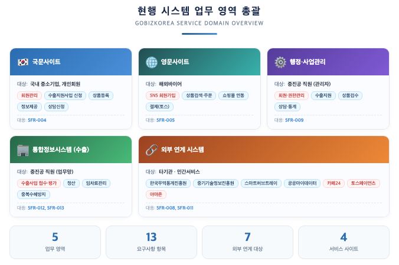
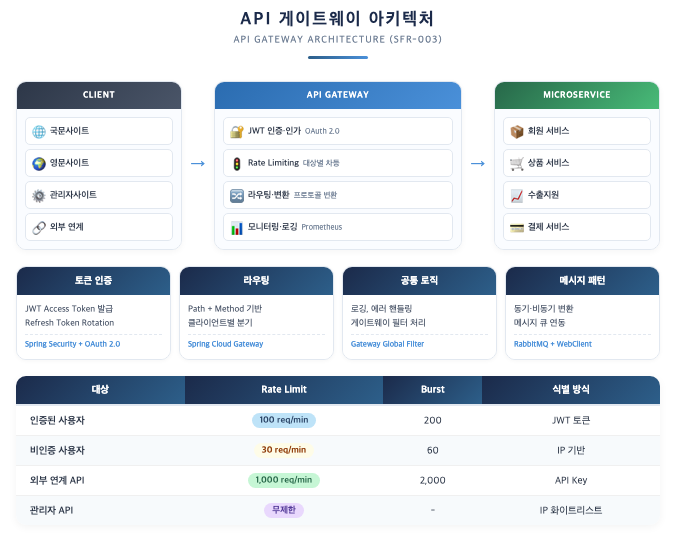
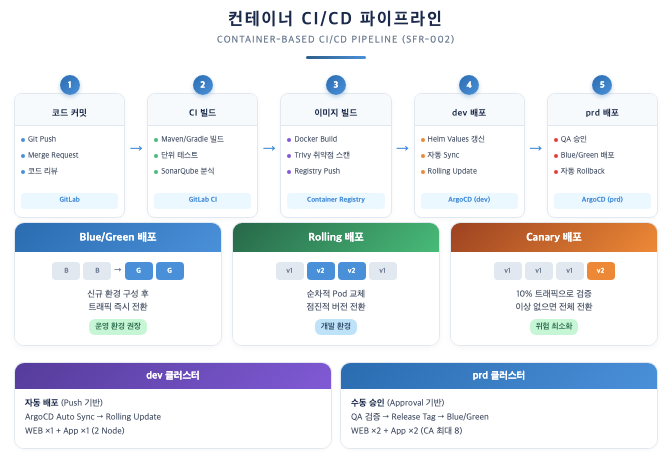
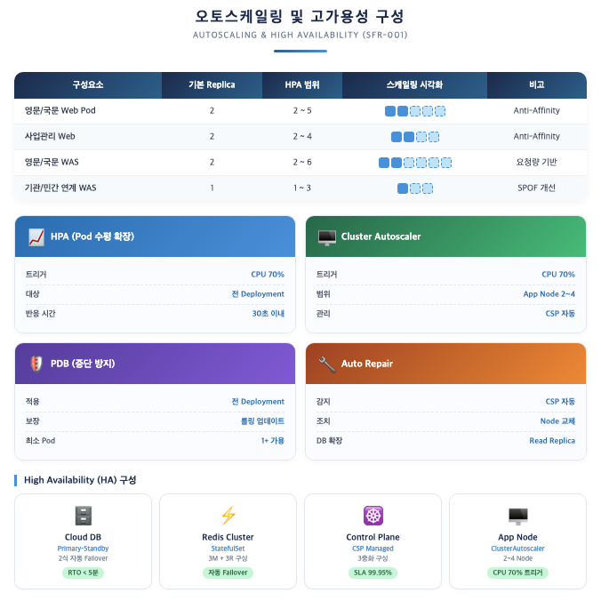
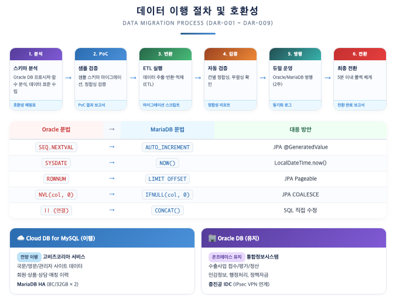
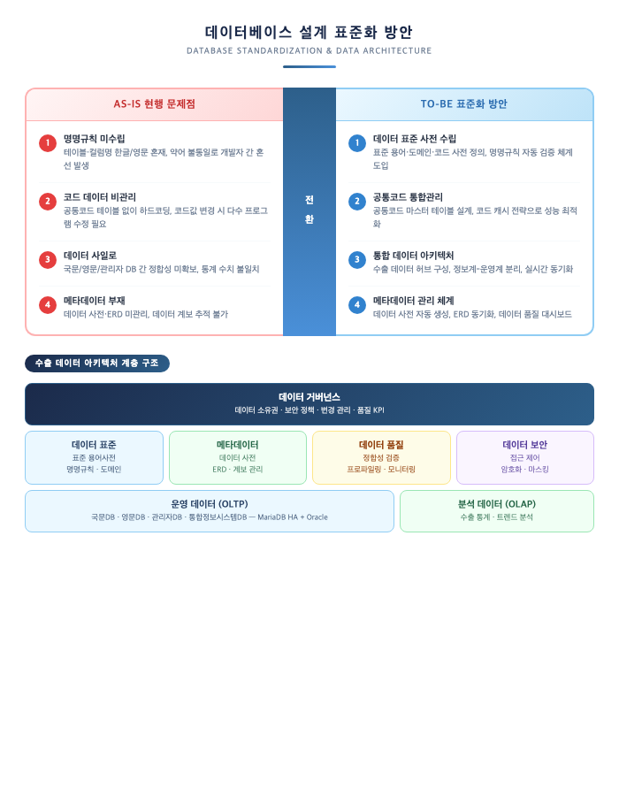
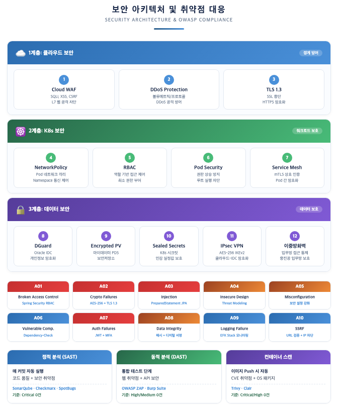
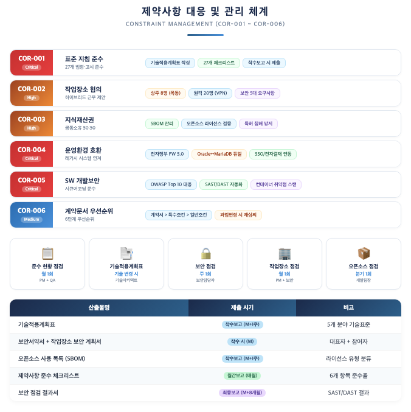

# III. 기술 및 기능

## 1. 기능 요구사항

### 1.1 업무 분석

#### 1.1.1 현행 시스템 업무 영역 분석

본 사업의 대상인 온라인수출플랫폼(고비즈코리아)은 중소기업의 온라인 수출을 종합 지원하는 플랫폼으로, 다음 5개 업무 영역으로 구성됩니다.

#### 1.1.2 현행 서비스 기능 분석

**▶ 수출지원사업 영역**

| 세부 서비스 | 주요 기능 | 비고 |
|---|---|---|
| **B2B 온라인수출사업** | 국내 중소기업과 해외바이어 간 수출거래성사 지원, B2B거래 활성화 | 핵심 사업 |
| **수출계약대응지원** | 바이어 매문의 유효성 검증, 무역실무 밀착지원 | |
| **온라인수출 공동물류** | 수출 물량 집적 후 물류비절감 지원 | |
| **글로벌쇼핑몰활용 판매지원** | 해외온라인시장진출을 위한 글로벌쇼핑 물입점 및 판매지원 | |
| **자사몰진출사업** | 자사쇼핑몰 활용 해외자사몰 구축·성장 지원 | |

**▶ 글로벌이커머스 트렌드·정보 지원 영역**

| 세부 서비스 | 주요 기능 |
|---|---|
| **상담신청바로가기** | 글로벌셀링, 수출신고, 물류통관 등 온라인수출 애로 상담신청 |
| **글로벌이커머스 동향** | 해외거점 현지정책정보, 한류소식, 해외시장 진출전략 동향분석리포트 제공 |
| **온라인수출역량강화교육** | 온라인수출 입문~심화 커리큘럼 교육사업 |
| **해외구매오퍼정보** | 해외바이어 구매희망제품 정보 제공, 국내 공급사 매칭 |

#### 1.1.3 AS-IS 분석 및 개선 방향

**▶ AS-IS 시스템 구성**

| 구분 | 현행 구성 | 수량 |
|---|---|---|
| **WEB서버** | 민간클라우드 (운영, 개발) | 2식 |
| **WAS서버** | 민간클라우드 (운영, 개발, 고비즈행정, 기타API) | 7식 |
| **DB서버** | 민간클라우드 (운영, 개발) | 2식 |
| **NAS서버** | 민간클라우드 (운영, 개발) | 2식 |
| **통합정보시스템** | 중진공 IDC (WEB 1식, WAS 1식, Oracle DB 기존 활용) | 3식 |

**▶ AS-IS 문제점 및 TO-BE 개선 방향**

### 1.2 기능 요구사항 구현방안

> ※ SFR-001(클라우드 네이티브 적용), SFR-002(컨테이너 기반 배포)는 「1.3 기술 적용방안」에서 상세 기술합니다.

#### 1.2.1 API 게이트웨이 관리 기능 (SFR-003)

NKS prd 클러스터 앞단에 API 게이트웨이를 배치하여, 모든 API 요청에 대한 인증·인가·라우팅·모니터링을 통합 관리합니다.

#### 1.2.2 국문사이트 개발 (SFR-004)

**▶ 국문사이트 업무 구성 및 구현방안**

| 업무 영역 | 세부 기능 | 구현 방안 |
|---|---|---|
| **회원영역** | 회원가입, 로그인, 마이페이지 조회 | 유형별 회원분류 처리 (개인회원, 기업회원) |
| | 공인인증서 로그인, 중소벤처24 로그인(이지패스) | 중소벤처24와 통합SSO·IM 연동처리 (SSO SW는 발주사 제공) |
| **수출지원** | 공동물류(기업 신청, 접수) | 전자정부 FW 5.0 기반 신청·접수 워크플로우 |
| | 온라인수출플랫폼(기업 신청, 접수) | React(Next.js) SSG 기반 UI 구현 |
| | 전자상거래 수출지원(기업 신청, 접수) | MariaDB 기반 데이터 관리 |
| **상품서비스** | 상품등록, 상품조회, 상품검색, 상품카테고리 | Elasticsearch 기반 통합검색, 카테고리 트리 관리 |
| **정보제공** | 수출초보기업 대상 글로벌 이커머스 트렌드 등 특화정보 제공 | CMS(콘텐츠관리시스템) 기반 정보 게시 |
| **애로센터** | 수출초보기업 특화상담신청, 특화상담센터 운영 | 상담 워크플로우, CTI 서비스 연동 |
| **마케팅서비스** | 수출초보기업 상담신청, 해외바이어 매칭서비스 | 매칭 알고리즘, 알림 서비스 연동 |
| **기타** | 고비즈코리아 안내, FAQ, Q&A, 사이트맵 등 | 공통 레이아웃, SEO 최적화 |
| **UI/UX 재설계** | UI/UX 공통가이드('디지털 정부서비스 UI/UX 가이드라인') 준수 | VortexUI 디자인 시스템 적용 |

**▶ 국문사이트 기술 구성**

| 구분 | 기술 스택 | 비고 |
|---|---|---|
| **프론트엔드** | React + Next.js (SSG/SSR) | SEO 최적화, 반응형 |
| **백엔드** | Spring Boot 3.x + 전자정부 FW 5.0 | Open JDK 17 |
| **인증** | 중소벤처24 SSO (이지패스), 공인인증서 | 발주사 SSO SW 제공 |
| **데이터** | Cloud DB for MySQL (MariaDB) | 클라우드 DB |
| **검색** | Elasticsearch | 상품·콘텐츠 통합검색 |
| **캐시** | Redis Cluster | 세션 관리, API 캐시 |

#### 1.2.3 영문사이트 개발 (SFR-005)

**▶ 영문사이트 업무 구성 및 구현방안**

| 업무 영역 | 세부 기능 | 구현 방안 |
|---|---|---|
| **회원영역** | 회원가입, 로그인, 마이페이지 조회 | 이메일 기반 가입 + SNS 간편가입 |
| | 구글, 링크드인, 페이스북 등 SNS 간편 회원가입 | OAuth 2.0 Social Login (발주사 협의) |
| **상품/서비스** | 상품조회, 상품카테고리, 기업정보확인, 구매문의, 상품주문, 상품주문이력 | 다국어 지원(i18n), 해외 CDN 적용 |
| **지원/서비스** | 중소기업 매칭서비스 | AI 기반 매칭 추천 |
| **공공 및 민간 쇼핑몰 링크** | buyKorea, tradeKorea.com 물품연동 (각 사이트 API 활용) | REST API 연동, 상품 상세 보기에서 민간 쇼핑몰 링크 기능 제공 |
| | 민간 쇼핑몰 링크 장애 시 대체 페이지 자동 표시 | Circuit Breaker 패턴 (Resilience4j) |
| **토스페이먼츠 결제** | 상품별 토스페이먼츠 결제 연동 | 토스페이먼츠 API 활용, 고비즈코리아↔토스페이먼츠 고객키 관리 |
| | 판매자(중소기업) 가입링크 활용안내페이지 제공 | 운영·정산 기능은 토스페이먼츠에서 제공 |
| | 고비즈코리아로 통한 매출액 등 통계 표시 | 관리자 대시보드 통계 연동 |
| **카페24 상품연동** | 카페24 ↔ 고비즈코리아 상품 양방향 연동 | 카페24 API 활용 |
| **아마존 상품연동** | 아마존 ↔ 고비즈코리아 상품 양방향 연동 | 아마존 API 활용, VPN 연계 |
| **이미지 캐시서버** | 이미지 캐시서버를 별도 구현, 클라우드 CDN 서비스 적용 | NCloud CDN+ 활용 |
| **UI/UX 재설계** | UI/UX 공통가이드 준수 | VortexUI 디자인 시스템, 글로벌 사용자 고려 |

#### 1.2.4 수출기업 데이터 분석 및 설계 (SFR-006)

**▶ 데이터 분석 및 설계 방안**

| 구분 | 활동 | 산출물 |
|---|---|---|
| **기존 데이터 분석** | 기존 고비즈코리아 기업정보, 해외바이어, 상품정보 등 데이터 표준화 분석 | 데이터 현황 분석서 |
| **데이터 구조변경** | 국문사이트·영문사이트 서비스를 고려한 데이터 구조 재설계 | ERD, 테이블 정의서 |
| **정보계 데이터 구성** | 통계처리를 위한 정보계 데이터 구성 | 정보계 데이터 모델 |
| **데이터 표준화** | 수출 데이터 재설계를 위한 표준 용어·도메인·코드 정의 | 데이터 표준 사전 |
| **데이터 마이그레이션** | 기존 데이터 구조에서 신규 구조로의 이행 | 마이그레이션 스크립트, 검증 보고서 |

**▶ 핵심 데이터 영역**

| 데이터 영역 | 주요 항목 | 저장 위치 |
|---|---|---|
| **기업정보** | 기업 기본정보, 수출 역량, 인증 현황 | Cloud DB (MariaDB) |
| **해외바이어** | 바이어 프로필, 관심 분야, 구매 이력 | Cloud DB (MariaDB) |
| **상품정보** | 상품 상세, 카테고리, 가격, 이미지 | Cloud DB + Object Storage |
| **상담/매칭** | 상담 이력, 매칭 결과, 계약 진행 상태 | Cloud DB (MariaDB) |
| **수출사업** | 접수, 평가, 정산, 실적 데이터 | Oracle DB (중진공 IDC 유지) |

#### 1.2.5 수출기업 데이터 통계기능 개발 (SFR-007)

**▶ 통계기능 구현방안**

| 통계 영역 | 구현 내용 | 구현 방안 |
|---|---|---|
| **바이어 매칭 정보 통계** | 기존 관리자메뉴에서 제공하던 바이어 매칭 통계 기능 고도화 | 정보계 DB + 대시보드 |
| **수출실적 통계** | 수기로 관리하던 통계정보를 시스템으로 구현 | 자동 집계 배치, 실시간 대시보드 |
| **민간·공공 연계 수출데이터** | 민간 및 공공 등 유관기관과의 수출데이터 통계 | API 연동 데이터 집계 |

**▶ 통계 기술 구성**

| 구분 | 기술 스택 | 비고 |
|---|---|---|
| **데이터 집계** | Spring Batch | 일/주/월 단위 배치 |
| **실시간 통계** | Redis 기반 카운터 + 스트림 | 실시간 조회수, 매칭수 |
| **시각화** | Nexacro N V24 차트 컴포넌트 (관리자) | 관리자 전용 |
| **데이터 내보내기** | Excel/CSV 다운로드 | 관리자 권한 |

#### 1.2.6 공공마이데이터 연계 (SFR-008)

**▶ 공공마이데이터 연계 구성**

| 연계 구성 | 구현 내용 | 비고 |
|---|---|---|
| **본인기업정보 요청 API 세트** | 행정안전부 공공마이데이터 유통시스템간 이용기관 발급신청 API 활용, 표준 규격 준수 연계 | 데이터 안전 수신 |
| **본인기업정보 수신 API 세트** | 제공요구권 수취 API, 데이터 이용내역 API 등을 활용하여 중진공 내 설치·구현, 본인기업정보 전송 | 수신 연계 |
| **묶음정보 등록 및 API 연계 테스트** | 데이터 요청문 생성 → 제공시스템 전송 → 묶음정보 발급 검증 | 연계 테스트 |

**▶ 보안저장소(PDS) 개발**

행정안전부 가이드라인에 따라 보안저장소(PDS: Personal Data Store)를 개발하여, 수신한 행정정보를 안전하게 보관하며, 행정 및 사업관리서비스에서 확인 가능하도록 구현합니다.

- PDS로 수신한 행정정보는 구분 정보에 따라 제공하도록 구현
- NKS 클러스터 내 Encrypted PV(암호화 볼륨)에 보안 저장
- 접근 로그 기록 및 비정상 접근 탐지

#### 1.2.7 행정 및 사업관리서비스 개발 (SFR-009)

중진공 직원을 위한 사업관리서비스(관리자 기능)를 재개발합니다. 행정 및 관리자 화면은 **Nexacro N V24** 기반으로 구현합니다.

**▶ 행정 및 사업관리 기능 구성**

| 기능 영역 | 세부 기능 | 구현 방안 |
|---|---|---|
| **회원관리** | 회원조회, 회원정보수정(이력포함), 개인회원·기업회원 가입 관리 | Nexacro N V24 + Spring Boot REST API |
| **권한관리** | 업무담당자 접속권한 부여 및 회수, 부서·개인 단위 권한 부여 | 통합정보시스템과 연계, RBAC 기반 |
| **수출지원** | 공동물류(기업평가, 선정, 정산), 온라인수출플랫폼(기업평가, 선정, 정산), 전자상거래 수출지원(기업평가, 선정, 정산) | 워크플로우 엔진, 전자결재 연동 |
| **국문사이트 관리자기능** | 국내기업관리, 수출협상진행, 상품검수관리, 수출계약체결, 상담관리, 통계관리, 상품등록관리, 교육과정관리, SMS관리, 매칭메이킹관리, 온라인전시관 관리 | Nexacro 그리드 기반 CRUD |
| **영문사이트 관리자기능** | 해외바이어관리, 상품검수관리, 통계관리 | 다국어 데이터 관리 |
| **개인정보 기능개발** | 개인정보의 안전성 확보조치 기준(행안부)에 따른 접속기록 보관 및 조회, 다운로드 기록 확인 기능 | 접속기록 6개월 보관, 위·변조 방지 |
| **CTI 서비스 연동** | CTI 서비스(SaaS서비스) 연동, 통화기록 등 보관 | SaaS API 연동 |

#### 1.2.8 대량메일·문자·카카오톡 서비스 구현 (SFR-010)

**▶ 대량발송 아키텍처**

| 구성요소 | 역할 | 기술 스택 |
|---|---|---|
| **발송 스케줄러** | 예약 발송, 반복 발송 관리 | Spring Batch + Quartz |
| **메시지 큐** | 대량 발송 시 비동기 처리, 재시도 | RabbitMQ |
| **발송 게이트웨이** | 채널별(이메일/SMS/카카오/RCS) 발송 처리 | 채널별 API 어댑터 |
| **발송 모니터링** | 발송 현황, 실패 알림, 통계 | Prometheus + Grafana |

대량메일은 Spring Batch + Thymeleaf 템플릿 엔진 기반으로 발송하며, 수신거부 링크 자동 삽입(정보통신망법 준수)과 발송 성공/실패/반송 로그를 관리합니다. 카카오톡(알림톡/친구톡), SMS/LMS/MMS, KT SMS RCS를 통합하여 채널별 API 어댑터로 처리하며, 080 수신거부 번호를 연동합니다.

#### 1.2.9 민간 및 타기관 연계 (SFR-011)

NKS prd 클러스터의 전용 WAS Pod(기관연계 WAS, 민간연계 WAS)를 통해 외부 시스템과의 연계를 구현합니다.

**▶ 타기관 연계 구현방안**

| 연계 대상 | 연계 방식 | 구현 내용 |
|---|---|---|
| **한국무역통계진흥원** | API | Tmydata 서비스 연동, 고비즈데이터 처리 |
| **중소기업기술정보진흥원** | API | 중소기업통합관리시스템 연동, SIMS 데이터 처리 |
| **중진공 물류시스템(스마트트레이드허브)** | SSO/API | 인천공항 물류시스템 연동, 동의받은고객 한해 스마트트레이드허브와 회원데이터 공유 |

**▶ 연계 공통 아키텍처**

| 구성요소 | 역할 | 비고 |
|---|---|---|
| **연계 어댑터** | 연계 대상별 프로토콜 처리 (REST, SOAP, DB Link) | Spring Integration |
| **메시지 큐** | 비동기 연계, 재시도 로직, Dead Letter Queue | RabbitMQ |
| **연계 모니터링** | 연계 성공/실패 현황, 지연 알림 | Prometheus Exporter |
| **데이터 변환** | 연계 데이터 포맷 변환 (JSON ↔ XML ↔ DB) | MapStruct, JAXB |

#### 1.2.10 통합정보시스템(수출) 재개발 (SFR-012)

통합정보시스템(수출)은 중진공 IDC에 위치하며, 기존 통합정보시스템DB를 활용하되 WEB·WAS서버를 신규 구성합니다.

**▶ 통합정보시스템 재개발 범위**

| 기능 영역 | 세부 기능 | 구현 방안 |
|---|---|---|
| **정보시스템 구성** | 기존 중진공 통합정보시스템DB 활용, WEB·WAS서버 신규 구성 | Nginx + Tomcat (중진공 IDC) |
| **권한관리** | 기존 통합정보시스템과 동일한 권한관리 기능 | RBAC, 통합정보시스템 연계 |
| **수출마케팅 실적 조회 관리** | 수출실적입력/조회, 데이터업로드, 글로벌 외부위원 등록/검색 | Nexacro N V24 + Spring Boot |
| **인큐베이터 임차료관리** | 회수계획등록, 회수처리, 납부안내문, 환율정보 등록 | 전자정부 FW 5.0 |
| **중복수혜방지관리** | 부정당업자 등록 및 관리, 수출바우처·자사몰진출·혁신바우처·해외지사화 정보등록 | 교차검증 로직 |
| **HTML5 웹 기반** | HTML5 웹기반으로 구현, 메뉴 등 안내 기능 지원 | 레거시 ActiveX 제거 |
| **내부 SSO 처리** | 중진공 전자결재시스템 등 내부 SSO 처리개발 | SAML 2.0 기반 SSO |
| **데이터 마이그레이션** | 기존 데이터 마이그레이션 지원 | Oracle DB 유지, 스키마 최적화 |

#### 1.2.11 통합정보시스템(수출) 연계 (SFR-013)

고비즈코리아(클라우드)와 통합정보시스템(중진공 IDC) 간의 데이터 연계를 IPsec VPN을 통해 구현합니다.

**▶ 연계 기능 구현방안**

| 연계 기능 | 구현 내용 | 비고 |
|---|---|---|
| **고객정보(기업정보) 등록** | 통합정보시스템의 고객정보 등록 추가 기능, 공단지원현황 등 기업정보 자동 등록 | 기 등록 데이터 시 수출정보만 업데이트 |
| **행정·관리자사이트 연계** | 통합정보시스템(수출)과 행정(내부, 관리자)사이트 간 API 기반 데이터 연계 | REST API, JSON |
| **데이터 통신간 암호화** | IPsec VPN(AES-256, IKEv2) 기반 암호화 통신 | 국정원 보안성검토 대응 |
| **장애 및 로그관리** | 장애 발생에 따른 로그 관리, 재처리 기능 개발 | Dead Letter Queue, 재시도 3회 |

**▶ 연계 데이터 흐름**

| 방향 | 데이터 | 연계 방식 | 주기 |
|---|---|---|---|
| 고비즈코리아 → 통합정보시스템 | 기업정보, 수출사업 신청, 상품정보 | REST API (Push) | 실시간 |
| 통합정보시스템 → 고비즈코리아 | 평가 결과, 정산 정보, 사업 상태 | REST API (Pull) | 실시간/배치 |
| 양방향 | 회원 인증 정보 (SSO) | SAML 2.0 | 실시간 |

### 1.3 기술 적용방안

본 사업은 현행 VM 기반 온프레미스 환경을 **NKS(Ncloud Kubernetes Service) 이중 클러스터 + 하이브리드 클라우드** 아키텍처로 전환하여, 클라우드 네이티브 기반의 안정적이고 확장 가능한 시스템을 구축합니다.

#### 1.3.1 TO-BE 시스템 아키텍처

**▶ 개발/운영 환경 분리**

RFP SFR-001에서 요구하는 개발 및 운영 환경 분리를 NKS 이중 클러스터로 구현합니다. 개발 환경은 고비즈코리아 내부망에만 구성하고, 소스변경 사항 배포 시 고비즈코리아 내부망과 DMZ망에 각각 배포합니다.

| 항목 | dev 클러스터 | prd 클러스터 |
|---|---|---|
| **Control Plane** | CSP Managed | CSP Managed |
| **WEB Node** | ×1 / 4C/16GB (DMZ 구간) | ×2 / 4C/16GB (DMZ 구간) |
| **App Node** | ×1 / 8C/32GB (내부망) | ×2 / 8C/32GB (내부망, CA: 2~4) |
| **DB** | Cloud DB for MySQL (4C/16GB) | Cloud DB for MySQL HA (8C/32GB × 2) |
| **Worker 합계** | **2 Node** | **4 Node (CA 최대 8)** |

#### 1.3.2 클라우드 네이티브 기술 적용 (SFR-001)

본 사업에서는 전자정부 표준프레임워크 5.0을 중심으로 공개 SW 기반의 클라우드 네이티브 기술 스택을 적용합니다. 컨테이너 오케스트레이션(NKS), 오픈소스 DB(MariaDB HA), GitOps 기반 CI/CD 등을 통해 벤더 종속을 최소화하고 확장성·운영 효율성을 확보합니다.

**▶ 하이브리드 클라우드 구성**

중진공 업무망과 VPN 연결을 통한 하이브리드 클라우드를 적용합니다.

- 중진공 업무망 ↔ 고비즈코리아 내부망 간 IPsec VPN 구성
- 국정원 보안성검토에 따른 보안정책 적용
- 민감정보 처리는 통합정보시스템(수출)에서 처리하도록 구현
- 현 운영환경을 준용하여 방화벽 정책, 서버 접근권한, 백업 및 모니터링 정책 적용

#### 1.3.3 컨테이너 기반 배포 (SFR-002)

컨테이너화된 애플리케이션을 쉽고 안전하게 배포하기 위해 자동화 기반의 컨테이너 배포를 구현합니다.

#### 1.3.4 오토스케일링 및 가용성 (SFR-001)

업무서비스 부하에 따른 컨테이너 리소스 용량 및 오토스케일링 정책을 마련합니다. 클러스터 자동 확장 시 서비스 중단을 최소화하기 위한 방안을 수립하였습니다.

#### 1.3.5 외부 연계 시스템

본 사업에서는 공공기관 및 민간서비스와의 외부 연계를 NKS prd 클러스터의 전용 WAS Pod(기관연계 WAS, 민간연계 WAS)를 통해 구현합니다.

| # | 연계 대상 | 유형 | 연계 방식 | 목적 |
|---|---|---|---|---|
| 1 | 한국무역통계진흥원 | 공공 | API | 무역 통계 연동 |
| 2 | 중기기술정보진흥원 | 공공 | API | 기술정보 연동 |
| 3 | 스마트허브트레이 | 공공 | SSO/API | 물류시스템, 회원 공유 |
| 4 | 공공마이데이터 | 공공 | VPN | 본인기업정보 요청/수신 |
| 5 | 카페24 | 민간 | API | 상품 양방향 연동 |
| 6 | 토스페이먼츠 | 민간 | API | 결제/매출 연동 |
| 7 | 아마존 | 민간 | VPN | 글로벌 상품 연동 |

---

## 2. 데이터 요구사항

### 2.1 데이터 이행 계획

#### 2.1.1 데이터 이행 개요

본 사업은 현행 Oracle DB 기반의 고비즈코리아 데이터를 Cloud DB for MySQL(MariaDB)로 이행하는 작업을 포함합니다. 기존 중진공 IDC의 Oracle DB는 통합정보시스템(수출) 용도로 유지하며, 고비즈코리아 서비스 데이터만 클라우드 DB로 이행합니다.

#### 2.1.2 데이터 표준 수립 및 관리 (DAR-001, DAR-002)

「공공기관 데이터베이스 표준화 지침」을 준수하여 데이터 표준을 수립하고 S-Meta 시스템에 등록합니다.

#### 2.1.3 데이터 구조 설계 (DAR-003)

수출 데이터 재설계를 위한 기업정보, 해외바이어, 상품정보 등의 데이터를 표준화하고, 국문사이트·영문사이트 서비스를 고려하여 데이터 구조를 재설계합니다.

**▶ 하이브리드 DB 구조**

| 영역 | DB | 주요 데이터 | 비고 |
|---|---|---|---|
| **클라우드** | Cloud DB for MySQL HA (8C/32GB × 2) | 국문/영문/관리자 사이트, 회원/상품/상담/매칭 | 자동 Failover |
| **중진공 IDC** | Oracle DB (기존 유지) | 수출사업 접수/평가/정산, 민감정보 행정처리, 정책자금 연계 | IPsec VPN 연계 |

두 DB 간에는 IPsec VPN을 통한 데이터 연계를 수행하며, Spring Boot 듀얼 DataSource 구성으로 JPA/MyBatis 병행 운영합니다.

### 2.2 데이터 검증 방안

#### 2.2.1 데이터 구조 검증 (DAR-004)

| 검증 항목 | 검증 방법 | 검증 시기 |
|---|---|---|
| **스키마 정합성** | 원본(Oracle)과 대상(MariaDB) 테이블 구조 비교 | 마이그레이션 후 |
| **참조 무결성** | FK 관계 검증, 고아 레코드 탐지 | 마이그레이션 후 |
| **인덱스 정합성** | 인덱스 존재 여부, 성능 검증 | 마이그레이션 후 |
| **데이터 건수 검증** | 원본·대상 테이블별 건수 비교 자동화 스크립트 | 매 이행 배치 후 |

#### 2.2.2 데이터 값 검증 (DAR-006)

| 검증 항목 | 검증 방법 | 비고 |
|---|---|---|
| **필수값 검증** | NOT NULL 제약조건 위반 데이터 탐지 | 자동 스크립트 |
| **범위값 검증** | 숫자형 필드의 최소/최대값, 날짜형 필드의 유효 범위 검증 | 비즈니스 규칙 기반 |
| **형식 검증** | 이메일, 전화번호, 사업자번호 등 형식 패턴 검증 | 정규표현식 활용 |
| **코드값 검증** | 코드 테이블과의 참조 정합성 검증 | 공통코드 기반 |
| **합계 검증** | 금액/수량 필드의 원본·대상 합계 비교 | 체크섬 방식 |

#### 2.2.3 데이터 정합성 검증 (DAR-008)

Oracle과 MariaDB 간 병행운영 기간(2주) 동안 데이터 정합성을 지속적으로 검증합니다.

**▶ 정합성 검증 절차**

| 단계 | 검증 활동 | 도구 |
|---|---|---|
| **1차 검증** | 테이블별 건수, 체크섬 비교 | 자체 검증 스크립트 |
| **2차 검증** | 주요 업무 트랜잭션 시나리오별 결과 비교 | 테스트 시나리오 |
| **3차 검증** | 외부 연계 시스템 데이터 송수신 정합성 | 연계 테스트 |
| **최종 검증** | 사용자 인수테스트(UAT) 기반 업무 데이터 확인 | 사용자 참여 |

### 2.3 에러 처리 방안

#### 2.3.1 데이터 이행 시 에러 처리

| 에러 유형 | 처리 방안 | 비고 |
|---|---|---|
| **인코딩 오류** | UTF-8 통일, 문자셋 변환 스크립트 적용 | Oracle NLS → MariaDB UTF8MB4 |
| **데이터 타입 불일치** | 호환성 매핑표 기반 타입 변환, 예외 데이터 로깅 | 자동 변환 + 수동 보정 |
| **제약조건 위반** | 이행 전 데이터 클렌징, 위반 건 별도 리포팅 | 원본 데이터 정비 |
| **시퀀스/자동증가 충돌** | MAX 값 기반 시퀀스 재설정, GAP 분석 | 이행 완료 후 검증 |
| **대용량 LOB 데이터** | 분할 이행, 스트리밍 전송, 실패 시 재시도 로직 | 이미지/첨부파일 |

#### 2.3.2 운영 시 에러 처리

| 에러 유형 | 처리 방안 | 비고 |
|---|---|---|
| **DB 커넥션 장애** | Connection Pool 모니터링, 자동 재연결, Failover | HikariCP 설정 |
| **데이터 동기화 오류** | 재시도 로직(3회), Dead Letter Queue 처리, 알림 | RabbitMQ 활용 |
| **데이터 복구** | 자동 일 1회 Full Backup + 바이너리 로그, PITR 지원 | Cloud DB 관리형 |
| **Oracle-MariaDB 연계 오류** | VPN 장애 감지, 대기열 기반 비동기 재시도, 수동 동기화 | IPsec VPN 모니터링 |

---

## 3. 보안 요구사항

### 3.1 보안기술 적용 방안

#### 3.1.1 보안 관리 체계 (SER-001)

착수부터 사업 종료 시까지 현장 보안 점검 및 교육을 진행하며, 고객사의 보안 규정을 수용하고 준수합니다. 보안 관리 체계는 **관리적 보안**, **기술적 보안**, **물리적 보안**의 3개 축으로 구성하며, 점검결과에 따른 취약점 보완 및 재검사를 중심에 두고 지속적으로 운영합니다.

**▶ 관리적 보안**

| 구분 | 관리 방안 | 비고 |
|---|---|---|
| **정책 및 지침** | 인적·물적 자원에 보안 정책 및 지침 수립 후 적용, 보안 정책에 따른 수시 보안 진단 실시 | |
| **인적 자원 관리** | 프로젝트 인력 투입 시 각 개인의 친필 서명이 들어간 보안서약서 제출, 인원 교체 발생 시 정보보안책임자에게 보고, 사업 시작 전 또는 인원 교체 시 보안 교육 후 참여 | |
| **비밀 보안 준수** | 사업 수행 중 취득한 지식은 비밀 보안 준수, 사업 완료 후에도 취득한 지식에 대한 비밀 보안 준수 | |
| **취득 정보 유출 금지** | 수행 과정 중 취득한 자료와 정보는 발주사의 승인 없이 외부 유출 또는 누설 금지, 법적 책임이 있는 대표자용 보안확약서 및 참여자용 보안 확약서 작성 및 제출 | |
| **내부 자료 관리** | 사업 수행에 필요한 내부 자료는 복사 및 외부 반출 금지 | 발주사 승인 시 산출물 보관용 보조기억매체 제외 |
| **용역 산출물 보안** | 모든 산출물은 지정된 산출물 저장소 또는 PC에 저장, 사업 종료 시 정보보안 담당자 입회 하 완전 폐기 또는 반납 | 지정 자료관리 PC는 외부 Network 차단 |
| **개인정보보호** | 개인정보보호법 및 기술적·관리적 보호조치 기준 준수, 개인식별 정보 암호화 DB 저장, 소스코드 직접 코딩 금지 | |
| **저작권** | 저작권을 침해할 수 있는 소프트웨어 및 문서의 보유 및 사용 금지 | |

> ※ 관리 방안은 개인정보보호법, 개인정보의 기술적·관리적 보호조치 기준, 정보통신망법 등 관련 법규를 준수합니다.

**▶ 개인정보보호 관리 방안 (SER-002)**

수집되는 개인정보는 「개인정보보호법」 및 「개인정보의 안전성 확보조치 기준」에 따라 관리되도록 개발하며, 다음 사항을 이행합니다.

- 개인정보 수집은 최소화하고, 고유식별번호 등은 암호화하여 저장
  - 중진공 표준 솔루션 **DGuard**를 활용한 DB 암호화 적용
- 개인정보 접속기록을 저장하고, 비정상적인 접속여부 등을 관리
- 수집된 개인정보의 파기 절차를 구현
- 개인정보의 안정성을 고려하여 특정 정보는 가명정보, 합성정보 등으로 변환 수행
  - 개발·테스트 환경에서는 실제 개인정보 대신 합성정보를 생성하여 활용

#### 3.1.2 응용 프로그램 및 DB 보안, 클라우드 보안 아키텍처 (SER-004)

본 사업은 하이브리드 클라우드 구성을 포함하므로, **클라우드·K8s·데이터** 3계층 보안 아키텍처를 적용하며, OWASP Top 10 (2021) 취약점에 대한 체계적 대응과 정적/동적/컨테이너 보안 검증 체계를 수립합니다.

**▶ 개인정보보호 조치**

| 보호 조치 | 구현 방안 | 법적 근거 |
|---|---|---|
| **개인정보 암호화** | 주민번호, 계좌번호, 비밀번호 AES-256 암호화 저장 | 개인정보보호법 제29조 |
| **접속기록 관리** | 개인정보 조회·수정·삭제 로그 6개월 보관, 위·변조 방지 | 안전성 확보조치 기준 제6조 |
| **개인정보 파기** | 보유기간 만료 시 자동 파기, 파기 로그 기록 | 개인정보보호법 제21조 |
| **다운로드 통제** | 관리자 다운로드 시 사유 기재, 승인 절차, 워터마크 | 개인정보보호법 제29조 |
| **개인정보 마스킹** | 일반 사용자 조회 시 주민번호 뒷자리 마스킹 | 개인정보 보호지침 |

#### 3.1.3 물리적/기술적/망접근 보안 (SER-006, SER-007)

내/외부망 접근 관리, 시설에 대한 출입 관리, 장비 반출 관리 등 지속적인 물리적 보안 사고 방지 활동을 실시합니다.

| 구분 | 세부 항목 | 관리 방안 |
|---|---|---|
| **물리적 보안** | 장비 반입/반출 관리 | 외부 반입 장비 악성 코드 감염 확인, PC 백신 최신 상태 유지, 노트북·USB 등 장비 관리 절차 준수 |
| | 시설 보안 | 프로젝트 수행 사무실 주요 장비 설치 장소에 대한 출입 보안 실시 |
| | 사무 환경 관리 | 잠금 장치 보관함 사용, 문서 보안 등급 부여 및 권한 관리 |
| | 자료 폐기 | 「정보시스템 저장매체 불용처리 지침」 준수, 데이터삭제 S/W 또는 Format 후 반출 |
| **기술적 보안** | 시스템 보안 | 시스템 Password의 주기적 변경 관리 |
| | 바이러스 보안 | PC 백신 프로그램 최신 상태 유지 |
| | 데이터 보안 | 불의 사고 대비 백업 정책 수립 및 실행 |
| **내외부망 접근 보안** | 방화벽/원격접근 통제 | 방화벽 또는 원격접근통제시스템 활용, 발주사 정보보안 S/W 설치 |

#### 3.1.4 인력 보안 (SER-005)

사업 참여 인력에 대한 주기적인 보안 교육 및 점검 활동을 통해 보안 사고 예방 활동을 실시합니다.

| 구분 | 관리 방안 | 비고 |
|---|---|---|
| **공통** | 사업 시작 전 또는 인원 교체 시 보안 교육 후 참여, 월 1회 주기적 교육 실시, 보안 정책 위반 시 '사업자 보안 위규 처리 기준'에 따라 행정 조치 | |
| **사업 착수 시** | 프로젝트 인력 투입 시 각 개인의 친필 서명이 들어간 보안서약서 제출 | |
| **사업 수행 시** | 개인 저장 장치 반입/반출 통제, 인원 철수 시 특별 보안 교육 및 PC 반출 절차 적용, 접속 계정 삭제, 발주사 요구 보안교육 참석 | |
| **사업 종료 시** | PC는 프로젝트 자료 사용 불가능하도록 조치, 사업 관련 자료 보유 금지, "대표자용 보안확약서" 및 "참여자용 보안확약서" 제출 | 자료 사용 불가능 조치 방법은 고객사와 협의 후 확정 |

### 3.2 보안 표준 준수 방안

#### 3.2.1 준수 대상 보안 규정 및 지침

발주기관 및 상위 기관의 보안 규정과 지침을 준수하며, 국가정보원의 보안성검토 결과에 따른 보안정책 및 조치사항을 적용합니다.

- 국가정보원의 국가 정보보안 기본지침
- 중소벤처기업부, 중소벤처기업진흥공단의 보안 규정 및 지침
- 개인정보보호법 등 개인정보보호 관련 법규, 지침
- 행정안전부장관이 정하는 「소프트웨어 개발보안 가이드」
- 행정기관 및 공공기관 정보시스템 구축·운영 지침
- 중소벤처기업진흥공단의 「정보화 용역사업 보안관리 실무가이드」
- 소프트웨어 보안약점 진단가이드
- 「공공기관의 개인정보보호에 관한 법률」에 의한 개인정보 보호지침 등

#### 3.2.2 국정원 보안성 검토 대응

본 사업은 하이브리드 클라우드 구성(민간클라우드 + 중진공 IDC)을 포함하므로, 국정원 보안성 검토 대상입니다.

| 검토 항목 | 대응 방안 |
|---|---|
| **암호 모듈 검증** | 국정원 검증필 암호 모듈 사용 (DB암호화, 키보드 보안, 구간 암호화) |
| **CC 인증 제품** | 필수 보안 제품 CC 인증 제품 사용 (방화벽, 침입방지, WAF 등) |
| **백도어 방지** | 보안기능 확인, 취약점 제거, 펌웨어 업데이트, 오픈소스 리스트 제공 |
| **VPN 암호화** | IPSec VPN, AES-256, IKEv2 프로토콜 |
| **보안 점검** | 국정원 보안성 검토 협조, 지적 사항 즉시 조치 |

#### 3.2.3 소프트웨어 개발보안 준수 (COR-005)

본 사업은 「전자정부법 시행령」 제50조~제53조 및 행정안전부 「소프트웨어 개발보안 가이드」를 준수하여 개발합니다.

**▶ 보안 검증 체계**

| 검증 단계 | 검증 방법 | 검증 도구 | 검증 시기 |
|---|---|---|---|
| **① 설계 단계** | 기술적용계획표 작성, 아키텍처 리뷰 | 체크리스트 | M+2주 |
| **② 개발 단계** | 코드 리뷰, 정적 분석 | SonarQube, ESLint | 매 스프린트 |
| **③ 테스트 단계** | 웹 접근성 검사, 웹 호환성 테스트 | WAVE, BrowserStack | M+6개월 |
| **④ 오픈 전** | 품질인증, 보안 점검 | 전자정부 품질인증, 국정원 보안점검 | M+8개월 |

---

## 4. 제약사항

### 4.1 제약사항 분석 및 대응방안

본 컨소시엄은 RFP에서 제시된 6개 제약사항(COR-001~006)을 완벽히 준수하며, 각 제약사항에 대한 구체적인 이행 방안과 관리 체계를 수립하였습니다.

#### 4.1.1 COR-001: 표준 지침 준수

본 사업은 RFP에서 제시된 27개 법령·고시를 준수하며, 각 표준별 준수 현황을 기술적용계획표로 관리합니다.

**▶ 준수 대상 법률 (14개)**

| 법률명 | 준수 내용 | 대응 방안 |
|---|---|---|
| **지능정보화 기본법** | 정보화사업 추진 절차, 정보시스템 구축·운영 기준 | 정보화사업 관리지침 준수, PMO 체계 운영 |
| **개인정보 보호법** | 개인정보 수집·이용·제공·파기, 안전성 확보조치 | 개인정보처리방침 수립, 암호화, 접속기록 관리 |
| **소프트웨어 진흥법** | SW사업 수행 기준, 하도급 제한, 대가 기준 | 과업심의위원회 개최 완료, 중소SW사업자 단독 수행 |
| **전자정부법** | 정보시스템 구축·운영 지침, 전자정부 표준프레임워크 적용 | 전자정부 FW 5.0 적용, 행정안전부 고시 준수 |
| **정보통신기반 보호법** | 주요정보통신기반시설 지정·보호 | 침해사고 대응 체계 수립 |
| **정보통신망법** | 개인정보보호, 정보보호 조치, 접근제어 | ISMS-P 인증 기준 준수 고려 |
| **통신비밀보호법** | 통신 내용 보호, 암호화 통신 | TLS 1.3 적용, IPSec VPN 암호화 |
| **국가계약법** | 계약 체결·이행·검사 기준 | 협상에 의한 계약, 용역계약일반조건 준수 |
| **하도급거래 공정화에 관한 법률** | 하도급 대금 지급, 부당특약 금지 | 본 사업 하도급 불허 (RFP 명시) |
| **공공데이터법** | 공공데이터 개방, 표준화 | 공공데이터 개방 API 검토 |
| **보안업무규정(대통령령)** | 국가 정보보안 기본지침 | 국정원 보안성 검토 대응 |

**▶ 준수 대상 고시 및 지침 (13개)**

| 고시/지침명 | 준수 내용 | 대응 방안 |
|---|---|---|
| **장애인·고령자 정보접근 편의 증진 고시** | KWCAG 2.2 | WCAG 2.1 AA 준수, 접근성 인증마크 취득 목표 |
| **전자정부 웹사이트 품질관리 지침** | 웹사이트 품질관리 기준 | 품질 테스트 수행, 품질관리계획서 제출 |
| **행정기관 정보시스템 구축·운영 지침** | 기술적용 계획, 정보화사업 관리 | 기술적용계획표 작성·제출, 정보화사업 절차 준수 |
| **SW사업 계약 및 관리감독 지침** | 과업심의위원회, 계약금액 조정 | 과업심의 완료, 과업변경 시 재심의 요청 |
| **용역계약일반조건** | 계약 이행, 산출물 제출, 하자보수 | 계약예규 준수, 하자보수 12개월 |
| **공공기관 데이터베이스 표준화 지침** | 데이터 표준 수립, 표준 사전 관리 | S-Meta 시스템 등록, 범정부 표준 준수 |
| **모바일 전자정부 서비스 관리 지침** | 모바일 앱·웹 보안, UI/UX 가이드 | 반응형 웹 적용, 모바일 보안 취약점 점검 |
| **디지털 정부서비스 UI/UX 가이드라인** | UI/UX 설계 원칙, 사용성 기준 | VortexUI 기반 일관된 디자인 시스템 적용 |
| **소프트웨어 개발보안 가이드** | 시큐어코딩, 보안약점 진단 | OWASP Top 10 대응, 정적 분석(SonarQube) |

**▶ 기술적용계획표 작성 및 관리**

기술적용계획표는 「행정기관 및 공공기관 정보시스템 구축·운영 지침」 제7조 및 제43조에 근거하여 작성하며, 착수보고 시 발주기관에 제출합니다.

| 관리 항목 | 관리 방법 |
|---|---|
| **작성 시기** | 착수보고 시 (M+1주) |
| **작성 범위** | 서비스 접근 및 전달, 인터페이스 및 통합, 플랫폼 및 기반구조, 요소기술, 보안 5개 분야 |
| **작성 주체** | PM + 기술아키텍트 (TA) |
| **검토·승인** | 발주기관 검토 → PM 서명 → 사업 기간 중 준수 |
| **변경 관리** | 기술 스택 변경 시 변경 사유 기재 후 발주기관 승인 득함 |

#### 4.1.2 COR-002: 작업장소 상호협의 결정

본 컨소시엄은 하이브리드 근무 체계를 제안하며, 발주기관과 협의하여 최종 확정합니다.

**▶ 작업장소 제안**

| 작업 유형 | 제안 작업장소 | 인원 | 근무 형태 | 보안 조치 |
|---|---|---|---|---|
| **핵심 개발** | 중진공 목동 본사 인근 사무실 | 8명 | 상주(주5일) | 출입통제, 보안서약서, PC 보안 |
| **원격 개발** | 아스트라비전 강남 본사 | 20명 | 원격(VPN) | VPN 암호화, 화면녹화 금지, 반출금지 |
| **회의·보고** | 중진공 목동 본사 회의실 | PM+ | 주1~2회 | 출입증 발급, 방문 기록 |
| **긴급 대응** | 재택 (필요 시) | 필요 | 긴급 시 | VPN + 다중인증(MFA) |

#### 4.1.3 COR-003: 지식재산권

본 사업의 지식재산권은 「용역계약일반조건」 제56조 및 「계약예규」 제35조의2에 따라 발주기관(중진공)과 제안사(컨소시엄)가 공동으로 소유합니다.

**▶ 지식재산권 귀속 원칙**

| 지식재산권 항목 | 귀속 | 지분율 | 비고 |
|---|---|---|---|
| **산출물 저작권** | 공동 소유 | 균등 (50:50) | 별도 정함이 없는 한 균등 |
| **소스코드** | 공동 소유 | 균등 (50:50) | 타 기관 공동활용 계획 없음 (RFP 명시) |
| **설계 문서** | 공동 소유 | 균등 (50:50) | ERD, API 명세서, 아키텍처 설계서 등 |
| **데이터베이스** | 공동 소유 | 균등 (50:50) | 스키마, 데이터 표준 사전 등 |

**▶ 오픈소스 소프트웨어 라이선스 관리**

| 오픈소스 SW | 라이선스 | 사용 목적 | 준수 사항 |
|---|---|---|---|
| **React** | MIT License | 프론트엔드 UI 렌더링 | 상업적 이용 가능, 저작권 고지 |
| **Next.js** | MIT License | SSG 프레임워크 | 상업적 이용 가능, 저작권 고지 |
| **Spring Boot** | Apache License 2.0 | 백엔드 프레임워크 | 상업적 이용 가능, 라이선스 고지 |
| **MariaDB** | GPL v2 | 데이터베이스 | 서버 측 사용, 소스코드 공개 의무 없음 |
| **Kubernetes** | Apache License 2.0 | 컨테이너 오케스트레이션 | 상업적 이용 가능, 라이선스 고지 |
| **GitLab CE** | MIT License | SCM + CI | 상업적 이용 가능, 저작권 고지 |
| **ArgoCD** | Apache License 2.0 | GitOps CD | 상업적 이용 가능, 라이선스 고지 |

#### 4.1.4 COR-004: 기존 운영환경 호환

본 사업은 신규 클라우드 시스템과 기존 IDC 시스템을 병행 운영해야 하므로, 호환성 확보가 핵심입니다.

**▶ 전자정부 표준프레임워크 호환성**

| 호환성 항목 | 기존 환경 | 목표 환경 | 호환성 확보 방안 |
|---|---|---|---|
| **프레임워크 버전** | 전자정부 FW 3.x/4.x | 전자정부 FW 5.0 | Spring Boot 3.x 기반 마이그레이션 |
| **JDK 버전** | JDK 8/11 | Open JDK 17/21/23 | Jakarta EE 마이그레이션 (javax.* → jakarta.*) |
| **Spring 버전** | Spring 4.x/5.x | Spring Boot 3.x | Spring Boot Migration Guide 적용 |
| **데이터베이스** | Oracle 19c | MariaDB 11.x + Oracle | 듀얼 DataSource, SQL 호환성 매핑표 |

#### 4.1.5 COR-005: 소프트웨어 개발보안 준수

> ※ 상세 내용은 「3.1.2 응용 프로그램 및 DB 보안」 및 「3.2.3 소프트웨어 개발보안 준수」 절을 참조합니다.

#### 4.1.6 COR-006: 계약문서의 우선순위

**▶ 계약문서 우선순위**

| 우선순위 | 문서명 | 비고 |
|---|---|---|
| **1순위** | 계약서 | 최종 계약 체결 문서 |
| **2순위** | 일반용역계약 특수조건 | 중진공 특수조건 |
| **3순위** | 용역계약일반조건 | 재정경제부 계약예규 |
| **4순위** | 과업내용서 | 계약 시 첨부 |
| **5순위** | 제안요청서 (RFP) | 입찰 공고 문서 |
| **6순위** | 제안서 | 본 제안서 |

**해석 원칙:**
- 상위 문서가 하위 문서에 우선합니다.
- 문서 간 상충 시 상위 문서를 따릅니다.
- 명시되지 않은 사항은 상호 협의하여 결정합니다.

**▶ 과업 범위 변경 관리**

과업 내용 변경은 「소프트웨어 진흥법」 제50조에 따라 다음 프로세스를 준수합니다.

1. 변경 사유 발생 → 제안사가 과업변경요청서 제출 (별지 13호 서식)
2. 발주기관 검토 → 과업심의위원회 개최 요청 검토
3. 과업심의위원회 개최 → 변경 타당성 검토, 계약금액·기간 조정 심의
4. 심의 결과: 승인 시 계약 변경 체결, 불승인 시 기존 계약 유지
