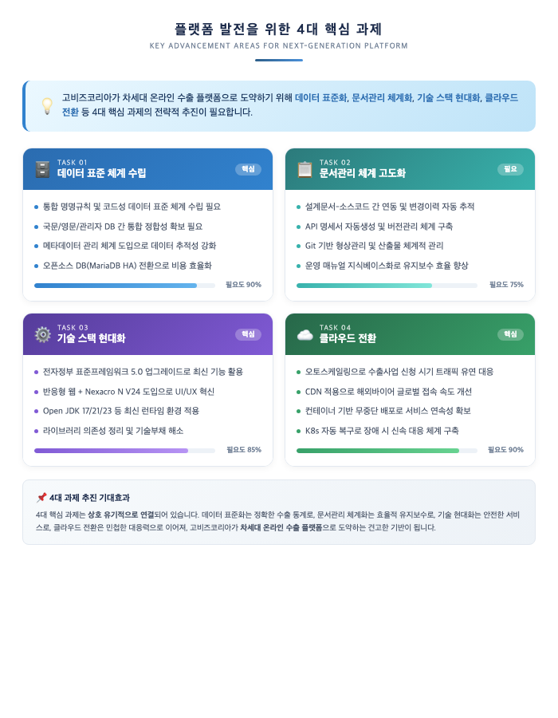
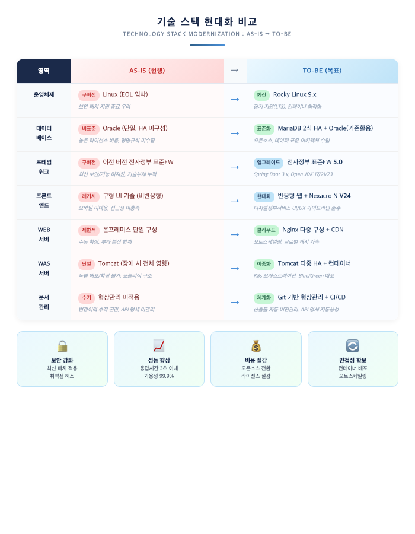
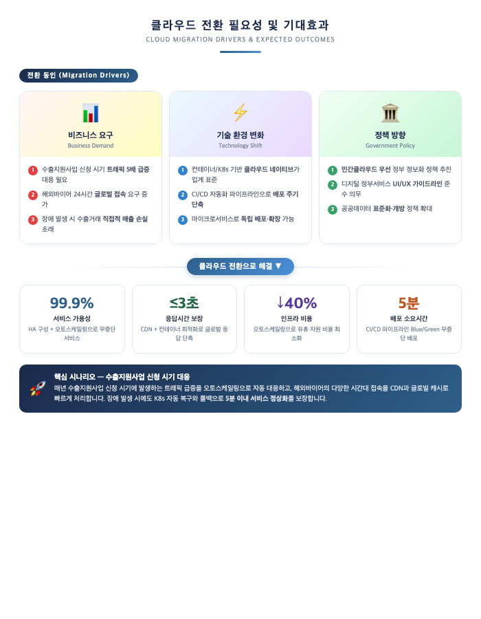
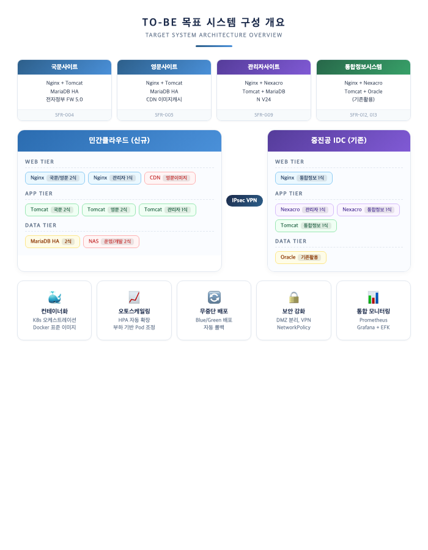
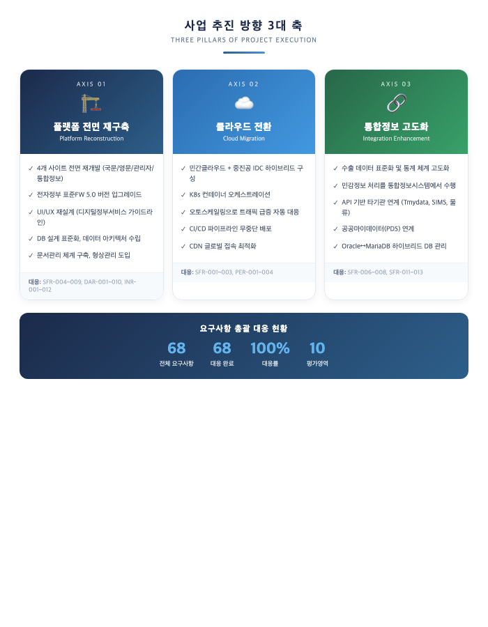

## II. 추진전략 및 방법

### 2.1 사업이해도

#### 2.1.1 추진배경 및 목적 이해

본 사업은 중소벤처기업진흥공단(온라인수출처)이 운영하는 **온라인수출플랫폼(고비즈코리아)** 의 전면 재구축과 클라우드 전환을 목적으로 합니다. 디지털 무역의 급격한 성장에 따라 국내 중소기업의 온라인 수출 참여가 확대되고 있으며, 이에 발맞추어 고비즈코리아가 차세대 플랫폼으로 도약하기 위해 **데이터 표준 체계 수립**, **문서관리 고도화**, **기술 스택 현대화**, **클라우드 전환**이 필요한 시점입니다.

본 컨소시엄은 **베트남 온라인 수출플랫폼 모델 전수 ODA 사업**(중진공 발주, 2024~2026년, 31.2억원)을 통해 Gobiz Vietnam을 직접 구축하여 고비즈코리아의 업무 프로세스와 데이터 구조를 실무적으로 파악하고 있습니다.

| 사업 목적 | 내용 | 대응 요구사항 |
|---------|------|------------|
| 플랫폼 현대화 | 4개 사이트(국문/영문/관리자/통합정보) 전면 재구축 | SFR-004, 005, 009, 012 |
| 클라우드 전환 | 민간클라우드 기반 하이브리드 인프라 구성 | SFR-001, 002 |
| 데이터 표준화 | 수출 데이터 아키텍처 수립 및 통계 고도화 | SFR-006, 007, DAR-001~009 |
| 사용자 경험 혁신 | 디지털 정부서비스 UI/UX 가이드라인 준수 재설계 | INR-001~012 |
| 기관 연계 강화 | 수출유관기관 API 기반 통합 연계 | SFR-011, 013 |

---

#### 2.1.2 플랫폼 발전을 위한 4대 핵심 과제

고비즈코리아가 차세대 온라인 수출 플랫폼으로 도약하기 위해 다음 **4대 핵심 과제**의 전략적 추진이 필요합니다. 각 과제는 상호 유기적으로 연결되어, 데이터 표준화는 정확한 수출 통계로, 문서관리 체계화는 효율적 유지보수로, 기술 현대화는 안전한 서비스로, 클라우드 전환은 민첩한 대응력으로 이어집니다.

---

#### 2.1.3 기술 스택 현대화 방향

운영체제부터 프레임워크, 데이터베이스, 프론트엔드에 이르기까지 **전 영역에 걸친 기술 현대화**를 통해 현대 기술력을 소화할 수 있는 구조로 전환합니다. 특히 전자정부 표준프레임워크 5.0 업그레이드(Spring Boot 3.x, Open JDK 17/21/23)와 Git 기반 형상관리·CI/CD 도입은 보안 강화와 개발 생산성 향상을 동시에 달성하는 핵심 전환 포인트입니다.

---

#### 2.1.4 클라우드 전환 필요성

현행 인프라 구조에서는 수출지원사업 신청 시기의 트래픽 급증이나 해외바이어의 다양한 시간대 접속 등 **다양한 상황에 빠르게 대처하기 어렵습니다**. 클라우드 전환은 비즈니스 요구, 기술 환경 변화, 정부 정책 방향이라는 3가지 동인에 의해 추진되며, 구체적 기대효과를 제시합니다.

---

#### 2.1.5 목표시스템 TO-BE 및 추진 방향

민간클라우드와 중진공 IDC를 IPsec VPN으로 연결하는 하이브리드 클라우드 환경 위에, K8s 컨테이너 오케스트레이션을 적용하여 오토스케일링·무중단 배포·자동 복구가 가능한 인프라를 구축합니다.

본 컨소시엄은 **플랫폼 전면 재구축**, **클라우드 전환**, **통합정보 고도화**의 3대 축으로 차별화된 사업 추진 방향을 제시합니다.

> **컨소시엄 강점**: 아스트라비전은 ODA 사업으로 Gobiz Vietnam을 구축하고, KOTRA AI무역지원센터 3개소를 운영하여 고비즈코리아의 업무 프로세스를 실무적으로 파악하고 있습니다. 퀸텟시스템즈는 AWS ISV Partner로서 MSA/멀티테넌트 아키텍처 운영 경험을 보유하고 있습니다.

---

> **[작성 메모]**
> - 본 섹션은 배점 10점(90점 기준), A4 약 2페이지 분량으로 구성하였습니다.
> - 고객 관점에서 "문제 지적"이 아닌 "발전 방향·필요성" 중심으로 서술하였습니다.
> - 이미지 5건 (HTML 원본 `images/03_*.html` 보관): 4대 핵심 과제, 기술 현대화 비교, 클라우드 전환 필요성, TO-BE 시스템 구성, 3대 추진 방향
