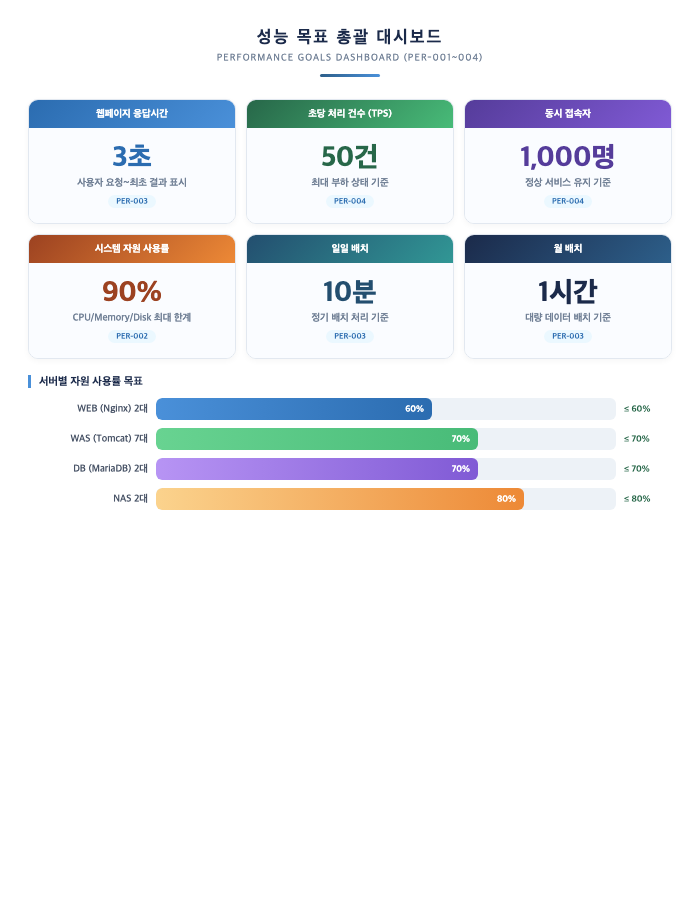
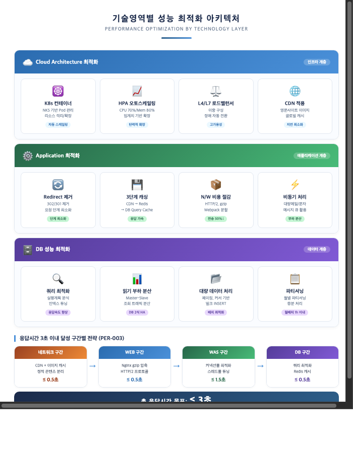
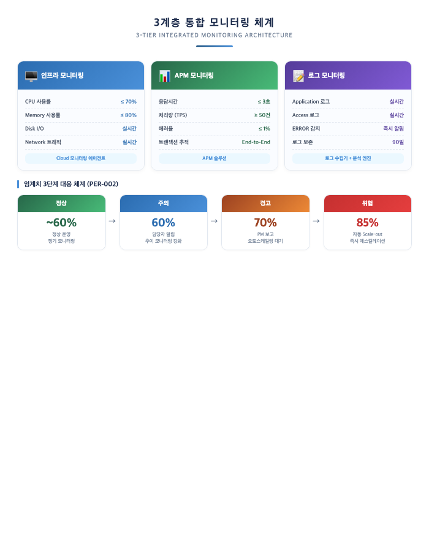
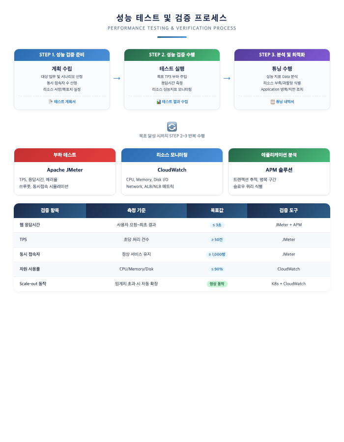
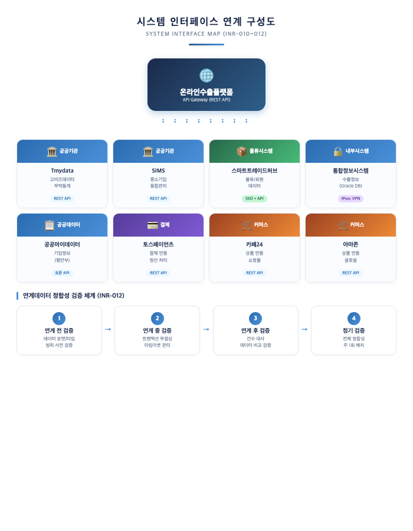
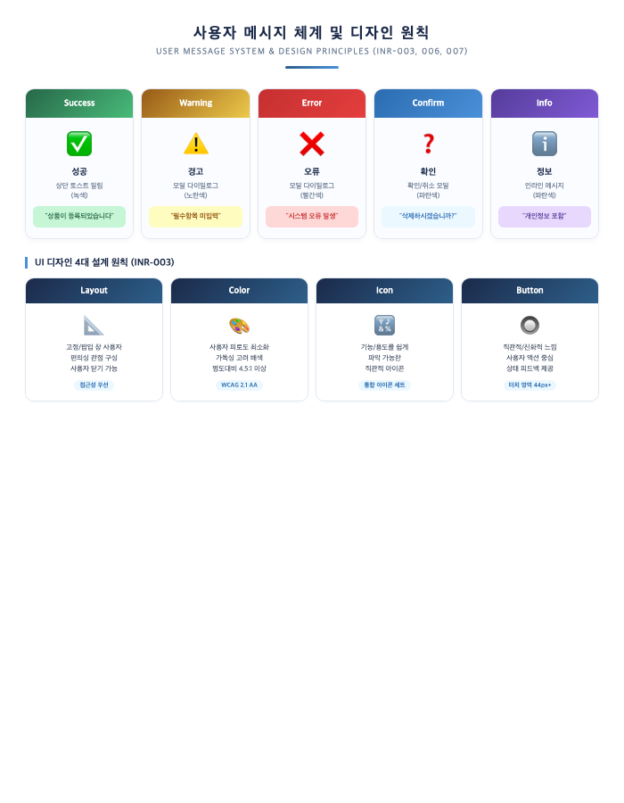
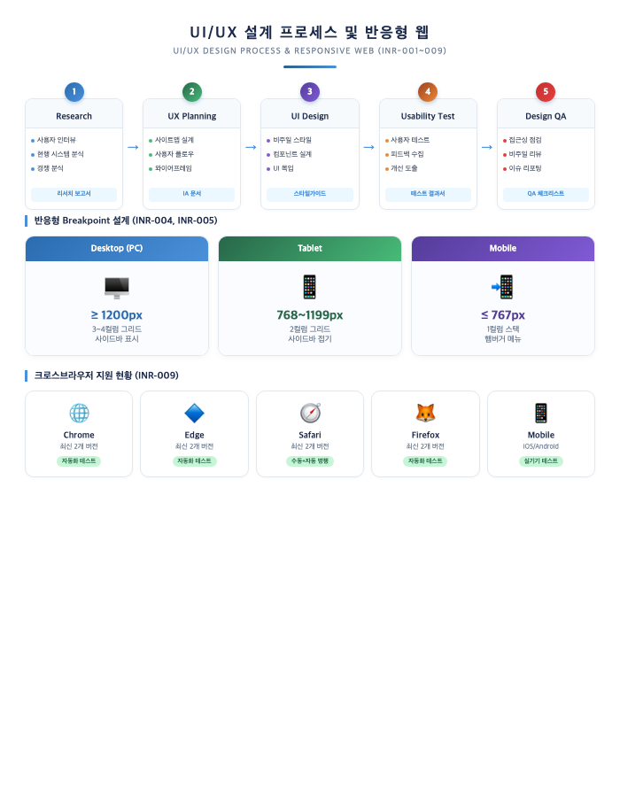
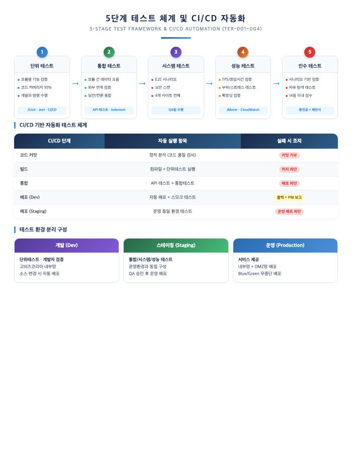
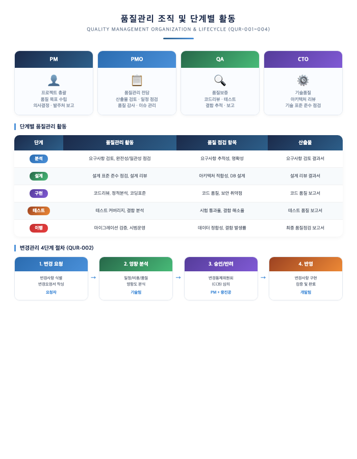
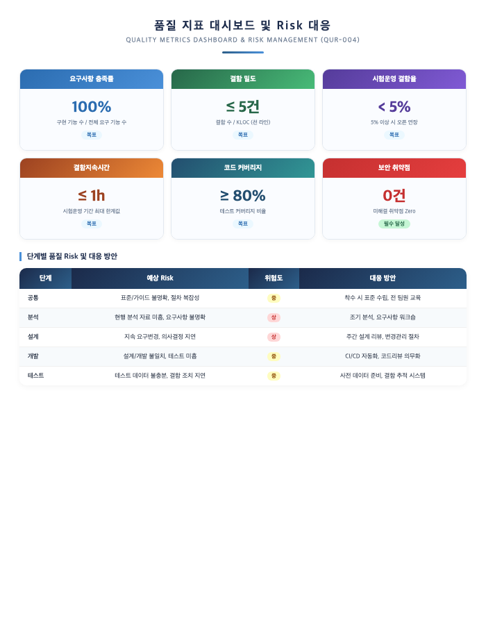

# IV. 성능 및 품질

## 1. 성능 요구사항

### 1.1 성능 충족 방법론 및 도구

본 사업은 민간클라우드 기반의 온라인수출플랫폼을 클라우드 네이티브 아키텍처로 전환·재구축하는 사업으로, 체감성능을 보장하기 위한 Architecture와 개발표준을 설계하고, 클라이언트·서버 각 구간별 응답시간을 점검·튜닝하여 최적의 성능을 확보합니다.

#### 1.1.1 성능 목표 및 기준

> **[요구사항 대응]** PER-001(성능 일반 요구사항), PER-002(시스템 자원 사용), PER-003(응답시간 및 처리 성능), PER-004(동시 처리)

**▶ 성능 목표 총괄**

아래 대시보드는 본 사업의 핵심 성능 목표값과 서버별 자원 사용률 목표를 종합적으로 제시합니다.

**▶ 성능 일반 요구사항 대응 (PER-001)**

| 요구사항 | 대응 방안 |
|---|---|
| 성능을 고려한 개발 방안 제시 | 클라우드 네이티브 아키텍처 기반 성능 최적화 설계 |
| 안정적 운영지원 및 사용자 지원 방안 | APM + 인프라 모니터링 이중 감시 체계 구축 |
| 확장성, 호환성, 유연성 고려 | Kubernetes 오토스케일링 + 서비스 독립 확장 |
| 시스템 성능상태 모니터링 및 조기 조치 | 실시간 대시보드 + 임계치 기반 자동 알림 체계 |

- 목적시스템에 대하여 안정적 운영지원 및 사용자 지원 방안을 제시하고, 향후 확장성, 호환성, 유연성 등을 충분히 고려한 개발 방안을 제시합니다.
- 시스템 개발 중 로그 또는 도구를 이용하여 시스템 성능상태를 모니터링하며 문제를 미리 파악하여 조치한 후 시스템을 오픈합니다.

#### 1.1.2 기술영역별 성능 충족 방안

아래 도표는 Cloud Architecture / Application / DB 3개 계층별 성능 최적화 방안과 응답시간 3초 이내 달성을 위한 구간별 전략을 시각화합니다.

**▶ 시스템 자원 사용 관리 (PER-002)**

클라우드 환경의 민간클라우드 인프라(WEB 2대, WAS 7대, DB 2대, NAS 2대)에 대해 다음과 같이 자원을 설계합니다.

| 서버 유형 | 구성 | 자원 설계 기준 | 평균 사용률 목표 |
|---|---|---|---|
| WEB (Nginx) | 2대 | 정적 콘텐츠 서빙 + 리버스 프록시 | 60% 이하 |
| WAS (Tomcat) | 7대 | 4개 사이트(국문/영문/관리자/통합정보) 분산 배치 | 70% 이하 |
| DB (MariaDB) | 2대 | Master-Slave 이중화, 읽기 부하 분산 | 70% 이하 |
| NAS | 2대 | 파일 스토리지, 이미지 캐시서버 연동 | 80% 이하 |

- **임계치 3단계 관리**: 주의(60%) → 경고(70%) → 위험(85%)으로 단계별 대응 체계를 수립합니다. 위험 단계 도달 전에 오토스케일링이 자동 작동하여 **평균 사용률 90% 이하**를 보장합니다.
- **용량 계획(Capacity Planning)**: 월별 자원 사용 추이를 분석하여 분기별 용량 계획을 수립하고, 수출 박람회 등 이벤트 시 사전 스케일업을 수행합니다.
- 기존 대국민서비스 및 내부서비스의 원활한 성능을 보장하기 위해, WEB·WAS·DB 서버 각각에 대해 독립적인 모니터링을 수행하며 컨테이너 기반 격리를 적용합니다.

**▶ 배치 처리 성능 최적화 (PER-003)**

| 배치 유형 | 목표 | 최적화 방안 |
|---|---|---|
| 일일 배치 | **10분 이내** | 멀티스레드 병렬 처리, 벌크 INSERT/UPDATE, 인덱스 최적화 |
| 월 배치 | **1시간 이내** | 테이블 파티셔닝, 증분 처리, 비피크 시간대 실행 |

- **대량 자료 화면 출력/엑셀 다운로드**: 시스템에 영향을 주지 않도록 스트리밍 방식으로 처리하며, 대용량 엑셀 생성은 비동기 백그라운드 작업으로 전환합니다.
- **예외사항**: 대량 데이터 검색요청, BATCH성 작업요청, 한 개 이상의 큰 이미지(500KB 이상) 혹은 동영상을 가지고 있는 화면에 적용되지 않으며, 기타 타당한 사유가 있어 3초 이내의 응답시간을 초과할 경우에는 중진공과 협의하여 결정합니다.
- 임의의 선택 기준이 허용되는 대량의 데이터 처리에는 적용되지 않습니다.

**▶ 동시 처리 보장 방안 (PER-004)**

| 정책 항목 | 설정값 | 비고 |
|---|---|---|
| 최소 Pod 수 | 2개 | 가용성 보장 (최소 이중화) |
| 최대 Pod 수 | 10개 | 비용 효율성 고려 상한 |
| Scale-out 임계치 | CPU 70% / Memory 80% | 부하 증가 시 자동 확장 |
| Scale-in 임계치 | CPU 30% / Memory 40% | 부하 감소 시 자동 축소 |
| Cooldown 기간 | 300초 | 빈번한 스케일링 방지 |

- **L4/L7 로드밸런서**: WEB 서버 앞단에 로드밸런서를 배치하여 트래픽을 균등 분산합니다. 라운드로빈 + 최소접속(Least Connection) 방식을 혼합 적용합니다.
- **세션 클러스터링**: Redis 기반 세션 공유를 통해 WAS 간 세션 일관성을 보장하며, 특정 WAS 장애 시에도 사용자 세션이 유지됩니다.
- **그레이스풀 디그레이드**: 최대 동시접속자 수 임계치의 **90% 이상** 시 서비스 지연 안내 페이지를 제공하여 사용자 경험을 보호합니다.
- **피크타임 대응**: 수출 박람회, 기업 모집 마감일 등 예측 가능한 트래픽 급증 시점에는 사전 스케일업을 수행합니다.
- 동시처리에 있어 시스템 부하를 최소화하고 성능저하가 없어야 하며, 필요시 HW/SW를 추가하여 이를 보완합니다.
- 성능 저하의 문제가 없음에 대한 공급사의 보장과 책임을 문서로써 확인합니다.
- 주어진 HW/SW 운영환경에서 동시처리가 목표값 달성이 어려운 경우 제안사와 상호 협의하여 변경 가능합니다.

#### 1.1.3 성능 모니터링 체계

3계층 통합 모니터링 아키텍처를 구축하여 성능 이슈를 사전에 탐지하고 대응합니다. 아래 도표는 인프라/APM/로그 모니터링 계층별 구성과 임계치 3단계 대응 체계를 보여줍니다.

- **실시간 대시보드**: WEB(Nginx), WAS(Tomcat), DB(MariaDB), NAS 각 계층의 성능 지표를 실시간 시각화합니다.
- **자동 알림 체계**: 임계치 초과 시 담당자에게 이메일/SMS 자동 알림을 발송하고, Critical 등급은 PM에게 즉시 에스컬레이션합니다.
- **성능 로그 분석**: 개발 중 로그 또는 APM 도구를 이용하여 시스템 성능상태를 모니터링하며, 문제를 미리 파악하여 조치한 후 시스템을 오픈합니다.

---

### 1.2 성능 테스트 방안

#### 1.2.1 성능 검증 절차

워크로드의 확장성 구성/설정을 분석하여 테스트 대상/범위를 정의하고, 리소스별 확장 Configuration과 Parameter에 대한 확장성 테스트(Scale In/Out)를 진행합니다. 아래 도표는 성능 테스트 3단계 프로세스, 주요 도구, 검증 항목을 종합적으로 제시합니다.

#### 1.2.2 분석 및 최적화 프로세스

1. Jmeter를 통한 부하주입 및 목표 TPS, 응답시간, Batch 처리시간 측정
2. 클라우드 리소스(ALB/NLB, WAS, DB/Redis, NAS) 환경에서 시나리오별 성능지표 모니터링(CloudWatch)
3. 서비스 관점 성능기준 준수 여부(응답/처리시간) 확인
4. 클라우드 리소스 성능지표 분석(성능 기준 대비 여유 및 병목/부족 여부)
5. 병목/지연 원인 식별: Application Logic, DB Query(Slow 등), I/F Latency 등 외부요인
6. 리소스 수량조정/Spec Up 또는 Spec Down을 통한 최적화
7. 성능테스트 수행 및 분석 과정 반복(목표 달성 시까지)

#### 1.2.3 확장성(서비스 연속성) 검증

피크 타임 및 과부하에 따른 시스템 안정성을 점검하고, 클라우드 환경을 고려한 테스트를 수행하여 서비스의 연속성 방안을 수립 및 실행합니다.

**▶ 서비스 연속성(확장성) 테스트**

| 과업(Task) | 활동(Activity) | 산출물 |
|---|---|---|
| 확장성 정책 | 테스트 대상 정의, 테스트 시나리오 및 시나리오별 임계 부하량 선정 | 성능 테스트 계획서 |
| 확장성 구성 | 리소스별 확장구성, 확장성 테스트/정상 동작 여부 확인 | 성능 테스트 결과 보고서 |
| 확장성 설정 | 리소스 설정변경, 리소스 최적화 | 성능 테스트 결과 보고서 |

**▶ 확장성 테스트 절차**

1. Scalability 설정/검증을 위한 임계 부하 테스트
2. 워크로드 SA 구성/설정 분석
3. 확장성 테스트 대상 정의
4. 리소스별 확장 Conf/Parameter 체크
5. 임계 부하 주입(성능 테스트 동일 방식)
6. 임계 여부 확인(Monitoring/Alerting)
7. 확장 여부 검증(Scale-out)
8. 확장 리소스 원복 여부 확인
9. 부하 해제

**▶ 체감성능 점검**

| 점검 영역 | 점검 방법 | 점검 대상 |
|---|---|---|
| 체감성능 점검 | 단말, 브라우저 중심의 서비스 속도 측정 | Mobile 단말(LTE, 5G, WiFi), PC 브라우저 |
| 성능 점검 | CloudWatch 기반 응답속도 지연구간 분석 | WEB/WAS/DB 전 계층 |
| QA 점검 | QA 인력을 통한 매뉴얼 점검 | 주요 업무 시나리오 |

- 처리 형태가 느린 경우 사용자에게 사전 알림 방안을 수립합니다(세부내역은 중진공과 협의).

---

## 2. 인터페이스 요구사항

### 2.1 시스템 인터페이스 분석 및 설계

> **[요구사항 대응]** INR-010(시스템 인터페이스 일반), INR-011(연계모듈 제공), INR-012(연계데이터 정합성 확보 및 타 시스템과 연계)

#### 2.1.1 시스템 인터페이스 설계

본 사업에서 연계가 필요한 외부 시스템과의 인터페이스를 다음과 같이 설계합니다. 아래 도표는 온라인수출플랫폼을 중심으로 8개 외부 시스템과의 연계 구성 및 데이터 정합성 검증 체계를 시각화합니다.

**▶ 시스템 인터페이스 설계 원칙 (INR-010)**

| 설계 원칙 | 적용 방안 |
|---|---|
| 시스템 메뉴 구성 및 접근 방안 | 갱신주기, 연계 어플리케이션 실행시간 등 성능 고려 설계 |
| 데이터 연계 정확성 검증 | 개발 및 테스트 환경 구성 → 기능적 정확성 검증 → 운영 시스템 적용 |
| 안정적 성능 제공 | 사용자 또는 정보 증가 시에도 추가 라이선스 비용 미발생 |

- 시스템의 성능에 미치는 영향을 고려하여 갱신주기, 연계 어플리케이션 실행시간 등을 설정합니다.
- 데이터 연계의 정확성을 위해 개발 및 테스트 환경을 구성하고, 연계 어플리케이션의 기능적 정확성을 검증한 후 운영 시스템에 적용합니다.
- 사용자 또는 정보 증가 시에도 안정적인 성능을 제공하여야 하며, 추가 라이선스 비용 등이 발생하지 않아야 합니다.

#### 2.1.2 연계모듈 및 표준 인터페이스 (INR-011)

**▶ 표준 연계모듈 사용 방안**

| 연계 방식 | 적용 방안 | 비고 |
|---|---|---|
| 개방형 연계 기술 | REST API, JSON/XML 표준 프로토콜 | 다양한 주체에게 온라인 데이터 제공 |
| 주관기관 표준연계모듈 | 구축시스템 연계 시 주관기관의 표준연계모듈을 이용 | 중진공 표준 준수 |
| 시스템 연계방안 제시 | 웹 기반 구축, 웹접근성·호환성·보안 가이드라인 준수 | 표준 API 제공 |

- 다양한 주체에게 구축시스템과 관련된 데이터를 온라인으로 제공할 경우, 개방형 연계 기술(API 등)을 사용합니다.
- 데이터 연계 시 시스템 성능에 영향(부하 등)을 주지 않도록 개발합니다.
- 외부 연계시스템은 해당 시스템담당과 협의하여 원활한 연계가 되도록 구축합니다.
- 연계 대상 시스템과 표준화된 연계방안을 제시하며, 표준 API를 제공하여 타 시스템에서 용이하게 연계하여 사용 가능합니다.

#### 2.1.3 시스템 정보 연계방안 제시

| 항목 | 내용 |
|---|---|
| 연계대상 | 한국무역통계진흥원, 중기기술정보진흥원, 스마트트레이드허브, 통합정보시스템, 공공마이데이터, 토스페이먼츠, 카페24, 아마존 |
| 연계범위 | 고비즈데이터, SIMS 데이터, 물류/회원, 수출정보, 기업정보, 결제, 상품 |
| 연계방식 | REST API, SSO, IPsec VPN |
| 연계주기 | 실시간/일배치/월배치 (시스템별 상이) |
| 연계건수 | 수요기관과 협의하여 확정 |

- 연계대상, 연계범위, 연계방식, 연계주기, 연계건수 등 사업 추진 시 연계 관련 제반 사항을 제시하되, 구축단계에서의 적용은 수요기관과 협의합니다.

---

### 2.2 사용자 인터페이스 분석 및 설계

> **[요구사항 대응]** INR-001(사용자 인터페이스 방안), INR-002(온라인 도움말 및 절차서), INR-003(사이트 구성 및 디자인 설계), INR-004(사용단말을 고려한 화면 사이즈), INR-005(스크린 사이즈), INR-006(사용자 수행 결과에 대한 메시지 제공), INR-007(확인 메시지 제공 방안), INR-008(통합 UI), INR-009(통합UI 멀티플랫폼/브라우저 지원)

#### 2.2.1 사용자 편의성 중심 인터페이스 설계 (INR-001)

**▶ 사용자 인터페이스 설계 방안**

| 요구사항 | 대응 방안 |
|---|---|
| 온라인 도움말 제공 | 컨텍스트 기반 온라인 도움말 + 서식 관련 정보 연동 |
| 사용자가 원하는 기능을 쉽게 찾는 체계 | 직관적 메뉴 구조 + 통합 검색 + 퀵 메뉴 |
| 현재 위치 정보 표시 | 브레드크럼(Breadcrumb) 네비게이션 전 페이지 적용 |
| 사이트별 바로가기 퀵 메뉴 | 국문/영문/관리자/통합정보 4개 사이트별 맞춤 퀵 메뉴 |
| 직관적 인터페이스 | 사용자 유형별 대시보드 + 시각적 계층 구조 설계 |

- **직관적 메뉴 구성**: 수출지원(공동물류/온라인수출플랫폼/전자상거래), 상품서비스, 정보제공, 애로센터, 마케팅서비스 등 주요 업무를 최상위 메뉴로 구성하여 2클릭 이내에 목표 기능에 도달할 수 있도록 설계합니다.
- **온라인 서식 지원**: 온라인 서식을 포함한 콘텐츠는 필요한 경우 서식과 관련 정보를 함께 제공합니다. 시스템은 콘텐츠의 모양이나 배치를 이해하기 쉽게 구성합니다.
- **통합 검색**: 상품, 기업, 바이어 정보를 통합 검색할 수 있는 전역 검색 기능을 제공합니다.
- **위치 정보**: 모든 페이지에 브레드크럼을 표시하여 사용자의 현재 위치를 명확히 인지할 수 있도록 합니다.

#### 2.2.2 온라인 도움말 및 절차서 (INR-002)

**▶ 온라인 도움말 체계**

| 도움말 유형 | 제공 방식 | 비고 |
|---|---|---|
| 컨텍스트 도움말 | 각 화면에서 물음표(?) 아이콘 클릭 시 팝업 표시 | 기능별 맞춤 |
| 업무 절차서 | 회원가입, 상품등록, 수출지원 신청 등 단계별 절차서 | Step-by-step |
| FAQ 시스템 | 카테고리별 정리, 검색 기능 | 지속 업데이트 |
| 현행화 관리 | 관리자 사이트에서 도움말 콘텐츠 직접 편집 | 버전 관리 |

- 사용자가 별도로 교육을 받지 않더라도 온라인 도움말 및 절차서를 이용하여 기능을 이용할 수 있도록 도움말 기능을 체계적으로 구성하여야 합니다.
- 온라인 도움말 기능을 지속적으로 현행화할 수 있는 방안을 제시합니다.

#### 2.2.3 사이트 구성, 디자인 설계 및 메시지 체계 (INR-003, INR-006, INR-007)

아래 도표는 사용자 메시지 5대 유형(성공/경고/오류/확인/정보) 분류 체계와 UI 디자인 4대 설계 원칙을 시각화합니다.

- 사이트 구조 및 디자인 방향은 콘텐츠에 대한 접근성 및 이용 편리성을 고려한 User Interface를 지원합니다.
- 특정 브라우저에 종속되지 않고, Web 환경 하에서 플랫폼 독립적인 사용자 환경 지원이 가능해야 합니다(PC, 모바일, Tablet 환경 지원).
- 등록, 수정, 저장, 삭제와 같이 사용자와 시스템 간의 상호작용에 대한 확인 메시지를 제공하되, 표준 운영체제 환경에서 일반적으로 사용되는 표준 UI를 채택하여 구현합니다.
- 삭제, 입력정보 완료 혹은 미완료 후 저장 등 사용자의 수행 활동에 대한 메시지를 제공합니다.
- 시스템 및 프로그램 오류 발생 시 알람 메시지를 제공합니다.
- 개인정보를 포함한 정보를 게시할 경우 알림 메시지를 제공합니다.

#### 2.2.4 반응형 웹 및 크로스브라우저 설계 (INR-004, INR-005, INR-008, INR-009)

아래 도표는 5단계 UI/UX 설계 프로세스, 반응형 Breakpoint 설계, 크로스브라우저 지원 현황을 종합적으로 제시합니다.

- 다양한 사용자 단말을 고려한 화면을 구성하며, PC 등 단말기에 독립적인 최적화 화면 및 정보를 제공합니다.
- 반응형 웹 기술을 적용하며, 특정 해상도에 최적화된 디자인을 지양하고 스크린 및 구성요소 크기는 CSS를 사용하여 유동적으로 지정합니다.
- 수평스크롤은 사용하지 않도록 설계합니다(단, 출력용 조회 화면 등은 예외 가능).
- 필요시 사용자의 스크린 사이즈별 유동적인 서비스 제공을 위한 서비스 대상 콘텐츠를 선정하여 중진공과 협의 후 확정합니다.
- 화면 UI 기획 및 디자인에 관련된 제반 사항을 발주기관과 긴밀한 협조를 통하여 시행토록 합니다.

**▶ 통합 디자인 시스템**

4개 사이트(국문/영문/관리자/통합정보시스템) 간 통일된 UI를 구현하기 위해 공통 디자인 시스템을 구축합니다.

| 구성 요소 | 내용 |
|---|---|
| 공통 레이아웃 | 헤더/푸터/사이드바/콘텐츠 영역 표준화 |
| 컴포넌트 라이브러리 | 버튼, 입력폼, 테이블, 카드, 모달 등 표준 컴포넌트 |
| 색상 팔레트 | 주색/보조색/배경색/텍스트색 통일 |
| 타이포그래피 | 제목/본문/캡션 서체 및 크기 표준 |
| 아이콘 세트 | 업무별 표준 아이콘 통일 |

- 전체 시스템 간 통일성을 부여하여 UI를 구성하여야 합니다.
- 화면 UI 기획 및 디자인에 관련된 제반 사항을 중진공과 긴밀한 협조를 통하여 시행토록 합니다.
- UI는 직관적이면서도 사용자의 효율적인 상호작용이 가능하여야 하며, 다양한 사용자 요구를 수용할 수 있도록 시스템의 유연한 변경이 가능하여야 합니다.
- **UI/UX 공통가이드**(디지털 정부서비스 UI/UX 가이드라인, 2024.2.29 배포)를 준수합니다.
- 웹 표준 기반의 Client 표현기술을 적용하여 일반사용자가 다양한 OS 플랫폼과 다양한 브라우저 환경에서 서비스를 이용할 수 있도록 구현합니다.
- 브라우저에서 웹 페이지 깨짐 및 오작동 없이 구현합니다.
- 목표시스템 설계는 기 구축한 시스템을 포함한 통합사용 환경을 고려하여 최적화된 Cross Browser 환경과 구축방안을 제시합니다.

---

### 2.3 인터페이스 검토 계획

#### 2.3.1 인터페이스 검토 체계

**▶ 인터페이스 검토 단계**

| 검토 단계 | 검토 내용 | 검토 주체 | 산출물 |
|---|---|---|---|
| 설계 검토 | UI 와이어프레임, 연계 인터페이스 설계 적합성 | 발주처 + 제안사 | 인터페이스 설계 검토서 |
| 구현 검토 | UI 구현 품질, 연계 기능 동작 확인 | 개발팀 + QA | 인터페이스 구현 검토서 |
| 통합 검토 | 전체 시스템 인터페이스 통합 동작 검증 | 발주처 + 제안사 | 인터페이스 통합 검증서 |

#### 2.3.2 사용자 인터페이스 검토 계획

**▶ UI/UX 검토 항목**

| 검토 항목 | 검토 기준 | 검토 방법 |
|---|---|---|
| 웹접근성 | WCAG 2.1 AA 등급 준수 | 자동 점검 도구 + 수동 점검 |
| 사용성 | 주요 업무 2클릭 이내 도달, 직관적 네비게이션 | 사용성 테스트(실제 사용자) |
| UI/UX 가이드라인 준수 | 디지털 정부서비스 UI/UX 가이드라인 | 체크리스트 기반 점검 |
| 반응형 대응 | PC/Tablet/Mobile 정상 표시 | 디바이스별 화면 테스트 |
| 크로스브라우저 | Chrome/Edge/Safari/Firefox 정상 동작 | 브라우저별 자동화 테스트 |

#### 2.3.3 시스템 인터페이스 검토 계획

**▶ 연계 인터페이스 검토 항목**

| 검토 항목 | 검토 기준 | 검토 방법 |
|---|---|---|
| 연계 기능 | API 호출/응답 정상 동작 | 연계 테스트 시나리오 |
| 데이터 정합성 | 연계 전후 데이터 일치 | 건수 대사, 데이터 비교 |
| 성능 영향 | 연계로 인한 시스템 부하 미발생 | 부하 테스트 병행 |
| 장애 대응 | 연계 장애 시 로그 관리 및 재처리 | 장애 시나리오 테스트 |
| 보안 | 통신간 암호화, 인증 적용 | 보안 점검 |

---

## 3. 테스트 요구사항

### 3.1 테스트 유형 및 환경

> **[요구사항 대응]** TER-001(테스트 방안 수립), TER-002(단위테스트), TER-003(통합테스트), TER-004(인수테스트)

#### 3.1.1 5단계 테스트 체계 및 CI/CD 자동화 (TER-001)

본 사업은 **단위 → 통합 → 시스템 → 성능 → 인수** 5단계 체계적 테스트 프로세스를 적용하며, CI/CD 파이프라인 기반 자동화 테스트로 회귀결함을 방지합니다. 아래 도표는 5단계 테스트 파이프라인, CI/CD 자동화 체계, 테스트 환경 분리 구성을 종합적으로 제시합니다.

#### 3.1.2 테스트 일정 계획

270일 사업기간 내 테스트 일정을 다음과 같이 수립합니다.

| 구분 | 시작 시점 | 종료 시점 | 비고 |
|---|---|---|---|
| 단위 테스트 | 개발 착수 시 | 개발 완료 시 | 개발과 병행, CI/CD 자동 |
| 통합 테스트 | 모듈 완료 시점 | 시스템 테스트 전 | 모듈별 순차 진행 |
| 시스템 테스트 | 통합 완료 후 | 성능 테스트 전 | 4개 사이트 전체 |
| 성능 테스트 | 시스템 테스트 후 | 인수 테스트 전 | 성능 목표 검증 |
| 인수 테스트 | 성능 테스트 후 | 검수일 전 | 중진공 참여 |

- 업무별 단위시험, 통합시험 등에 대한 방안을 제시하여야 하며, 검수일 이전까지 제시한 방안에 따라 시험운영을 완료합니다.
- 구축 완료시까지 지속적으로 단위테스트를 실시합니다.
- 시스템 간의 안정적인 전환을 위한 방안을 제시합니다.
- 시험 운영결과 오류사항 등을 과업 기간 내 보완이 완료되도록 합니다.

---

### 3.2 테스트 방법 및 절차

#### 3.2.1 단위테스트 (TER-002)

**▶ 단위테스트 수행 절차**

| 순서 | 활동 | 산출물 |
|---|---|---|
| 1 | 테스트 계획 수립 (범위, 절차, 조직, 일정, 시험환경, 평가기준) | 단위테스트 계획서 |
| 2 | 테스트 케이스 작성 (시나리오, 처리 절차, 수행 데이터, 예상결과) | 테스트 케이스 명세서 |
| 3 | 테스트 실행 (자동 + 수동) | 테스트 실행 로그 |
| 4 | 결함 분석 및 조치 | 결함 추적 대장 |
| 5 | 결과 보고서 작성 및 발주기관 제출 | 단위테스트 결과서 |

**▶ 단위테스트 품질 지표**

| 점검 항목 | 측정 방법 | 목표 |
|---|---|---|
| 결함유형 분석 | 결함발생건수, 결함비율 | 결함비율 5% 이하 |
| 결함심각도 분석 | 치명/주요/단순/사소 결함별 발생 건수 | 치명결함 0건 |
| 결함발견 추세분석 | 시험일시, 발견결함 수 | 추세 감소 확인 |
| 시험 커버리지 | (시험대상 유스케이스 / 전체 유스케이스) × 100 | 95% 이상 |

- 개발 프로그램에 대한 단위 테스트 수행 방안을 제시하여야 합니다.
- 단위 테스트를 통해 요건 반영도, 기능 구현도 등을 세밀하게 점검하여 이후의 테스트(시스템, 통합) 과정에서 기능 관련 문제가 발생하지 않거나 최소화되도록 하여야 합니다.
- 사전에 테스트 계획서를 작성하여 제공하여야 하며, 결과와 향후 조치 방안이 포함된 단위 테스트 결과보고서를 발주기관에 제출하여야 합니다.
- 테스트 결과에 따른 자체적인 시정조치 이외에 발주기관이 요청한 사항을 반영하여야 합니다.

#### 3.2.2 통합테스트 (TER-003)

**▶ 통합테스트 수행 범위**

| 구분 | 내용 |
|---|---|
| 테스트 범위 | 4개 사이트(국문/영문/관리자/통합정보) 전체 기능 + 외부 연계 |
| 테스트 데이터 | 오류 데이터 포함 실 사용 시나리오 기반 데이터 구성 |
| 테스트 환경 | 실제 운영환경과 동일하게 구성하여 실시, 연계를 포함 |
| 수행 인력 | 개발팀 + QA + 실제사용자 또는 이에 준하는 수준(상담센터 직원 등)의 인력 |

**▶ 통합테스트 유형별 수행**

| 유형 | 검증 내용 | 산출물 |
|---|---|---|
| 기능 통합 | 모듈 간 데이터 흐름, 업무 프로세스 정상 동작 | 통합테스트 시나리오/케이스 |
| 연계 통합 | 외부 시스템(Tmydata, SIMS, 스마트트레이드허브 등) 연계 정상 동작 | 연계테스트 결과서 |
| 보안 통합 | SSO, 권한관리, 암호화 정상 동작 | 보안테스트 결과서 |
| 전환 통합 | 기존 시스템 데이터 마이그레이션 정합성 | 데이터 전환 검증 결과서 |

**▶ 통합테스트 검증 및 관리**

- 시나리오에 따라 단위테스트가 완료된 프로그램들을 대상으로 검증합니다.
- 기능, 성능 등의 요구사항 및 설계사양 충족여부를 검증합니다.
- 기능수행 후의 결과가 사전에 예측된 결과와 일치하는지 검증합니다.
- 시스템의 접근권한 및 업무 권한에 대한 적절성을 검증합니다.
- 대내시스템 간, 영역 간 연계 및 이를 포함하는 업무흐름을 검증합니다.
- **요구사항 추적 매트릭스(RTM)**: 요구사항에 대한 시스템 반영결과 추적을 위한 요구사항 추적 매트릭스를 점검하고 기능의 정상적 수행여부를 검증합니다.
- **결함 추적**: 결함을 파악하고 원인을 추적하여 결함을 제거합니다.
- **테스트 결과 이력관리**: 테스트 결과 및 조치내역의 이력을 관리합니다.
- **시범운영 전환 시나리오**: 시범운영 및 전환가동을 위한 목표치, 검증 상세 시나리오를 제시합니다.
- 통합테스트 시나리오에 대한 설명과 시연을 통해 진행합니다.
- 기존 시스템과의 병행테스트 방안 수립 후 발주처 승인 하에 진행합니다.
- 통합테스트 진행시 실제사용자 또는 이에 준하는 수준(상담센터 직원 등)의 테스트를 진행합니다.

**▶ 통합테스트 산출물**

| 산출물 | 내용 |
|---|---|
| 통합 테스트 계획서 | 테스트 범위, 시나리오, 일정, 조직 |
| 통합 테스트 시나리오·케이스 | 업무별 상세 테스트 시나리오 및 케이스 |
| 통합 테스트 결과서 | 테스트 수행 결과, 결함 현황, 조치 내역 |
| 통합 테스트 참여자 및 조직체계 | 테스트 참여 인력, 역할 배분 |

#### 3.2.3 인수테스트 (TER-004)

**▶ 인수테스트 수행 계획**

| 항목 | 내용 |
|---|---|
| 수행 방법 | 시나리오 기반 검증 + 자유 탐색 테스트 병행 |
| 수행 절차 | 계획 수립 → 환경 준비 → 테스트 실행 → 결함 보완 → 재테스트 → 승인 |
| 참여 조직 | 중진공(검수 담당), 제안사(PM, 기술지원) |
| 점검 사항 | 기능 완전성, 성능 목표 달성, 보안 준수, 데이터 정합성 |
| 최종 검수 기준 | 치명결함 0건, 주요결함 해소율 100% |

**▶ 인수테스트 절차**

| 단계 | 활동 | 담당 | 산출물 |
|---|---|---|---|
| 1. 계획 | 인수테스트 계획 수립, 시나리오 작성 | 제안사 + 중진공 | 인수테스트 계획서 |
| 2. 환경 | 운영환경 동일 테스트 환경 구성 | 제안사 | 테스트 환경 구성서 |
| 3. 실행 | 시나리오 기반 테스트 수행 | 중진공(주도) + 제안사(지원) | 테스트 실행 결과 |
| 4. 보완 | 발견 결함 수정 및 보완 | 제안사 | 결함 조치 보고서 |
| 5. 재테스트 | 보완 사항 확인 테스트 | 중진공 | 재테스트 결과 |
| 6. 승인 | 최종 승인 및 인수 | 중진공 | 인수 확인서 |

**▶ 인수테스트 보장 사항**

- 수요기관의 승인(인수) 검사 및 테스트 요청과 관련된 시나리오를 제시합니다.
- 검사 및 테스트 수행방법, 절차, 참여 조직 및 역할, 점검사항, 최종 검수 기준, 점검 후 조치 방안 등을 세부적으로 기술하여 계획을 수립합니다.
- 수요기관과 협의하여 승인 검사/테스트를 계획하고, 수요기관이 승인 검사/테스트를 이행하기 위하여 필요한 모든 조력을 제공하여야 합니다.
- 개발 완료 후 최종 산출물 및 테스트 결과물을 첨부하여 수요기관에게 승인 검사 및 테스트를 요청합니다.
- 승인 검사 및 테스트 과정에서 발견된 하자사항은 만족한 결과를 얻을 때까지 보완·테스트를 반복적으로 실시해야 합니다.
- 본 사업 구축 완료 후 승인 검사 및 테스트를 요청할 수 있으며, 발주자는 검사 및 테스트 요청일로부터 **14일 이내**에 검사/테스트하여야 합니다. 검사/테스트 과정에서 기일이 추가로 소요되는 경우 상호 합의에 의해서 기간 연장이 가능합니다.
- 수요기관은 현장에 시급하게 적용해야 할 프로그램에 대해서는 사업 중이라도 승인 검사 및 테스트를 실시할 수 있습니다.

---

## 4. 품질 요구사항

### 4.1 단계별 품질 점검 방안

> **[요구사항 대응]** QUR-001(품질관리 일반사항), QUR-002(기능 구현 정확성), QUR-003(상호운영성), QUR-004(신뢰성, 확장성)

#### 4.1.1 품질관리 조직 및 단계별 활동 (QUR-001, QUR-002)

품질관리 조직과 운영절차를 구체적으로 편성하고, 분석/설계/구현/테스트/이행 각 단계별로 체계적인 품질관리 활동을 수행합니다. 아래 도표는 PM-PMO-QA-CTO 4계층 품질조직, 단계별 활동, 변경관리 절차를 종합적으로 제시합니다.

**▶ 품질관리 계획 주요 내용**

| 계획 항목 | 내용 |
|---|---|
| 품질 목표 | 결함밀도, 시험 커버리지, 일정 준수율 등 정량적 목표 |
| 품질 기준 | 전자정부 표준프레임워크 개발 가이드, 시큐어코딩 가이드 |
| 점검 주기 | 주간 코드리뷰, 격주 품질 점검, 월간 품질 보고 |
| 산출물 관리 | 형상관리(Git) 기반 산출물 버전관리 및 이력추적 |
| 위험 관리 | 위험 등록부 운영, 주간 위험 점검 회의 |

- 품질활동의 제반절차 및 산출물을 명시한 품질관리계획을 제안서 및 사업수행계획서에 상세하게 기술하여야 하며, 이에 근거하여 체계적이고 효과적인 프로젝트 진행을 위하여 사업기간동안 품질관리 조직을 통해 품질보증활동을 수행하고 결과물을 제출합니다.
- 본 과업범위 외의 요인(운영서버 등 정보자원)으로 인해 사업 결과에 영향이 있거나 예상되는 경우 원인과 해결방안을 발주기관에 제시하여 위험요소를 최소화하거나 문제가 해결될 수 있도록 적극 협조합니다.
- DB구축을 포함하는 경우 사업완료(검수)시 데이터품질진단 및 오류데이터 개선을 실시합니다.

**▶ 기능 구현 정확성 확보 (QUR-002)**

시스템은 제공되기로 한 요구사항을 모두 제공하며, 초기 협의한 요구사항에서 변경관리 절차를 통해 승인을 획득한 요구사항을 최종 기준요건으로 간주합니다.

| 추적 항목 | 관리 방법 |
|---|---|
| 요구사항 ID (SFR/PER/INR/TER/QUR 등) | RTM에 전체 등록 |
| 설계 매핑 | 요구사항 → 설계서 → 테스트케이스 연결 |
| 구현 매핑 | 설계서 → 소스코드 → 단위테스트 연결 |
| 검증 매핑 | 테스트케이스 → 테스트결과 연결 |

- 제공되기로 한 요구사항을 제공하는지 여부는 각 기능 요구사항의 검증(테스트) 활동을 통해 예상된 결과가 도출되었을 경우 요구사항을 제공한 것으로 평가합니다.
- 기능 구현 정확성은 사용자가 직접 테스트를 수행 기간에 테스트를 수행함으로써 평가합니다.
- 신규 기능 개발로 인해 기존 기능 및 성능에 영향을 미치지 않아야 합니다.
- 신규 기능 구축 시 정보시스템 운영 및 유지관리의 효율성 제고를 위해 기능별 활용 여부 점검이 가능하도록 구현합니다.

#### 4.1.2 상호운영성 (QUR-003)

**▶ 상호운영성 확보 방안**

| 영역 | 적용 표준 | 검증 방법 |
|---|---|---|
| 개발 표준 | 전자정부 표준프레임워크 5.0, Open JDK 17/21/23 | 프레임워크 호환성 테스트 |
| 인터페이스 표준 | REST API, JSON, XML | API 규격 검증 |
| 데이터 표준 | 범정부 데이터 표준, 공통표준용어 | 데이터 정합성 검증 |
| 보안 표준 | 시큐어코딩 가이드, 소프트웨어 보안약점 진단가이드 | 보안 점검 |
| 인프라 표준 | Linux, Nginx, Tomcat, MariaDB | 호환성 테스트 |

- 목표시스템은 본 사업과 관련된 정보시스템 및 기술표준과의 상호 운영성을 확보해야 합니다.
- 시스템 인터페이스 요구사항 및 어플리케이션과 정보간의 상호작용을 하는 기능은 기능 구현의 정확성뿐만 아니라 정보의 무결성, 데이터 정합성을 보장해야 합니다.
- 상호 운용성 검증은 통합테스트, 시스템테스트 수행 기간에 테스트를 수행함으로써 평가합니다.
- 행정기관 및 공공기관 정보시스템 구축 운영 지침(행정안전부 고시)에 따른 표준 기술을 적용해야 합니다.

#### 4.1.3 신뢰성, 확장성 (QUR-004)

**▶ 신뢰성 확보 방안**

| 신뢰성 지표 | 목표값 | 확보 방안 |
|---|---|---|
| 가용성 | **99.9% 이상** | 이중화(WEB/WAS/DB) + 자동 복구 |
| 결함 발생률 | **5% 미만** | CI/CD 자동테스트 + 코드리뷰 |
| 결함 지속시간 | **1시간 이내** | 장애 감지(5분) → 분석(15분) → 조치(40분) |
| 데이터 무결성 | **100%** | 트랜잭션 관리 + 백업/복구 체계 |

- 복구할 수 없는 자료의 손실로 이어질 수 있는 오류를 방지하고 오류 발생 시 즉시 사용자에게 관련 메시지를 공지해야 합니다.
- 시험운영 기간동안 발견된 결함 수와 결함의 지속시간을 측정해야 하며, 결함 발생율이 **5% 이상**인 경우에는 시스템 오픈기간을 연장합니다.
- 시험운영 기간동안 결함지속시간의 최대 한계값은 **1시간 이내**여야 합니다.
- 시스템의 목표 달성을 검증할 신뢰성 있는 측정 및 평가 방법을 제시합니다.

**▶ 확장성 확보 방안**

| 확장 영역 | 현재 설계 | 확장 방안 |
|---|---|---|
| 사용자 수 | 동시 1,000명 | Kubernetes HPA로 Pod 자동 증설, 최대 10배 확장 |
| 데이터량 | 현행 수준 | MariaDB 파티셔닝, NAS 용량 자동 확장 |
| 기능 추가 | 4개 사이트 | 서비스 독립 추가/변경 |
| 외부 연계 | 현행 연계 시스템 | API Gateway를 통한 신규 연계 용이 |

- 시스템에 포함된 모든 제품은 고객의 수에 제한되지 않고 증가를 수용할 수 있도록 확장될 수 있어야 합니다.
- 지속적으로 업그레이드 및 유지보수하기 위한 방안을 제시합니다. 컨테이너 기반 무중단 배포(Blue/Green, Rolling)를 적용하여 서비스 중단 없이 업그레이드가 가능합니다.

---

### 4.2 품질 검토 방안

#### 4.2.1 품질보증 계획

품질 계획, 목표, 요건에 대한 지속적인 품질 관리를 시행하며, 구축 이후에는 결과 검토를 통한 피드백, 수정/보완 등을 통하여 서비스의 품질을 보증합니다.

**▶ 품질관리 절차**

품질계획수립 → 품질관리활동 → 변경관리 → 품질검토(재검토/심사통과) → 서비스 런칭 → 지속관리

**▶ 프로젝트 품질관리 내용**

| 활동 | 내용 |
|---|---|
| 품질보증 계획수립 | 품질보증 목표와 품질보증활동 계획을 수립 |
| 표준 및 절차 수립 | 각 산출물 작성 표준 및 작성절차, 사용양식 정의 |
| 형상관리 | 도입 소프트웨어 및 문서, 장비 등에 대한 형상 항목을 식별하고 변경 사항을 통제하여 상태를 기록하고 유지 |
| 테스트 | 단위, 통합, 시스템 테스트 실시 |
| 워크스루 | 프로젝트 자체로 산출물에 대한 검토를 실시하여 결함을 조기에 발견하고 조치 |
| 정기협의 | 서비스 런칭 이후 정기 협의로 능동적인 품질 보증 활동 수행 |
| INFRA 보완 | 서비스 런칭 이후 시스템에 대해 INFRA 보완 |

#### 4.2.2 품질 지표 및 Risk 대응

아래 도표는 6대 정량적 품질 지표 목표값과 단계별 품질 Risk 및 대응 방안을 종합적으로 제시합니다.

#### 4.2.3 진척 관리 절차

서비스의 일정(진척도) 관리를 통해 프로젝트 담당자 및 관리자에게 현재 진척 및 진행률에 대한 정보를 수집 및 전달합니다.

**▶ 진척 관리 원칙**

- 진도 관리의 기준은 각 업무별로 확인된 사항을 Bottom-up 방식으로 취합하여 PM/PL이 관리합니다.
- 진도 관리 결과 일정에 영향을 미칠 경우가 발생했을 때는 주요 Issue로 관리됩니다.
- 진도에 수정이 발생하였을 경우에는 즉각적으로 반영하고, 해당 업무팀에 즉각 통보합니다.

**▶ 계획 및 실적 관리**

| 단계 | 활동 |
|---|---|
| 프로젝트 전체일정 수립 | 프로젝트 시작 단계 작성 |
| 진행률 등록 및 확인 | 주기적 진행률 확인 |
| 진행률 최종 확인 | 적용된 진행률 최종 확인, 지연 시 이슈 등록 및 이슈관리 진행 |
| 실적 관리 | 계획 대비 실적관리 리포팅, 주간 진척 관리 보고서 작성 |

