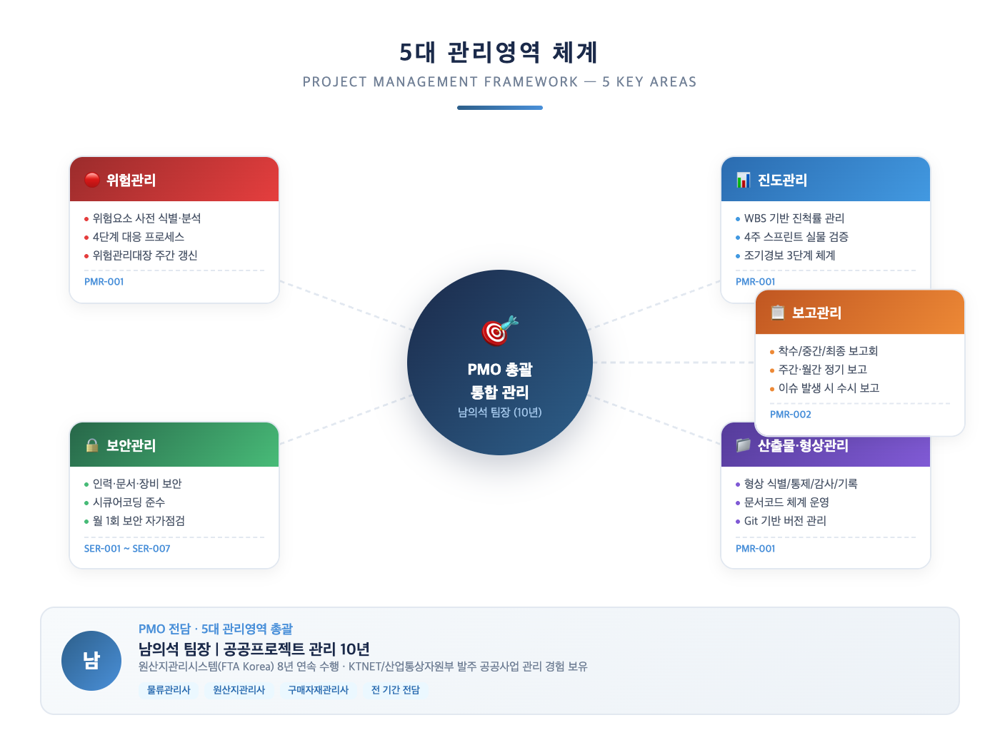
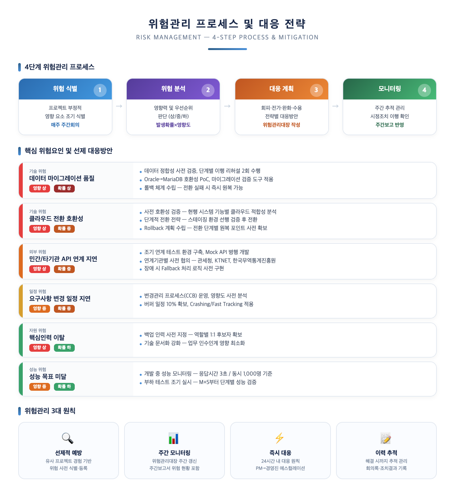
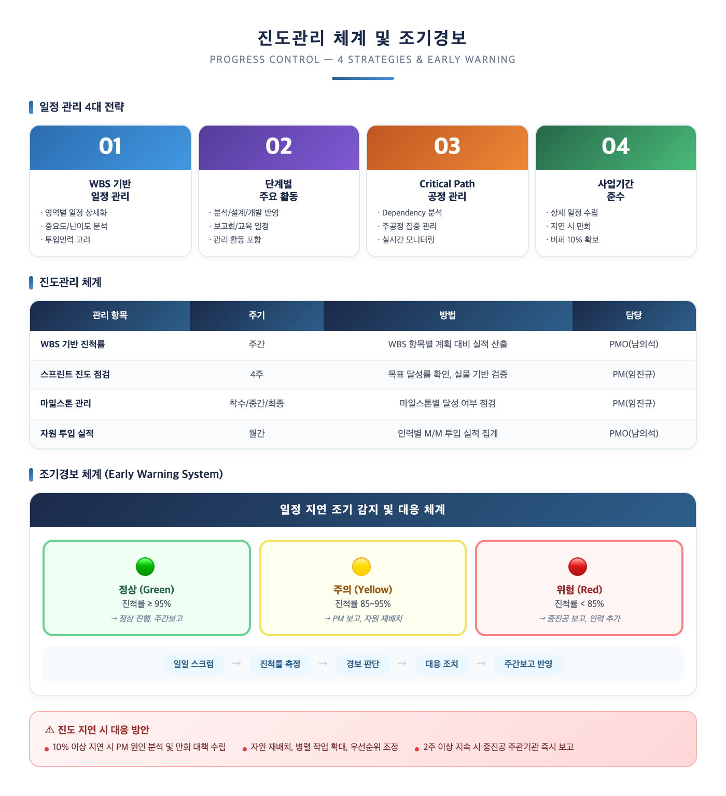
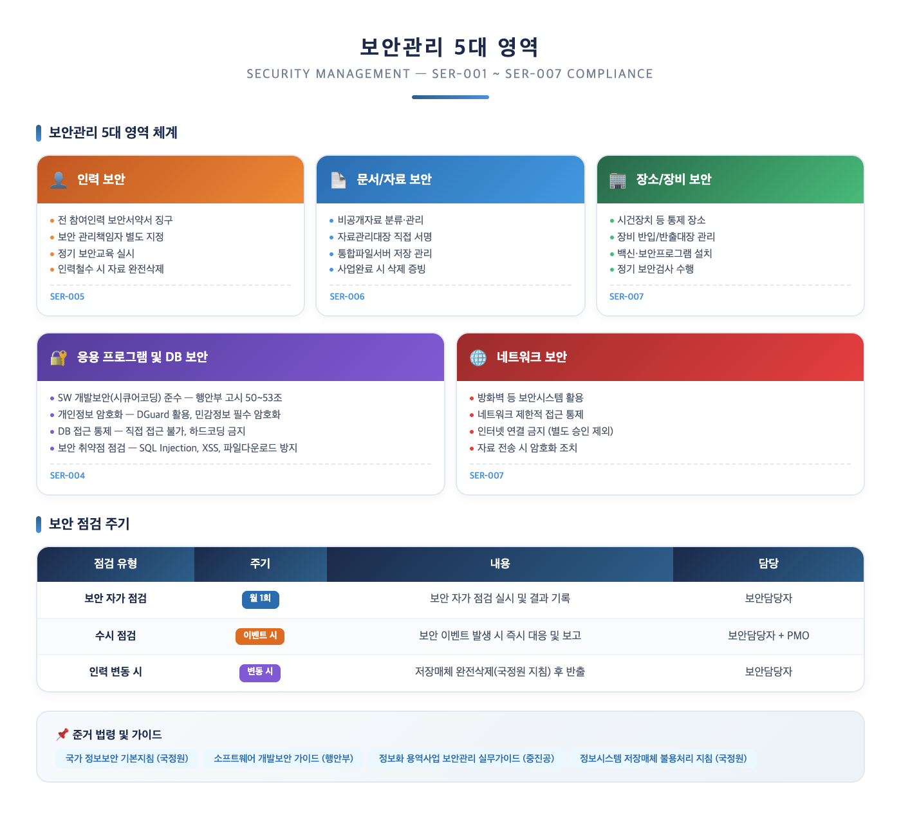
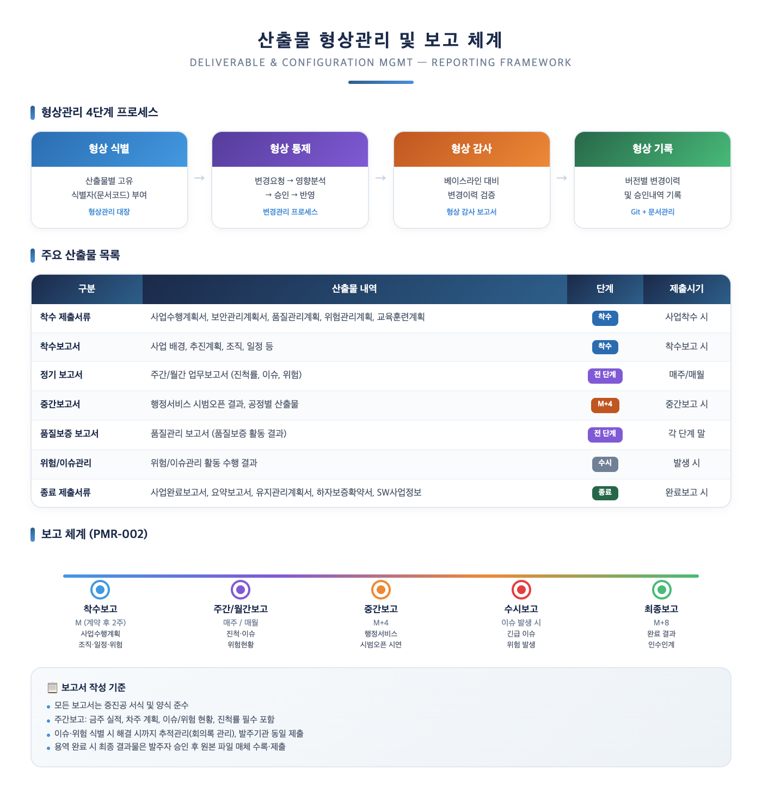
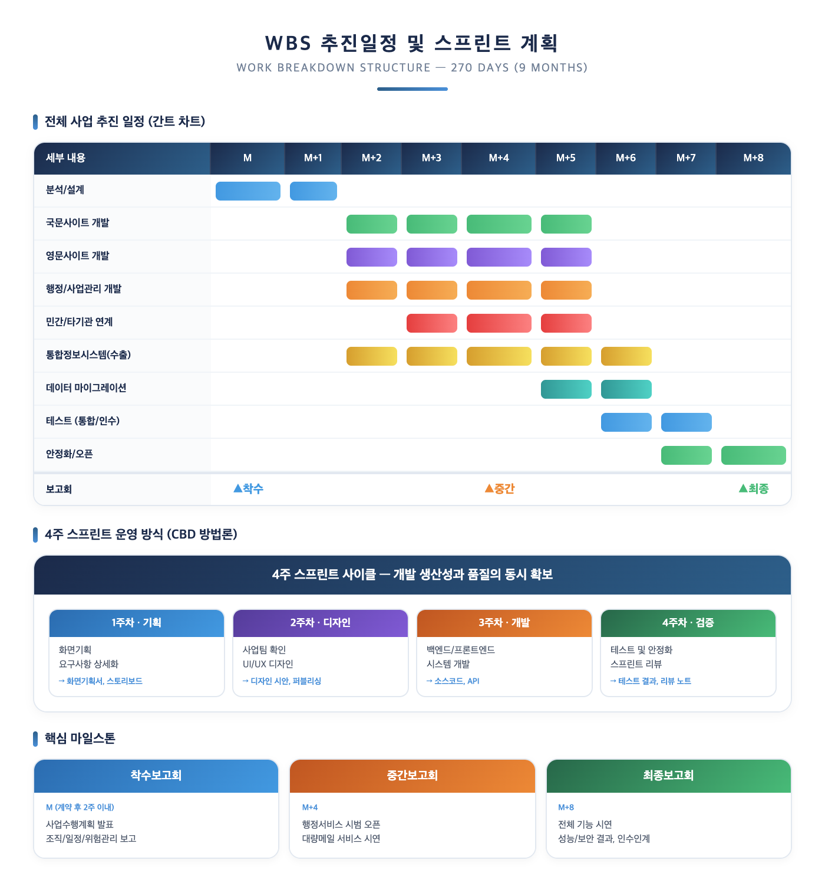
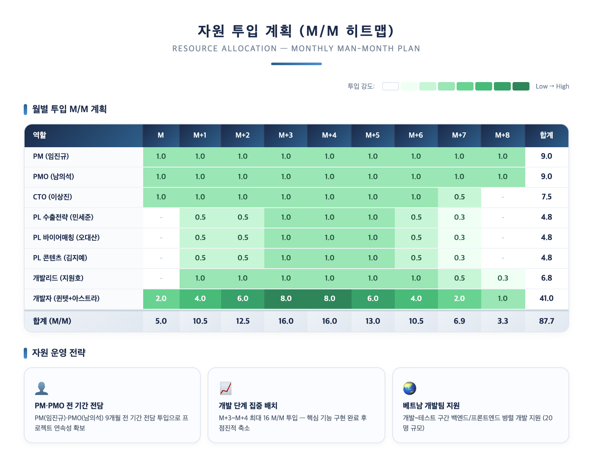
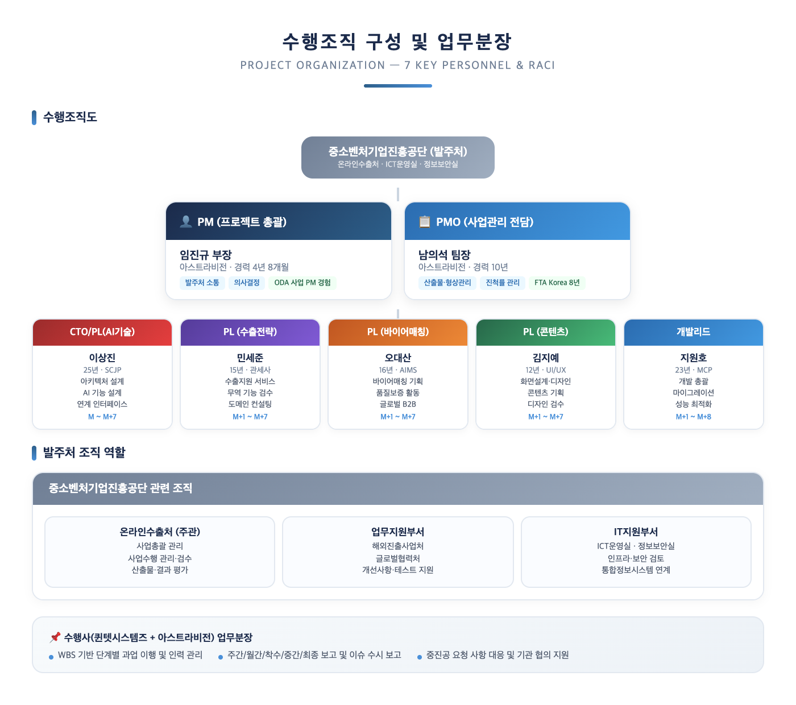

# V. 프로젝트 관리

## 1. 관리방법론

본 사업의 성공적 수행을 위해 **위험관리, 진도관리, 보안관리, 산출물/형상관리, 보고관리** 5대 관리 영역을 체계적으로 운영합니다. PMO 전담 인력인 남의석 팀장(공공프로젝트 관리 10년, 원산지관리시스템 8년 연속 수행)이 전 영역을 총괄하며, 중소벤처기업진흥공단의 사업 관리 및 운영지침을 철저히 준수합니다.

> **[요구사항 대응]** PMR-001(프로젝트 관리 일반사항), PMR-002(보고 관리), PMR-003/004(개발방법론 적용시 유의사항)

*[그림 5-1] PMO 총괄 5대 관리영역 체계도*

축적된 Know-How 기반의 관리방법론으로 착수 → 계획수립 → 실행/통제 → 종료의 4단계를 운영하며, 범위관리·일정관리·의사소통관리·품질관리·위험관리·구성관리의 6대 중점 관리 방안을 적용합니다. 각 영역별 담당자를 명확히 지정하여 PM(임진규)은 범위관리와 의사소통관리를, PMO(남의석)는 일정관리·위험관리·구성관리를, PL(오대산)은 품질관리를 책임집니다.

---

### 1.1 위험 관리

위험관리는 사업 수행 과정에서 발생 가능한 위험요소를 사전에 식별하고, 체계적으로 대응하여 사업 목표 달성에 미치는 부정적 영향을 최소화하는 활동입니다. **4단계 위험관리 프로세스**(식별 → 분석 → 대응계획 → 모니터링)를 반복 수행하며, 위험관리대장(Risk Register)을 통해 전체 위험 항목을 일원화 관리합니다.

*[그림 5-2] 위험관리 4단계 프로세스 및 핵심 위험요인 대응 전략*

본 사업의 특성을 고려하여 **데이터 마이그레이션 품질**, **클라우드 전환 호환성**, **기관 API 연계 지연** 등 6대 핵심 위험요인을 사전 식별하고 선제적 대응방안을 수립하였습니다. 위험 현황은 주간보고서에 포함하여 주관기관에 정기 보고하며, PMR-002에 따라 이슈 및 위험관리 대상 항목이 식별된 경우 수시로 주관기관/전문기관과 협의하고 해결 시까지 추적관리를 실시합니다.

> **PMO 역량**: 남의석 팀장은 원산지관리시스템(FTA Korea) 8년 연속 수행(2017~2025) 과정에서 매년 위험관리대장을 작성·운영한 경험을 본 사업에 그대로 적용합니다. 특히, KTNET/산업통상자원부 발주 공공사업에서의 위험 식별 및 대응 노하우를 보유하고 있습니다.

---

### 1.2 진도 관리

270일(약 9개월) 사업 기간 내 모든 과업을 완료하기 위해, **WBS 기반의 진도관리**를 수행합니다. 보고 진척률과 실제 개발 진척의 GAP을 최소화하여 일정 및 품질 확보에 차질이 발생하지 않도록 **4대 전략**(WBS 기반 일정관리, 단계별 활동 고려, Critical Path 공정관리, 사업기간 준수)을 적용합니다.

*[그림 5-3] 진도관리 4대 전략 및 조기경보(Early Warning) 체계*

Sprint 단위 **실물 기반 진척 관리**를 통해 단순 진척률 수치가 아닌 실제 동작하는 기능 기준으로 진척을 점검합니다. 4주차 스프린트 리뷰에서 실물 시연을 통한 검증으로 "선 진척보고 후 개발" 관행을 방지하며, **3단계 조기경보 체계**(Green/Yellow/Red)를 운영하여 진척률 기준에 따라 자원 재배치, 중진공 보고 등 단계별 대응 조치를 즉시 가동합니다.

주간 진척률이 계획 대비 **10% 이상 지연** 시 PM이 원인을 분석하고 만회 대책을 수립하며, 2주 이상 지속될 경우 중진공 주관기관에 즉시 보고합니다.

---

### 1.3 보안 관리

본 사업 수행 시 중소벤처기업진흥공단의 보안 규정 및 지침을 철저히 준수합니다. 국가정보원의 '국가 정보보안 기본지침', 행정안전부의 '소프트웨어 개발보안 가이드', 중소벤처기업진흥공단의 '정보화 용역사업 보안관리 실무가이드' 등 관련 규정을 전면 적용합니다.

> **[요구사항 대응]** SER-001(보안관리 지침 준수), SER-002(개인정보보호), SER-003(보안관리계획 제출), SER-004(응용 프로그램 및 DB 보안), SER-005(참여인력 보안), SER-006(문서/전산자료 보안), SER-007(장소/장비 보안)

*[그림 5-4] 보안관리 5대 영역 체계 및 점검 주기*

**인력 보안(SER-005)** 은 전 참여인력 보안서약서 징구, 보안 관리책임자 별도 지정, 정기 보안교육, 인력철수 시 국정원 지침에 따른 자료 완전삭제를 포함합니다. **문서/자료 보안(SER-006)** 은 비공개자료 분류·관리, 자료관리대장 직접 서명, 통합파일서버 저장 관리를 적용합니다. **장소/장비 보안(SER-007)** 은 시건장치 통제, 장비 반입/반출대장 관리, 백신·보안프로그램 필수 설치, 네트워크 제한적 접근 통제를 수행합니다.

**응용 프로그램 및 DB 보안(SER-004)** 은 행정안전부 고시 제50조~53조에 따른 SW 개발보안(시큐어코딩) 준수, 중진공 DB 보안 전용 솔루션(DGuard) 활용 개인정보 암호화, DB 직접 접근 불가 및 하드코딩 금지, SQL Injection·XSS 등 보안 취약점 방지 조치를 포함합니다. 국정원/중기부/중진공 보안성검토에 따른 보안취약점을 이행합니다.

---

### 1.4 산출물 형상 및 문서 관리

PMR-001에 따라 사업추진과정에서 생산되는 제반 작업 단위별 산출물에 대해 작업 일정계획 및 품질보증계획과 연계하여 산출물의 종류, 주요내용, 작성 및 제출시기, 제출 부수, 제출매체 등을 중진공과 협의 후 결정합니다.

*[그림 5-5] 형상관리 4단계 프로세스, 산출물 목록 및 보고 체계*

**형상관리**는 식별 → 통제 → 감사 → 기록의 4단계 프로세스를 운영하며, 문서코드 체계(PM-사업관리, AD-분석설계, DV-개발, TS-테스트, DP-이행)를 적용하여 산출물을 체계적으로 분류합니다. Git 기반 버전 관리와 변경관리 프로세스를 통해 베이스라인 대비 변경 이력을 추적합니다.

**보고관리**는 PMR-002에 따라 착수보고회(M), 중간보고회(M+4), 최종보고회(M+8)를 실시하며, 매주/매월 진척사항·이슈·위험 현황을 포함한 정기 보고를 수행합니다. 이슈·위험 식별 시 해결 시까지 추적관리(회의록 관리)를 실시하고, 발주기관에도 동일하게 제출합니다. 용역 완료 시 최종 결과물은 발주자 승인 후 원본 파일 매체를 수록하여 산출물과 함께 제출합니다.

> ※ 산출물 종류 및 제출시기/방법은 중진공과 협의하여 최종 결정

---

## 2. 일정계획

본 사업은 계약체결일로부터 **270일(약 9개월)** 이내에 완료하며, 착수 → 분석설계 → 개발 → 통합/연계 → 테스트/마이그레이션 → 시범운영/안정화 → 최종보고의 단계별 일정으로 추진합니다. ODA 사업(467백만원) 및 KTNET 원산지관리시스템(304백만원) 등 유사 규모 공공사업에서의 일정관리 경험을 바탕으로 **4주 스프린트 기반의 체계적 일정관리**를 적용합니다.

> **[요구사항 대응]** PMR-001(프로젝트 관리 일반사항)

### 2.1 단계별 활동 및 기간 (WBS)

*[그림 5-6] 전체 사업 추진일정(간트 차트), 4주 스프린트 사이클 및 핵심 마일스톤*

전체 사업은 **7단계**로 구분됩니다. **착수/분석**(M)에서는 현행 시스템 분석과 요구사항 정의를, **설계**(M+1~M+2)에서는 아키텍처·데이터모델·화면·API 설계를 수행합니다. **개발**(M+2~M+5)은 국문/영문사이트, 행정/사업관리, 통합정보시스템(수출) 기능을 4주 스프린트 방식으로 구현합니다. **통합/기관연계**(M+3~M+6)에서 한국무역통계진흥원, 중소기업기술진흥원 등 외부 시스템을 연계하고, **테스트/마이그레이션**(M+5~M+7), **시범운영/안정화**(M+7~M+8)를 거쳐 **최종보고**(M+8)로 마무리합니다.

CBD 방법론 기반의 **4주 스프린트** 사이클은 1주차 화면기획·요구사항 상세화, 2주차 사업팀 확인·UI/UX 디자인, 3주차 시스템 개발, 4주차 테스트·안정화·스프린트 리뷰로 운영합니다.

**중간보고회(M+4)** 시점에 행정서비스(사업관리·사업비관리)와 대량메일 서비스를 시범 오픈하여 발주처에 중간 성과를 가시적으로 제시합니다.

| 시범 오픈 대상 | 완성도 목표 | 점검 항목 |
|-----------|---------|---------|
| 행정서비스(사업관리) | 90% | 사업등록, 진행관리, 실적관리 |
| 사업비관리 서비스 | 90% | 예산집행, 정산, 증빙관리 |
| 대량메일 서비스 | 80% | 대량 발송, 수신확인, 통계 |

> ※ 상세일정은 프로젝트 착수 시 중진공과 협의하여 확정

> **실적 근거**: 아스트라비전은 ODA 사업(467백만원, 2025년) 및 KTNET 원산지관리시스템(304백만원, 2024년) 등 유사 규모 프로젝트에서 4주 스프린트 방식을 성공적으로 적용하여 일정 내 사업을 완료한 경험을 보유하고 있습니다.

---

### 2.2 자원 및 조직 투입 계획

*[그림 5-7] 월별 M/M 투입 히트맵 및 자원 운영 전략*

PM(임진규)과 PMO(남의석)는 **전 기간 전담 투입**(각 9.0 M/M)하여 프로젝트 연속성을 확보합니다. 개발 단계(M+3~M+4)에 **최대 16.0 M/M을 집중 배치**하여 핵심 기능 구현을 완료한 후, 테스트/안정화 단계에서 점진적으로 축소합니다. 베트남 개발팀(20명)은 개발~테스트 단계에서 백엔드/프론트엔드 개발을 병렬 지원합니다.

단계별 자원 배분은 착수/분석 6.8 M/M → 설계 9.5 M/M → 개발 15.0 M/M → 통합/연계 10.3 M/M → 테스트/이행 9.0 M/M → 시범운영/안정화 5.9 M/M → 최종보고 4.4 M/M으로 개발 단계에 가장 많은 자원을 투입합니다.

---

## 3. 수행조직 및 업무분장

본 사업은 퀸텟시스템즈(총괄)와 아스트라비전 컨소시엄이 공동으로 수행하며, 역할별 전문성을 갖춘 **핵심인력 7명**을 중심으로 프로젝트 조직을 편성합니다. 전원 4년~25년의 경력을 보유한 전문가로 구성되어 있습니다.

### 3.1 수행조직 구성

*[그림 5-8] 수행조직도 — 핵심인력 7명 및 발주처 조직 역할*

**PM(임진규 부장)** 은 사업 전체 일정/범위/비용/품질 관리를 총괄하며, 중진공 담당자와의 대면/비대면 소통 및 보고회를 주관합니다. 베트남 ODA 사업(467백만원)에서 동일하게 PM 역할을 수행하여 중진공 발주 사업의 관리 체계와 보고 프로세스를 숙지하고 있습니다.

**PMO(남의석 팀장)** 은 산출물 관리, WBS 기반 진척률 관리, 형상 식별/통제/감사/기록, 보고서 작성을 전담합니다. 원산지관리시스템(FTA Korea) 8년 연속 수행 경험으로 공공사업 산출물 체계와 보고 프로세스에 정통합니다.

---

### 3.2 역할 및 업무분장 상세

**CTO/PL(AI기술) — 이상진** (25년, SCJP, FTA Korea 최초 개발자)은 클라우드 전환 아키텍처·컨테이너 기반 배포·DB 설계를 담당하며, AI 기반 수출지원 기능 설계 및 외부 시스템 연계 인터페이스를 설계합니다. 투입기간 M~M+7.

**PL(수출전략) — 민세준** (15년, 관세사)은 수출희망기업 지원 서비스, 수출사업 접수·평가·정산 기능을 설계하고, HS코드·FTA 원산지·관세율 관련 기능의 정확성을 검증합니다. 투입기간 M+1~M+7.

**PL(바이어매칭) — 오대산** (16년, AIMS 심사원)은 바이어-셀러 매칭 서비스 기획, AI 매칭 로직 설계, 해외 바이어 DB 연계를 담당하며, AIMS 심사원 역량 기반 품질보증 활동을 지원합니다. 투입기간 M+1~M+7.

**PL(콘텐츠) — 김지예** (12년, 그래픽/웹 디자이너)는 디지털 정부서비스 UI/UX 가이드라인 준수 화면 설계, 국문/영문 다국어 콘텐츠 기획, 전체 화면 디자인 일관성 검수를 책임집니다. 투입기간 M+1~M+7.

**개발리드 — 지원호** (23년, MCP)는 개발팀 관리·코드 리뷰·전자정부 표준프레임워크 5.0 적용을 총괄하며, 데이터 마이그레이션(Oracle→MariaDB) 설계 및 실행, 시스템 성능 튜닝(동시 1,000명, 응답시간 3초 이내)을 담당합니다. 투입기간 M+1~M+8.
