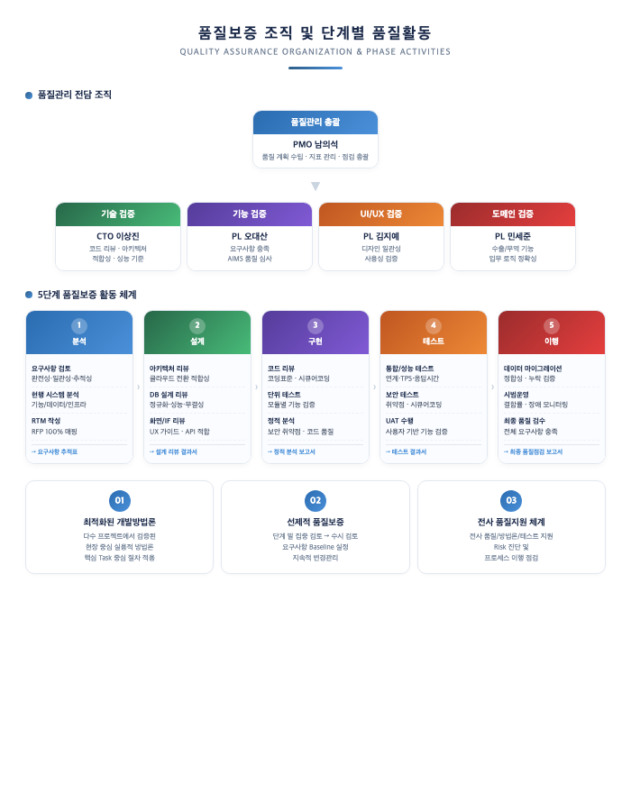
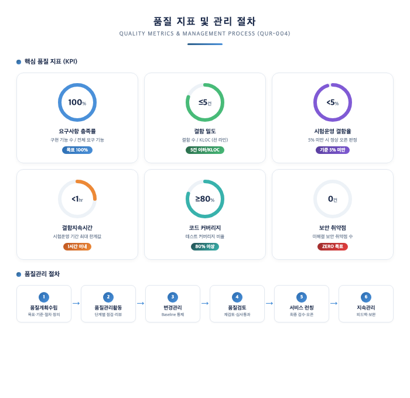
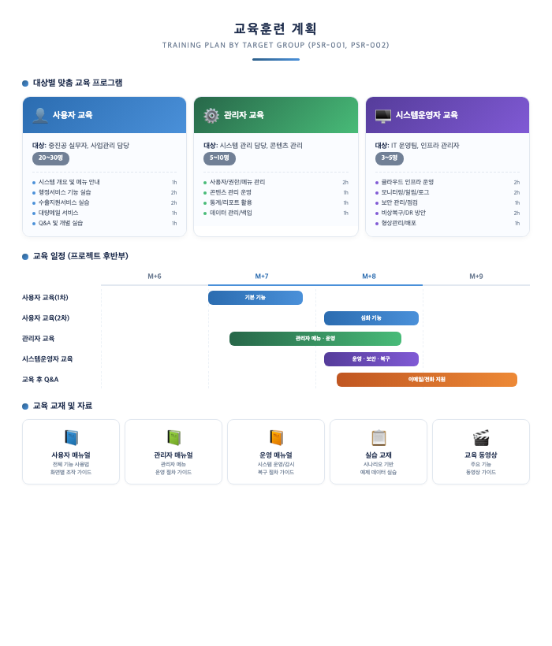
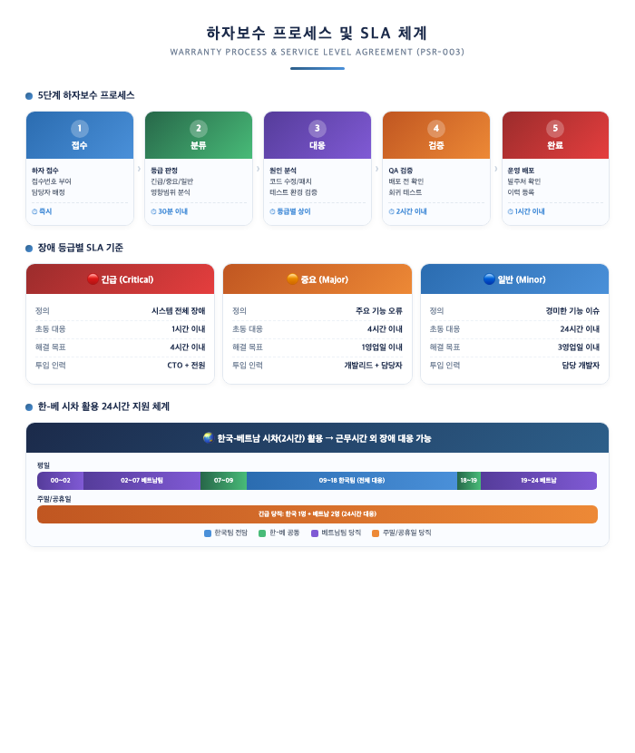
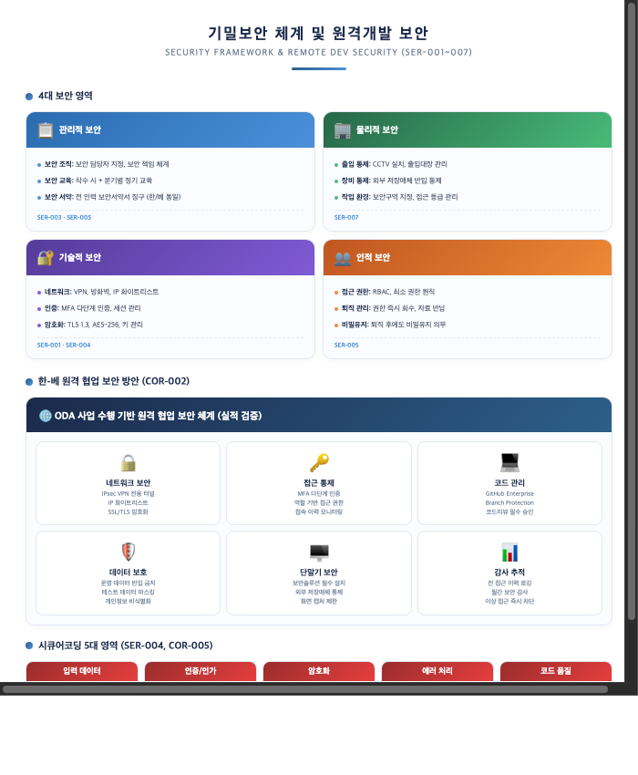
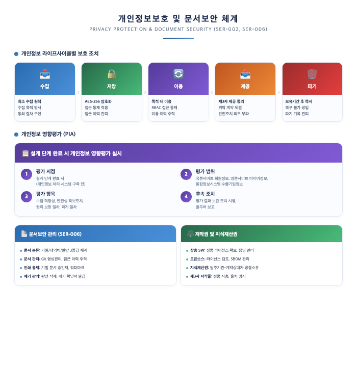

# VI. 프로젝트 지원

## 1. 품질보증 방안

본 컨소시엄은 품질보증 전담 조직을 구성하고, 분석/설계/구현/테스트/이행 각 단계별로 체계적인 품질보증 활동을 수행합니다. 중진공, KOTRA, KTNET, KISTI, 질병관리청 등 다수 공공기관 검수를 통과한 경험을 바탕으로, 본 사업에서도 발주처의 요구 품질 수준을 충족합니다.

> **[요구사항 대응]** QUR-001(품질관리 일반사항), QUR-002(기능 구현 정확성), QUR-003(상호운영성), QUR-004(신뢰성, 확장성)

---

### 1.1 품질보증 조직

품질관리 조직과 운영절차를 다음과 같이 구체적으로 편성합니다. PMO를 중심으로 기술/기능/UI·UX/도메인 4개 검증 영역의 전문가를 배치하여, 각 단계별 품질활동을 체계적으로 수행합니다.

> **PL 오대산의 AIMS 심사원 역량**: ISO/IEC 42001:2023 AIMS AI 경영시스템 심사원 자격을 보유한 오대산 이사가 AI 기능을 포함한 전체 시스템의 품질 검증을 수행합니다.

---

### 1.2 품질보증 방법 및 절차

QUR-001에 따라, 품질활동의 제반절차 및 산출물을 명시한 품질관리계획을 제안서 및 사업수행계획서에 상세하게 기술하고, 이에 근거하여 체계적이고 효과적인 프로젝트를 진행합니다.

#### (1) 단계별 품질보증 활동

분석 → 설계 → 구현 → 테스트 → 이행의 5단계에 걸쳐 품질보증 활동을 수행하며, 각 단계별 점검 항목과 산출물을 명확히 정의합니다.

> QUR-002에 따라, 시스템은 제공되기로 한 요구사항을 모두 제공하며, 기능 구현 정확성은 사용자가 직접 테스트를 수행함으로써 평가합니다. 신규 기능 개발로 인해 기존 기능 및 성능에 영향을 미치지 않도록 회귀 테스트를 반드시 실시합니다.

> QUR-003에 따라, 목표시스템은 본 사업과 관련된 정보시스템 및 기술표준과의 상호 운영성을 확보하며, 행정기관 및 공공기관 정보시스템 구축 운영 지침에 따른 표준 기술을 적용합니다.

---

#### (2) 품질 지표 및 관리 절차

QUR-004에 따라, 시스템의 목표 달성을 검증할 신뢰성 있는 측정 및 평가 방법을 제시합니다. 6대 핵심 품질 지표(KPI)와 6단계 품질관리 절차를 통해 체계적으로 품질을 관리합니다.

> QUR-004에 따라, 시험운영 기간 동안 발견된 결함 수와 결함의 지속시간을 측정하며, 결함 발생율이 5% 이상인 경우에는 시스템 오픈기간을 연장합니다. 시험운영 기간 결함지속시간의 최대 한계값은 1시간 이내로 관리합니다.

---

#### (3) 품질관리 활동 상세

**▶ 프로젝트 품질관리 내용**

| 활동 | 내용 |
|------|------|
| 품질보증 계획수립 | 품질보증 목표와 품질보증활동 계획을 수립 |
| 표준 및 절차 수립 | 각 산출물 작성 표준 및 작성절차, 사용양식 정의 |
| 형상관리 | 도입 소프트웨어 및 문서, 장비 등에 대한 형상 항목을 식별하고 변경 사항을 통제하여 상태를 기록하고 유지 |
| 테스트 | 단위, 통합, 시스템 테스트 실시 |
| 워크스루 | 프로젝트 자체로 산출물에 대한 검토를 실시하여 결함을 조기에 발견하고 조치 |
| 정기협의 | 서비스 런칭 이후 정기 협의로 능동적인 품질 보증 활동 수행 |

**▶ 전사 품질관리 활동**

| 활동 | 내용 |
|------|------|
| 사내감리 | 각 단계를 종료할 때 전문 감리인이 문서 검토 및 인터뷰 실시를 통해 산출물과 프로젝트 진행 시 위험 요소를 도출 |
| 제품검사 | 설치 시점에 시스템 기능 및 성능을 점검하여 보완케 하고, 구현 시점에 최종 검사를 실시 |
| 고객 만족도 조사 | 프로젝트 구축 또는 서비스 런칭 후 고객 만족도 조사를 실시하여 고객불만사항을 파악하고 개선 대책을 수립 |

**외부 요인 대응(QUR-001)**

본 과업범위 외의 요인(운영서버 등 정보자원)으로 인해 사업 결과에 영향이 있거나 예상되는 경우, 원인과 해결방안을 발주기관에 제시하여 위험요소를 최소화하거나 문제가 해결될 수 있도록 적극 협조합니다. DB구축을 포함하는 경우 사업완료(검수) 시 데이터품질진단 및 오류데이터 개선을 실시합니다.

---

## 2. 교육훈련

체계적이고 효율적인 교육을 위하여 사용자, 관리자, 시스템운영자 대상별로 맞춤형 교육훈련 계획을 수립합니다. 교육훈련계획 작성 시 교육대상, 교육일정 및 장소, 내용, 교재 등 기타 제반사항은 발주기관과 협의하여 결정합니다.

> **[요구사항 대응]** PSR-001(기술이전 교육), PSR-002(기술이전 계획)

---

### 2.1 교육대상별 방법 및 내용

PSR-001에 따라, 교육대상을 사용자, 관리자, 시스템운영자로 구분하여 대상별 맞춤 교육을 실시합니다. 시스템운영자에게는 시스템 운영, 시스템 감시 및 보안, 비상복구 방법에 관한 교육을 포함합니다.

> **ODA 기술이전 교육 경험**: 아스트라비전은 베트남 ODA 사업(2024.09 착수~2025.11 완료)에서 현지 운영 인력 대상 기술이전 교육을 성공적으로 수행한 경험을 보유하고 있습니다. KOTRA AI무역지원센터 3개소에서 참여기업 대상 온보딩 교육을 수행하며, 비전문가도 이해할 수 있는 교육 자료 작성 역량을 검증받았습니다.

---

### 2.2 교육 일정 및 조직

#### (1) 교육 일정

- 교육 일정은 발주기관과 협의하여 확정합니다.
- 대면 교육을 원칙으로 하되, 참석자 편의를 고려하여 온라인 병행 교육을 지원합니다.

#### (2) 교육 지원 조직

| 역할 | 담당 | 주요 업무 |
|------|------|---------|
| **교육 총괄** | PM | 교육 계획 수립, 발주처 협의, 교육 품질 관리 |
| **기능 교육 강사** | 업무 PL | 국문/영문/관리자 사이트 기능 교육, 실습 지도 |
| **시스템 교육 강사** | CTO | 클라우드 인프라, 모니터링, 보안, 비상복구 교육 |
| **교재 작성** | PMO | 매뉴얼 작성, 교육 동영상 제작, 실습 환경 준비 |

#### (3) 교육 후 지원

- 교육 완료 후 1개월간 교육 내용 관련 Q&A를 이메일/전화로 지원합니다.
- 교육훈련계획에는 시스템 구축 및 운영상 필요하다고 판단되어 발주기관에서 관련 교육을 요구할 경우 사업 수행 범위 내에서 적극 지원합니다(PSR-001).
- 교육 동영상을 제작하여 신규 인력 입사 시에도 자체 학습이 가능하도록 합니다.

---

## 3. 하자보수 방안

본 컨소시엄은 최종검수 완료일로부터 **12개월간** 무상 하자보수를 수행합니다. 한국 팀과 베트남 팀의 시차(2시간)를 활용하여 **근무시간 외에도 장애 대응이 가능한 24시간 지원 체계**를 구축하며, FTA Korea 시스템 유지보수 6년 연속 수행(2018~2023) 경험을 기반으로 안정적인 하자보수 서비스를 제공합니다.

> **[요구사항 대응]** PSR-003(하자보수 일반)

---

### 3.1 하자보수 계획 및 조직

#### (1) 하자보수 기본 계획

| 항목 | 내용 |
|------|------|
| **하자보수 기간** | 최종검수 완료일로부터 **12개월** |
| **하자보수 범위** | 본 사업에서 개발한 전체 시스템 (국문/영문/관리자/통합정보시스템) |
| **대응 채널** | 전화, 이메일, 온라인 이슈트래커(Jira), 긴급 핫라인 |
| **대응 시간** | 긴급(1시간 이내), 중요(4시간 이내), 일반(24시간 이내) |
| **비용** | 무상 (하자보수 기간 내) |

#### (2) 하자보수 전담 조직

| 역할 | 담당자 | 주요 업무 |
|------|--------|---------|
| **하자보수 총괄** | PM(임진규) | 하자보수 의사결정, 발주처 보고 |
| **기술 지원** | CTO(이상진) | 아키텍처 관련 장애 분석, 기술 의사결정 |
| **개발 대응** | 개발리드(지원호) | 코드 수정, 버그 패치, 배포 |
| **품질 관리** | PMO(남의석) | 하자보수 이력 관리, 보고서 작성 |
| **베트남 개발팀** | ASTRA TECHNOLOGY (20명) | 야간/휴일 긴급 대응, 코드 수정 지원 |

---

### 3.2 하자보수 절차 / 범위 / 기간

하자보수는 **접수 → 분류 → 대응 → 검증 → 완료** 5단계 프로세스로 수행하며, 장애 등급(긴급/중요/일반)에 따른 차등 SLA를 적용합니다. 한국-베트남 시차를 활용한 24시간 지원 체계로 야간/휴일에도 긴급 장애에 대응합니다.

---

#### (1) 기술/기능별 하자보수 범위

| 대상 시스템 | 하자보수 범위 | 주요 점검 항목 |
|-----------|------------|-------------|
| **국문사이트** | 회원, 수출지원, 상품서비스, UI/UX | 로그인/인증, 서비스 신청 프로세스, 페이지 렌더링 |
| **영문사이트** | SNS가입, 상품조회, 결제연동, CDN | 다국어 처리, 결제 정상 동작, CDN 캐시 갱신 |
| **관리자사이트** | 회원관리, 권한관리, 통계, CTI | Nexacro 화면 정상 동작, 데이터 정합성 |
| **통합정보시스템** | 수출사업 접수/평가/정산, 기관연계 | Oracle 연계 정상, 데이터 동기화, 보안 |
| **인프라** | 컨테이너, 네트워크, DB, 보안 | 오토스케일링 정상, VPN 연결, 백업/복구 |
| **연계 시스템** | 공공마이데이터, 민간/타기관 API | API 응답 정상, 데이터 정합성, 인증 토큰 관리 |

---

#### (2) FTA Korea 유지보수 경험 활용

본 컨소시엄의 핵심 인력은 **FTA Korea 원산지관리시스템 관련 사업을 2017년부터 2025년까지 8년 연속** 수행한 경험을 보유하고 있습니다(유지보수 6년: 2018~2023, 종합컨설팅 7년: 2018~2024). 이를 통해 축적한 공공 시스템 유지보수 노하우를 본 사업의 하자보수에 적용합니다.

| 경험 항목 | 적용 방안 |
|---------|---------|
| 장애 패턴 분석 및 선제 대응 | 고비즈코리아 시스템의 장애 패턴을 사전 분석하여 예방 조치 수행 |
| SLA 기반 체계적 관리 | 장애 등급별 대응시간/해결시간 기준 엄격 준수 |
| 정기 점검 및 예방 보수 | 월 1회 시스템 정기 점검, 보안 패치, 성능 모니터링 |
| 운영 이관 후 안정화 지원 | 운영팀 기술이전 완료 후에도 하자보수 기간 내 기술 자문 제공 |

---

## 4. 기밀보안

본 컨소시엄은 사업 수행 전 과정에서 기밀보안 체계를 수립하고, 저작권 존중, 시스템 보안성 확보, 개인정보보호 대책을 포괄하는 종합 보안 방안을 적용합니다. 특히 한국-베트남 원격 협업 환경에서의 보안 관리 경험(ODA 사업 수행)을 기반으로 원격개발 보안 방안을 구체적으로 제시합니다.

> **[요구사항 대응]** SER-001(보안관리 지침 준수), SER-002(개인정보보호 준수), SER-003(보안관리계획 제출), SER-004(응용 프로그램 및 DB 보안), SER-005(참여인력에 대한 보안), SER-006(문서 및 전산자료에 대한 보안), SER-007(장소 및 장비 등에 대한 보안), COR-002(작업장소 상호협의 결정), COR-005(소프트웨어 개발보안 준수)

---

### 4.1 보안체계 및 저작권 대책

본 사업에서 취급하는 모든 정보는 「국가정보보안기본지침」, 「전자정부법」, 「개인정보보호법」 등 관련 법령에 따라 관리합니다. 관리적/물리적/기술적/인적 4대 보안 영역에 걸쳐 종합적인 보안 체계를 수립하고, 한-베 원격 협업 환경에 특화된 6대 보안 조치를 적용합니다.

---

#### (1) 보안 취약점 점검 체계

| 점검 시점 | 점검 내용 | 도구/방법 |
|---------|---------|---------|
| 개발 단계 | 소스코드 정적 분석 | SonarQube, SpotBugs |
| 테스트 단계 | 웹 취약점 동적 분석 | OWASP ZAP, Burp Suite |
| 배포 전 | 인프라 보안 점검 | 보안 체크리스트, 취약점 스캐닝 |
| 운영 단계 | 정기 보안 점검 | 월간 보안 점검, 침해사고 대응 훈련 |

---

### 4.2 개인정보보호 대책

본 사업은 수출기업 및 해외바이어의 개인정보를 처리하므로, 「개인정보보호법」 및 「개인정보의 안전성 확보조치 기준」(개인정보보호위원회 고시)을 엄격히 준수합니다 (SER-002). 개인정보 수집 → 저장 → 이용 → 제공 → 파기의 전체 라이프사이클에 걸쳐 보호 조치를 적용하며, 설계 단계에서 개인정보 영향평가(PIA)를 실시합니다.

